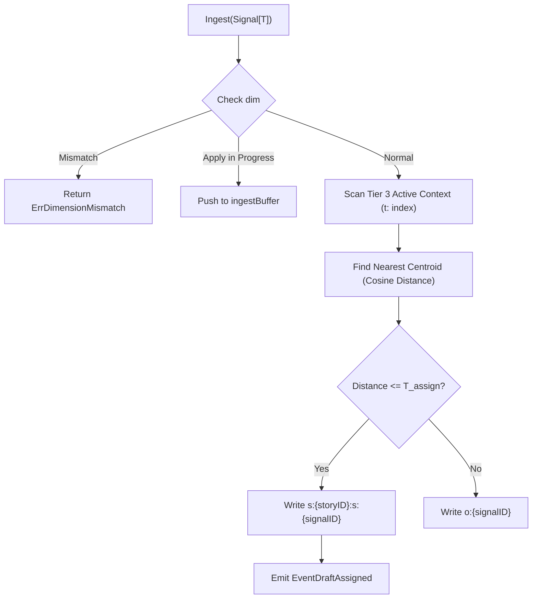

# SDD Spec: Real-Time Ingestion & Draft Assignment Engine

## Metadata
* **Status:** `DESIGN`
* **Author:** Streaming Story Team
* **Created:** 2026-08-11
* **Last Updated:** 2026-08-11
* **Approver:** Codefather

---

## Phase 1: Proposal (Rough Idea)

### 1.1 Problem Statement
In incoming signal streams, real-time feedback is required without waiting for high-cost batch re-clustering runs. Without a draft assignment mechanism, incoming signals remain unassigned until the next batch run, introducing up to 30 minutes of latency for downstream story tracking systems.

### 1.2 Proposed Solution
Implement a low-latency real-time ingestion pipeline (`Ingest`) that evaluates incoming signal embeddings against active context story centroids via cosine similarity. Signals matching within an adaptive per-story threshold $T_{\text{assign}}(\text{story})$ are provisionally assigned immediately ("Draft assignment"); unmatched signals enter an outlier holding bucket. During heavy batch write transactions, incoming signals stage into a non-blocking in-memory buffer.

### 1.3 Scope & Requirements
* **In Scope:**
  * Dimensionality validation on `Ingest` (atomic CAS).
  * Nearest active story centroid lookup across Tier 3 Active Context using `t:{unix_sec}:{storyID}` index.
  * Per-story adaptive assignment threshold computation:
    $$T_{\text{assign}}(\text{story}) = \text{mean\_distance}(\text{story}) + \text{AssignmentK} \times \sigma(\text{story})$$
  * Cold-start fallback using $\sigma_{\text{global}}$ when signal count $< \text{ColdStartMinSignals}$.
  * Floor enforcement $\sigma(\text{story}) \ge \text{SigmaFloor} \times \sigma_{\text{global}}$.
  * Dormant story frozen metric reuse and threshold clearing upon reactivation.
  * Staging in `ingestBuffer` while `applyInProgress` is set during batch updates.
  * Emission of `EventDraftAssigned` events.
* **Out of Scope:**
  * Distributed stream partitioning.
  * Approximate Nearest Neighbor (ANN) vector index integration.

---

## Phase 2: System Design (SDD)

### 2.1 Architecture & Components

### 2.2 Data Structures & Interfaces
- **Centroid Match Function**: `findNearestStory(sig Signal[T]) (StoryMeta, float64, error)`
- **Threshold Evaluator**: `calcThreshold(story StoryMeta) float64`
- **Draft Store Writes**:
  - Key `s:{storyID}:s:{signalID}` for provisional story assignment.
  - Key `o:{signalID}` for outlier retention.

### 2.3 Protocol / API Changes
- Public method `Ingest(ctx context.Context, sig Signal[T]) (uuid.UUID, error)` implemented on `Tracker[T]`.

### 2.4 Real-Time & Resource Impacts
- Allocation Budget: $O(1)$ heap allocations on ingestion path.
- Latency Budget: $< 1\text{ ms}$ per signal for brute-force centroid distance checks over active context.
- Verification: Benchmark tests `BenchmarkIngest` and `BenchmarkIngestDuringApply`.

---

## Phase 3: Implementation Plan (IP)

### 3.1 Task Breakdown
- [ ] **Task 1:** Implement vector distance calculation and centroid lookup helpers.
  - **Files:** `internal/dist/dist.go`, `tracker.go`
  - **Verification:** `go test ./pkg/... ./internal/dist`
- [ ] **Task 2:** Implement `calcThreshold` with cold-start, sigma-floor, and dormant frozen stat handling.
  - **Files:** `tracker.go`, `tracker_test.go`
  - **Verification:** `go test -run TestCalcThreshold ./...`
- [ ] **Task 3:** Implement complete `Ingest` flow including `ingestBuffer` staging and store persistence.
  - **Files:** `tracker.go`, `tracker_test.go`
  - **Verification:** `go test -run TestIngest ./...`

### 3.2 Risks & Mitigation
- **Risk:** High ingestion rate during long batch apply transactions could overflow `ingestBuffer`.
- **Mitigation:** Blocking `select` on `ingestBuffer` with `ctx.Done()` timeout guarantees back-pressure without memory leak.

---

## Phase 4: Execution & Verification
- [ ] All per-task verification steps pass.
- [ ] Linter / vet clean.
- [ ] Unit tests pass.
- [ ] Build targets compile.
- [ ] Neighbor packages unaffected.
- [ ] Approved by Codefather.

---

## Phase 5: Completed
- [ ] All Phase 4 items `[x]`.
- [ ] No regressions.
- [ ] Spec document reflects actual implementation.
- [ ] `spec/README.md` updated to `COMPLETED`.
- [ ] Approved by Codefather.
