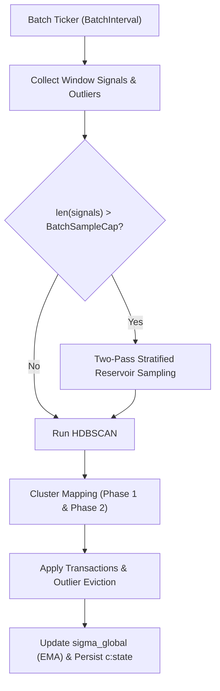

# SDD Spec: Periodic Batch Re-clustering & HDBSCAN Refinement

## Metadata
* **Status:** `DESIGN`
* **Author:** Streaming Story Team
* **Created:** 2026-08-11
* **Last Updated:** 2026-08-11
* **Approver:** Codefather

---

## Phase 1: Proposal (Rough Idea)

### 1.1 Problem Statement
Real-time provisional assignments are subject to local noise and temporal variance. Without periodic global re-clustering, stories drift, splits and merges go undetected, and outliers accumulate indefinitely.

### 1.2 Proposed Solution
Run a background batch process every `BatchInterval` (default: 30m). The batch run gathers signals from the current `BatchWindow` (default: 24h) and active outliers, executes density-based clustering via HDBSCAN, updates global calibration metrics ($\sigma_{\text{global}}$), and evicts stale outliers based on a relative TTL anchored to `lastBatchTimestamp`.

### 1.3 Scope & Requirements
* **In Scope:**
  * Signal collection across `BatchWindow`.
  * Outlier collection bounded by `lastBatchTimestamp - OutlierTTL`.
  * Relative outlier eviction (deleting stale outliers from `o:{signalID}`).
  * Two-pass stratified reservoir sampling down to `BatchSampleCap` (Pass 1: per-story minimum guarantee up to `SampleGuaranteeMaxFraction`; Pass 2: proportional distribution).
  * Integration with `internal/hdbscan` using fixed `MinClusterSize` and `MinSamples`.
  * Exponential Moving Average (EMA) update for global standard deviation:
    $$\sigma_{\text{global}} \leftarrow \text{EMAAlpha} \times \sigma_{\text{global\_prev}} + (1 - \text{EMAAlpha}) \times \text{mean\_distance\_active}$$
  * Persisting calibration state into `c:state`.
* **Out of Scope:**
  * GPU-accelerated HDBSCAN.

---

## Phase 2: System Design (SDD)

### 2.1 Architecture & Components

### 2.2 Data Structures & Interfaces
- Sampling Helper: `sampleSignals(signals []Signal[T], activeStories []StoryMeta, cap int) []Signal[T]`
- Calibration State Struct: `calibState` (`SigmaGlobal`, `Dim`, `LastBatchAt`)

### 2.3 Protocol / API Changes
- None (internal batch loop execution).

### 2.4 Real-Time & Resource Impacts
- Execution Budget: HDBSCAN complexity $O(N \log N)$ bounded by `BatchSampleCap` (default 50,000 points).
- Memory Budget: In-memory distance graph during HDBSCAN allocated per batch run.
- Verification: Unit tests in `tracker_test.go` and golden tests in `internal/hdbscan`.

---

## Phase 3: Implementation Plan (IP)

### 3.1 Task Breakdown
- [ ] **Task 1:** Implement signal and outlier window collection with relative TTL eviction logic.
  - **Files:** `tracker.go`
  - **Verification:** `go test -run TestOutlierEviction ./...`
- [ ] **Task 2:** Implement two-pass stratified reservoir sampling.
  - **Files:** `tracker.go`, `tracker_test.go`
  - **Verification:** `go test -run TestStratifiedSampling ./...`
- [ ] **Task 3:** Complete `runBatch` skeleton connecting collection, HDBSCAN execution, and calibration state update.
  - **Files:** `tracker.go`, `tracker_test.go`
  - **Verification:** `go test -run TestRunBatch ./...`

### 3.2 Risks & Mitigation
- **Risk:** HDBSCAN execution taking longer than `BatchInterval` on large signal volumes.
- **Mitigation:** Strict enforcement of `BatchSampleCap` bounds runtime.

---

## Phase 4: Execution & Verification
- [ ] All per-task verification steps pass.
- [ ] Linter / vet clean.
- [ ] Unit tests pass.
- [ ] Build targets compile.
- [ ] Neighbor packages unaffected.
- [ ] Approved by Codefather.

---

## Phase 5: Completed
- [ ] All Phase 4 items `[x]`.
- [ ] No regressions.
- [ ] Spec document reflects actual implementation.
- [ ] `spec/README.md` updated to `COMPLETED`.
- [ ] Approved by Codefather.
