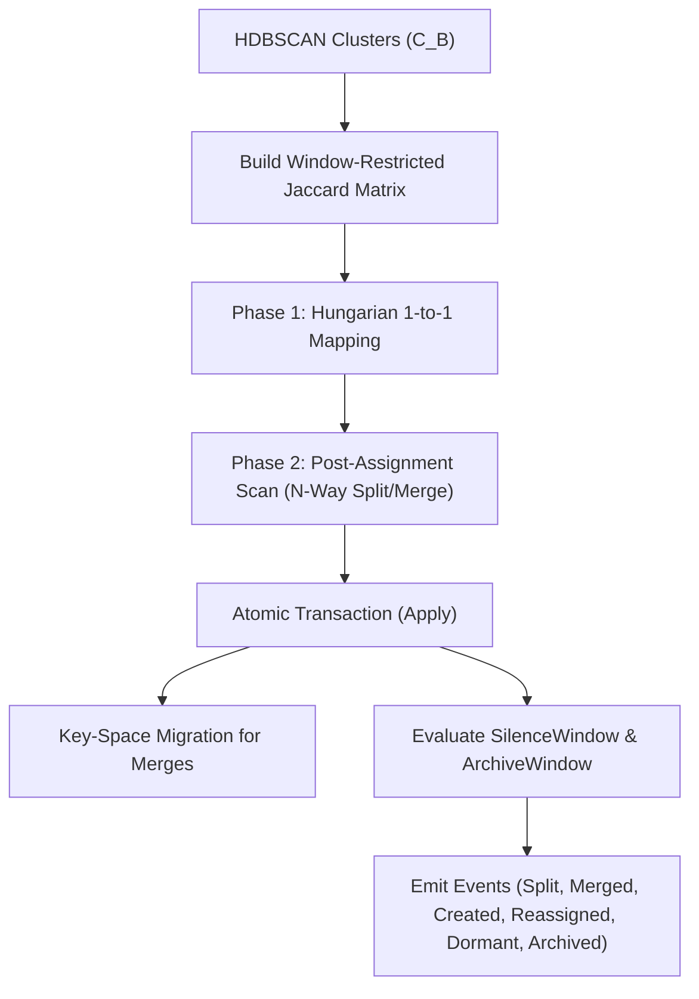

# SDD Spec: Two-Phase Cluster Mapping & Story Lifecycle Engine

## Metadata
* **Status:** `DESIGN`
* **Author:** Streaming Story Team
* **Created:** 2026-08-11
* **Last Updated:** 2026-08-11
* **Approver:** Codefather

---

## Phase 1: Proposal (Rough Idea)

### 1.1 Problem Statement
HDBSCAN produces anonymous clusters $C_B$ for each batch run. These clusters must be linked to existing persistent stories $S_P$ across time while supporting story creation, splits, merges, and lifecycle transitions (Active, Dormant, Archived) without breaking temporal signal stability or inflating Jaccard denominators on mature stories.

### 1.2 Proposed Solution
Implement a two-phase cluster mapping mechanism:
1. **Phase 1 (Primary Continuity)**: Solve optimal 1-to-1 matching via the Hungarian algorithm using Jaccard similarity restricted strictly to signals within `BatchWindow`.
2. **Phase 2 (Split & Merge Scan)**: Scan unmatched clusters and persistent stories for N-way splits ($C_B'$ coverage $>0.7$) and N-way merges ($S_P'$ coverage $>0.7$).
3. Apply survival rules (oldest `CreatedAt` survives in merges) and execute key-space migrations for retired story signals. Manage lifecycle state changes based on `SilenceWindow` and `ArchiveWindow`.

### 1.3 Scope & Requirements
* **In Scope:**
  * Jaccard cost matrix construction ($1 - \text{Jaccard}$) using window-scoped signal sets ($\text{At} \ge \text{now} - \text{BatchWindow}$).
  * Phase 1 Hungarian matching for pairs with $\text{Jaccard} \ge \text{MappingMinJaccard}$ (default: 0.6).
  * Phase 2 detection of N-way splits ($\text{SplitMinJaccard} \ge 0.3$, combined coverage $> 0.7$). Split is suppressed if $S_P$ is Dormant.
  * Phase 2 detection of N-way merges ($\text{SplitMinJaccard} \ge 0.3$, combined coverage $> 0.7$).
  * Survival rule: Oldest `StoryID` (earliest `CreatedAt`) survives. Secondary story signals migrated via key-space scan.
  * Outlier promotion for batch-clustered outliers.
  * Noise signal retention (HDBSCAN label -1 signals stay in existing story).
  * Lifecycle state machine: Active $\rightarrow$ Dormant (crossed `SilenceWindow`, freeze mean distance and $\sigma$), Dormant $\rightarrow$ Archived (crossed `ArchiveWindow`, terminal).
  * Scope-restricted signal re-assignment stability (re-assignment limited to `BatchWindow`).
* **Out of Scope:**
  * Manual operator story force-split API.

---

## Phase 2: System Design (SDD)

### 2.1 Architecture & Components

### 2.2 Data Structures & Interfaces
- Hungarian solver integration: `internal/hungarian.Solve(costMatrix)`
- Mapping decision structures representing pairings, splits, merges, new stories, and unclustered outliers.

### 2.3 Protocol / API Changes
- None (internal batch apply pipeline).

### 2.4 Real-Time & Resource Impacts
- Allocation Budget: Jaccard matrix bounded by $O(|C_B| \times |S_P|)$ where $|C_B|, |S_P| < 1000$.
- Latency Budget: $< 100\text{ ms}$ for mapping phase.
- Verification: Unit tests in `tracker_test.go` and `internal/hungarian`.

---

## Phase 3: Implementation Plan (IP)

### 3.1 Task Breakdown
- [ ] **Task 1:** Implement window-restricted Jaccard matrix calculation and Hungarian Phase 1 mapping.
  - **Files:** `tracker.go`, `internal/hungarian/hungarian.go`
  - **Verification:** `go test -run TestPhase1Mapping ./...`
- [ ] **Task 2:** Implement Phase 2 N-way split and N-way merge detection with oldest StoryID survival logic.
  - **Files:** `tracker.go`, `tracker_test.go`
  - **Verification:** `go test -run TestPhase2SplitMerge ./...`
- [ ] **Task 3:** Implement batch Apply key-space migrations and story lifecycle transitions (Dormant/Archived).
  - **Files:** `tracker.go`, `tracker_test.go`
  - **Verification:** `go test -run TestBatchApplyLifecycle ./...`

### 3.2 Risks & Mitigation
- **Risk:** Large key-space migration during merge blocking single-writer KV store.
- **Mitigation:** Execute all key migrations within the atomic `Update` transaction while `applyInProgress` redirects real-time ingest to `ingestBuffer`.

---

## Phase 4: Execution & Verification
- [ ] All per-task verification steps pass.
- [ ] Linter / vet clean.
- [ ] Unit tests pass.
- [ ] Build targets compile.
- [ ] Neighbor packages unaffected.
- [ ] Approved by Codefather.

---

## Phase 5: Completed
- [ ] All Phase 4 items `[x]`.
- [ ] No regressions.
- [ ] Spec document reflects actual implementation.
- [ ] `spec/README.md` updated to `COMPLETED`.
- [ ] Approved by Codefather.
