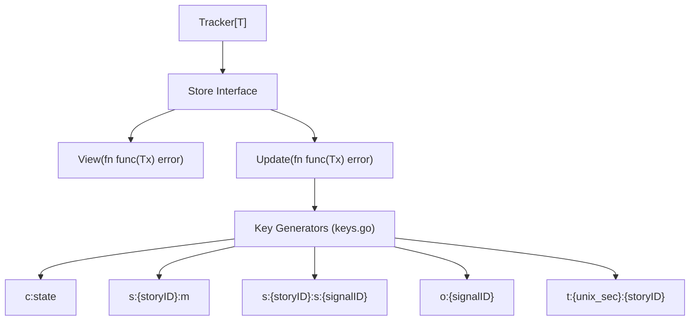

# SDD Spec: Key-Value Storage Schema & Persistence Layer

## Metadata
* **Status:** `DESIGN`
* **Author:** Streaming Story Team
* **Created:** 2026-08-11
* **Last Updated:** 2026-08-11
* **Approver:** Codefather

---

## Phase 1: Proposal (Rough Idea)

### 1.1 Problem Statement
The streaming story tracker requires persistent storage for signal vectors, story metadata, calibration state, and time indices over an abstract single-writer KV store. Keys must be strictly deterministic across restarts, deployments, and storage directories.

### 1.2 Proposed Solution
Define a strict key schema with explicit prefixes (`c:state`, `s:{storyID}:m`, `s:{storyID}:s:{signalID}`, `o:{signalID}`, `t:{unix_sec}:{storyID}`). Abstract storage access behind `Store` and `Tx` interfaces to support in-memory implementations (`memStore`) as well as production engines (BoltDB, LevelDB).

### 1.3 Scope & Requirements
* **In Scope:**
  * Fixed UUID v5 `TrackerNamespace` compile-time constant for signal UUID generation.
  * Key encoding helpers (`keyCalibState`, `keyStoryMeta`, `keySignal`, `keyOutlier`, `keyTimeIndex`).
  * Time index maintenance (`t:{unix_sec}:{storyID}`) for Tier 3 Active Context range scans.
  * Internal JSON persistence models (`storyRecord`, `calibState`).
  * `Store` and `Tx` abstraction interfaces.
  * In-memory test store (`memStore`).
* **Out of Scope:**
  * External SQL relational database persistence layer.

---

## Phase 2: System Design (SDD)

### 2.1 Architecture & Components



### 2.2 Data Structures & Interfaces
```go
type Store interface {
    View(fn func(tx Tx) error) error
    Update(fn func(tx Tx) error) error
    Close() error
}

type Tx interface {
    Get(key []byte) ([]byte, error)
    Put(key, value []byte) error
    Delete(key []byte) error
    Scan(prefix []byte, fn func(key, value []byte) error) error
}
```

### 2.3 Protocol / API Changes
- Key prefix definitions implemented in [`keys.go`](file:///home/ksharlaimov/dev/kampff-net/streaming-story/keys.go).

### 2.4 Real-Time & Resource Impacts
- Allocation Budget: Zero key formatting allocations via pre-allocated byte slices.
- Latency Budget: Key scans over `t:{unix_sec}:` prefix take $O(\text{active\_stories})$.
- Verification: `keys_test.go` and `memstore_test.go`.

---

## Phase 3: Implementation Plan (IP)

### 3.1 Task Breakdown
- [ ] **Task 1:** Verify key schema helpers and time index key format compliance.
  - **Files:** `keys.go`, `keys_test.go`
  - **Verification:** `go test ./...`
- [ ] **Task 2:** Verify `memStore` transactions, put, get, delete, and prefix scan semantics.
  - **Files:** `store.go`, `memstore_test.go`
  - **Verification:** `go test -run TestMemStore ./...`

### 3.2 Risks & Mitigation
- **Risk:** Time index stale key accumulation on story timestamp updates.
- **Mitigation:** Update operations explicitly delete `t:{old_timestamp}:{storyID}` before putting `t:{new_timestamp}:{storyID}`.

---

## Phase 4: Execution & Verification
- [ ] All per-task verification steps pass.
- [ ] Linter / vet clean.
- [ ] Unit tests pass.
- [ ] Build targets compile.
- [ ] Neighbor packages unaffected.
- [ ] Approved by Codefather.

---

## Phase 5: Completed
- [ ] All Phase 4 items `[x]`.
- [ ] No regressions.
- [ ] Spec document reflects actual implementation.
- [ ] `spec/README.md` updated to `COMPLETED`.
- [ ] Approved by Codefather.
