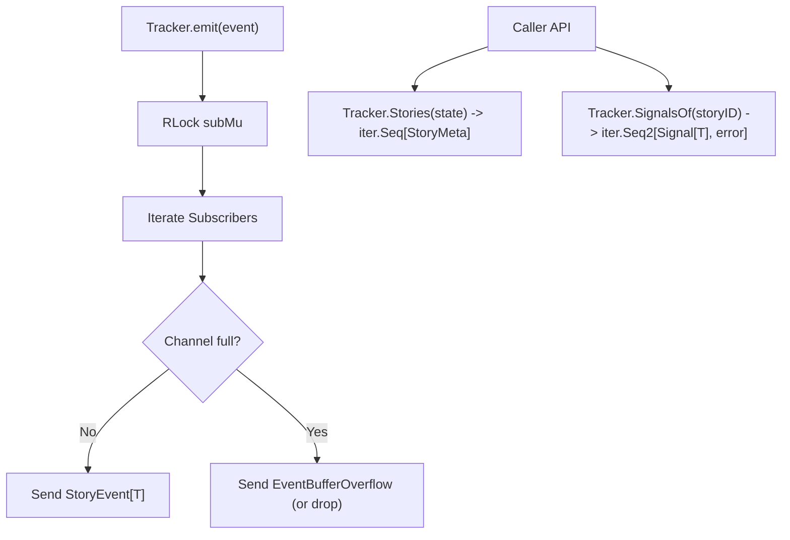

# SDD Spec: Event Streaming & Iterators API Component

## Metadata
* **Status:** `DESIGN`
* **Author:** Streaming Story Team
* **Created:** 2026-08-11
* **Last Updated:** 2026-08-11
* **Approver:** Codefather

---

## Phase 1: Proposal (Rough Idea)

### 1.1 Problem Statement
Callers need real-time notifications of story creation, splits, merges, assignments, and lifecycle transitions, as well as a zero-allocation idiomatic way to query stories and signals stored in the database.

### 1.2 Proposed Solution
Implement a thread-safe pub/sub event engine with per-subscriber buffered channels (`Subscribe`) and graceful overflow handling (`EventBufferOverflow`). Expose public Go 1.22 Range-over-func iterators (`Stories` and `SignalsOf`) using standard library `iter.Seq` and `iter.Seq2`.

### 1.3 Scope & Requirements
* **In Scope:**
  * Multi-subscriber event broadcast (`emit`) protected by read lock (`subMu`).
  * Non-blocking overflow handling: drop overflowing events and attempt to deliver `EventBufferOverflow`.
  * Single-story query method `Story(id uuid.UUID) (StoryMeta, error)`.
  * Story list iterator `Stories(state StoryState) iter.Seq[StoryMeta]`.
  * Story signal iterator `SignalsOf(storyID uuid.UUID) iter.Seq2[Signal[T], error]` (retained across all states including Archived).
  * Population of `BatchSummary` statistics for `EventBatchComplete`.
* **Out of Scope:**
  * WebSocket network event streaming wrapper.

---

## Phase 2: System Design (SDD)

### 2.1 Architecture & Components



### 2.2 Data Structures & Interfaces
```go
func (t *Tracker[T]) Subscribe() <-chan StoryEvent[T]
func (t *Tracker[T]) Stories(state StoryState) iter.Seq[StoryMeta]
func (t *Tracker[T]) SignalsOf(storyID uuid.UUID) iter.Seq2[Signal[T], error]
```

### 2.3 Protocol / API Changes
- Implement `Stories` and `SignalsOf` in [`tracker.go`](file:///home/ksharlaimov/dev/go.kvsh.ch/go.kvsh.ch-streaming-story/tracker.go).

### 2.4 Real-Time & Resource Impacts
- Allocation Budget: Zero allocation for Go 1.22 Range-over-func iterators during traversal.
- Memory Budget: Controlled per subscriber via `EventBufferSize` channel depth (default 512).
- Verification: Unit tests in `tracker_test.go`.

---

## Phase 3: Implementation Plan (IP)

### 3.1 Task Breakdown
- [ ] **Task 1:** Implement Go 1.22 `Stories(state StoryState) iter.Seq[StoryMeta]` iterator.
  - **Files:** `tracker.go`, `tracker_test.go`
  - **Verification:** `go test -run TestStoriesIterator ./...`
- [ ] **Task 2:** Implement Go 1.22 `SignalsOf(storyID uuid.UUID) iter.Seq2[Signal[T], error]` iterator.
  - **Files:** `tracker.go`, `tracker_test.go`
  - **Verification:** `go test -run TestSignalsOfIterator ./...`
- [ ] **Task 3:** Implement subscriber management and non-blocking event emission with `EventBufferOverflow`.
  - **Files:** `tracker.go`, `tracker_test.go`
  - **Verification:** `go test -run TestSubscribeEmit ./...`

### 3.2 Risks & Mitigation
- **Risk:** Slow subscribers blocking batch goroutine during event emission.
- **Mitigation:** Non-blocking `select` channel sends ensure slow subscribers are dropped with `EventBufferOverflow` without delaying tracker operations.

---

## Phase 4: Execution & Verification
- [ ] All per-task verification steps pass.
- [ ] Linter / vet clean.
- [ ] Unit tests pass.
- [ ] Build targets compile.
- [ ] Neighbor packages unaffected.
- [ ] Approved by Codefather.

---

## Phase 5: Completed
- [ ] All Phase 4 items `[x]`.
- [ ] No regressions.
- [ ] Spec document reflects actual implementation.
- [ ] `spec/README.md` updated to `COMPLETED`.
- [ ] Approved by Codefather.
