# SDD Spec: Centroid-Based Incremental Clustering

## Metadata
* **Status:** `COMPLETED`
* **Author:** Consigliere
* **Created:** 2026-08-16
* **Last Updated:** 2026-08-17
* **Approver:** Codefather

> **This document describes the design as built.** Five decisions were revised
> after the first implementation was measured against the reference corpus: the
> geometry distances are measured in, the promotion rule, the merge admission
> test, the handling of outliers no promotion claimed, and the derivation of
> story IDs. Each revision is folded into the sections below and summarised in
> §2.10. The approaches they replaced are recorded in
> [`HISTORY.md`](../../HISTORY.md).

---

## Phase 1: Proposal (Rough Idea)

### 1.1 Problem Statement

The batch phase re-clusters the whole window with HDBSCAN on every run and then
tries to recover story identity from anonymous cluster labels. Two properties of
that design make story tracking unstable in production.

**Chaining.** HDBSCAN builds a minimum spanning tree over mutual-reachability
distances — single linkage with a density correction. News embeddings chain: A
relates to B, B relates to C, A does not relate to C. Measured on a live corpus
of 596 signals (Gemini 3072-dim embeddings), grouping by transitive closure at
cosine distance 0.25 produces one component holding **324 of 596 signals**; at
0.30 it holds 469. Nearest-centroid grouping over the identical vectors at the
identical thresholds produces a largest group of 22 and 39 respectively. The
observed symptom — one huge low-density story absorbing unrelated coverage, with
the stories it absorbed retiring empty — is a chaining artifact.

It is not a dimensionality artifact. The same corpus measures an intrinsic
dimension of 4.6 (TwoNN), pairwise distance spread σ/μ of 0.21, and relative
contrast of 1.77. Distances are informative; the linkage is what fails. No
parameter setting removes a structural property of the linkage: raising
`MinClusterSize` from 3 to 8 cut the corpus to 2 clusters and 88% noise while
leaving the largest cluster at 35 points. `ClusterSelectionLeaf` (spec-less,
added 2026-08-16) cuts chains lower in the tree and helps materially at
`MinClusterSize` 3 — largest cluster 40 → 14 — but it does not stop chains
forming.

**Non-monotone identity.** Each run discovers clusters from scratch, so cluster
labels carry no continuity. The entire two-phase mapping engine (spec 003) —
Hungarian assignment over a Jaccard cost matrix, N-way merge and split
detection, survivor rules, key-space migration — exists to reconstruct identity
the clusterer discarded. Because the density landscape is global, signals
arriving anywhere can change any story's membership, and because the window is
sampled (`BatchSampleCap`), two runs over the same store can disagree. A story
can therefore split, merge, or retire on a run in which it received no new
signals at all.

The cost of doing nothing: story identity is the product. A tracker whose
stories dissolve and reappear under new IDs cannot support summarisation,
alerting, or any downstream consumer that holds a story ID.

### 1.2 Proposed Solution

Stop re-deriving stories. Make the batch phase **maintenance** rather than
re-clustering.

Story identity becomes primary and permanent rather than a per-run inference.
Assignment continues to work as the Draft phase already does — nearest story
centroid within a threshold — which never chains, because a signal is compared
to a story's centroid and never transitively to its neighbour's neighbour.

The batch run performs a small set of bounded operations: promote groups of
outliers into new stories, split stories that have grown into two, merge stories
that have converged into one, recentre statistics, and advance lifecycle states.
It does not reassign settled signals except through a split or a merge.

Merge and split are the two directions of one question — are these one story or
two? — separated by a hysteresis band. Two stories merge when their centroids
fall to `MergeThreshold`; one story splits when its best internal partition
exceeds the strictly larger `SplitThreshold`. Between the two, nothing happens.
The band is what stops a merge and a split from undoing each other run after
run (§2.2).

### 1.3 Scope & Requirements

* **In Scope:**
  * Replace `runBatchCore`'s cluster/map/apply pipeline with a maintenance pass.
  * Threshold-based merge of converged stories.
  * Threshold-based split of diverged stories, gated by a sound radius test.
  * Outlier promotion into new stories via mutual-neighbour groups.
  * Centroid, radius, and σ recomputation from current membership, with a
    separate recency centroid for admission (§2.7).
  * Retire `internal/hdbscan` and `internal/hungarian` and the spec 003 mapping
    engine.
  * Config: `AssignThreshold`, `MergeThreshold`, `SplitThreshold`,
    `MinStorySize`; deprecate the HDBSCAN and Jaccard knobs.
  * Preserve the KV key schema, event model, dormancy/archival, outlier TTL,
    and every public accessor.
* **Out of Scope:**
  * Reassigning individual signals between existing stories. Membership changes
    only through split or merge, which move groups (§2.6).
  * Changing the embedding pipeline, the distance metric, or the KV schema.
  * Dimensionality reduction. The measurements show it is unnecessary.
  * N-way splits in a single pass. A story splits in two per run; a story
    containing three groups resolves over successive runs (§2.4).

---

## Phase 2: System Design (SDD)

### 2.1 Architecture & Components

#### The Stability Invariants

The design is defined by four properties. Every mechanism below exists to hold
one of them, and a future change that breaks one is a regression regardless of
what it improves.

> 1. **Bounded revision.** Membership changes only through split or merge, both
>    of which move whole groups on explicit threshold-crossing evidence and emit
>    an event. No signal is silently relocated, and no story is reconstructed
>    from scratch.
> 2. **Local.** A signal arriving in story X cannot alter story Y's membership.
>    There is no global density landscape.
> 3. **Deterministic.** The same store state yields the same outcome,
>    independent of sampling.
> 4. **Non-chaining.** Membership is decided against a story centroid, never
>    transitively through another signal.

Today's design holds none of them.

Invariant 1 is deliberately weaker than strict monotonicity. An earlier draft of
this spec forbade splits outright to keep membership append-only, which is the
stronger guarantee — but it leaves a story that has genuinely diverged with no
remedy, and pushes the correction onto whoever consumes the story. Allowing
split and merge, and *only* those, keeps the guarantee that matters: a story's
membership changes only for a stated, observable, event-emitting reason.

```mermaid
graph TD
    subgraph Draft["Draft phase — unchanged"]
        ING["Ingest(signal)"] --> NEAR["nearest story centroid<br/>(Tier 1/2/3 lookup)"]
        NEAR -->|"d <= T_assign(story)"| ASSIGN["assign to story"]
        NEAR -->|"otherwise"| OUT["outlier bucket"]
    end

    subgraph Maintenance["Batch phase — replaces re-clustering"]
        TICK["BatchInterval tick"] --> GEOM["0. measure corpus mean,<br/>centre every collected signal"]
        GEOM --> EVICT["1. evict stale outliers"]
        EVICT --> PROMOTE["2. promote outlier groups<br/>(centroid growth, size >= MinStorySize)"]
        PROMOTE --> ADMIT["3. admit unclaimed outliers<br/>into stories that cover them"]
        ADMIT --> SPLIT["4. split diverged stories<br/>(best partition > T_split)"]
        SPLIT --> MERGE["5. merge converged stories<br/>(centroid distance <= T_merge<br/>and union not splittable)"]
        MERGE --> RECENTRE["6. recentre: centroids, radius, sigma, sigma_global"]
        RECENTRE --> LIFECYCLE["7. lifecycle: Active → Dormant → Archived"]
        LIFECYCLE --> EMIT["emit events + BatchSummary"]
    end
```



#### What Is Removed

| Component | Fate |
|---|---|
| `internal/hdbscan` | Deleted. No caller remains. |
| `internal/hungarian` | Deleted. No caller remains. |
| `mapClusters`, `clusterMapping`, `jaccardIndex`, `coverageIndex` | Deleted with the mapping engine (spec 003 superseded). |
| `clusterSignals`, `sampleSignals`, `sampleGroups` | Deleted. Maintenance is O(stories²) on centroids, so windowed sampling is unnecessary. |
| `MinClusterSize`, `MinSamples`, `ClusterSelection`, `MaxClusterSize`, `MappingMinJaccard`, `SplitMinJaccard`, `BatchSampleCap`, `SampleGuaranteeMaxFraction` | Deprecated by this spec, then **removed** (§2.10). |

#### What Is Preserved

The KV key schema in full (`c:`, `s:`, `o:`, `l:`, `t:`), the `Store`/`Tx`/
`Codec` contracts, `Ingest` and its buffered-apply behaviour, `Subscribe`,
`Story`, `Stories`, `SignalsOf`, `Signal`, `Outliers`, `SignalID`, the event
enum, dormancy and archival windows, outlier TTL semantics, and the σ_global EMA
calibration. This is an algorithm replacement inside `runBatchCore`, not an API
rewrite.

### 2.2 Thresholds and Their Calibration

Two thresholds in cosine distance, both in `[0, 2]` but practically `[0, 1]`,
plus one size floor.

| Name | Default | Meaning |
|---|---|---|
| `AssignThreshold` | 0.50 | Maximum centroid distance for a *signal* to join a story. |
| `MergeThreshold` | 0.40 | At or below this centroid distance, two stories are one story. |
| `SplitThreshold` | 0.55 | Above this centroid distance, one story's two parts are two stories. |
| `MinStorySize` | 3 | Signals a group must hold to exist as a story. |

**These are centred-space distances** (§2.10), which is why they are roughly
twice the raw-cosine figures this spec originally carried. On the reference
corpus the raw scale has a median 1-NN distance of 0.20 against a median pairwise
distance of 0.45; centred, the same corpus reads 0.49 and 1.02. A threshold
belongs in the valley between the two on whichever scale is in force, and 0.50
sits in it: grouping at that radius yields 32 stories with a largest of 28 — no
blob, no cliff.

#### Two Thresholds, One Hysteresis Band

Merge and split are the two directions of the same question — "are these one
story or two?" — but they are **not** exact complements, and giving them a
single shared threshold makes the system churn.

The asymmetry is in what each one measures:

- **Merge** evaluates one specific, historically-given partition: the two
  stories that happen to exist.
- **Split** *searches* for the best 2-way partition of a story's members.

A best-of-all-partitions search can beat a historically-given partition on the
same signals. Two stories whose centroids sit 0.21 apart merge; the merged
story's best internal cut may run along a different seam at 0.23 and split
again — into two stories that are not the two that merged. Nothing in the data
converged or diverged; the story IDs churned because a search was compared
against a fixed arrangement using one number.

Hence a band, with the split edge strictly above the merge edge:

| | Condition | Default |
|---|---|---|
| **Merge** | story centroid distance **≤ `MergeThreshold`**, and the union is one Split would leave whole | 0.40 |
| *(neither)* | between the two — leave as-is | — |
| **Split** | best-partition centroid distance **> `SplitThreshold`** | 0.55 |

The band between 0.40 and 0.55 is the stable region: a configuration of stories
sitting inside it is left alone, whichever way it got there. After a split at
separation *s* > 0.55, merge needs ≤ 0.40 and declines. After a merge at
*d* ≤ 0.40, a split needs a cut better than 0.55 — a margin of 0.15 better than
the arrangement just merged, which a mere re-seam cannot supply.

`validate()` enforces `MergeThreshold < SplitThreshold`. Setting them equal is
the single-threshold design above and is rejected at startup rather than
silently permitted, because the resulting churn is subtle and shows up only as
unexplained story-ID turnover in production.

**Sizing the gap.** The band must be wider than the typical gain a partition
search extracts over an arbitrary cut. The original raw-space gap of 0.08 was
about one standard deviation of that corpus's pairwise distribution (σ = 0.096);
the current 0.15 is a comparable fraction of the wider centred scale. It remains
the parameter most worth revisiting once `EventStorySplit` and `EventStoryMerged`
rates are observable. Repeated split-then-merge on the same signals means the gap
is too narrow.

#### Why Assignment Keeps Its Own Threshold

Assignment is not folded into the merge/split band because it compares
different objects. Assignment measures **one point** against a centroid; merge
and split measure **two centroids** against each other. A single signal is a
noisy sample and needs a wider tolerance than an averaged centroid, so the
natural scales differ — hence 0.50 for admitting a signal against 0.40 for
declaring two stories the same.

The ordering that must hold is `MergeThreshold < AssignThreshold`. If stories
merged at a distance wider than a signal may sit from a centroid, two stories
could unify while their own members were too far apart to have joined either —
incoherent. `SplitThreshold` is deliberately *not* bounded by `AssignThreshold`:
it measures two centroids, not a point against one, and the default 0.55 sits
above `AssignThreshold` 0.50 on purpose, so that a story is cut only when its
halves are further apart than any single signal was ever permitted to stray.
`validate()` enforces `MergeThreshold < SplitThreshold` and
`MergeThreshold < AssignThreshold`.

The existing adaptive per-story rule — `T_assign(story) = mean_distance +
AssignmentK × σ(story)`, with cold-start fallback to σ_global — is retained and
takes precedence once a story has at least `ColdStartMinSignals` members.
`AssignThreshold` is the cold-start floor and the absolute ceiling: a story's
adaptive threshold is clamped to it, so an unusually diffuse story cannot widen
its own catchment without bound. Clamping is what stops the adaptive rule from
recreating the blob by a different route.

### 2.3 Outlier Promotion

Outliers accumulate when no story is near enough. Promotion turns a compact group
of them into a new story.

1. Collect outliers within `OutlierTTL` of `lastBatchTimestamp` (unchanged), and
   sort them by signal ID so the grouping cannot depend on the order collection
   happened to read them.
2. **Grow** a group: seed on the outlier with the most neighbours within
   `AssignThreshold`, then repeatedly admit whichever remaining outlier is
   nearest the *running* centroid while it stays within the threshold.
3. **Compact** it: recompute the centroid and drop any member now beyond
   `AssignThreshold`, repeating until every survivor is inside.
4. A group of at least `MinStorySize` becomes a new story, its ID derived from
   its members (§2.11); `EventStoryCreated` is emitted. Retire the seed and
   repeat from 2 until no seed has enough neighbours.
5. Outliers no group claimed fall through to admission (§2.3.1).

**Why growth and not cliques.** Connected components are out of the question —
that is the transitive linkage which produced the 324-signal blob. The first
implementation therefore required *mutual* adjacency, every pair within the
threshold. That was too strict for real data: a news cluster of radius 0.16 has
extremes twice that apart, so all-pairs adjacency shattered single topics and
left most of their signals ungrouped. At one threshold on the reference corpus
cliques grouped 98 of 596 signals against 182 for growth.

**Why growth is nonetheless non-chaining.** The compaction in step 3 is the
guarantee. Whatever path the running centroid took while growing, every surviving
member ends within `AssignThreshold` of the *final* centre, so the group's
diameter is bounded by `4r − 2r²` at `r = AssignThreshold` and a ladder of
near-neighbours cannot walk out of it. Growth alone would chain — measured in raw
geometry it produced a 229-signal group where the centred, compacted version
produced 25.

Determinism comes from the ID sort in step 1 plus lower-index tie-breaking.

Promotion runs **before** split and merge, so a promoted story that turns out to
sit on top of an existing one is merged in the same run rather than lingering as
a near-duplicate until the next.

#### 2.3.1 Admission of Unclaimed Outliers

An outlier that no group claimed is tested against the stories that already
exist, and joins the nearest one whose adaptive threshold covers it.

This step was missing from the original design, and its absence was a leak rather
than a conservatism: the Draft phase runs **once**, at ingest. A signal arriving
before the batch that creates its story is bucketed and never re-tested, so it
expired at `OutlierTTL` even when an established story covered it perfectly. On
the reference corpus that stranded **342 of 596 signals**.

Admission applies exactly the Draft test — nearest `RecentCentroid`, same
`T_assign(story)` — against stories that now exist. Two rules keep it safe:

- Every threshold and centroid is computed **once, from pre-admission
  membership**. The outcome therefore does not depend on the order outliers are
  visited, and no admission can widen a story enough to admit the next — which
  would be chaining through a moving centroid.
- It runs **after** promotion, so a fresh group competes for the same outliers,
  and **before** split, so a story widened by admission is cut in the same run
  rather than staying diffuse until the next.

Admission is not the individual signal reassignment §2.6 forbids. That rule
protects story *membership* from being reshuffled run to run; an outlier has no
membership to disturb, and admission never moves a signal between stories.

### 2.4 Split

A story splits when it has come to hold two groups that `SplitThreshold` says
are different stories.

#### The Radius Gate

Evaluating a partition for every story on every run is wasteful, so a cheap
necessary condition runs first:

> Attempt a split only when `4·radius − 2·radius² > SplitThreshold`.

This gate is **sound**, not heuristic, but the bound is not the Euclidean
`2 × radius`. Cosine distance is not a metric, and `1 − cos` grows
quadratically in the angle, so two members each at cosine distance *r* from the
centroid can be up to `1 − cos(2·arccos(1−r))` apart — which expands to
`4r − 2r²`. At *r* = 0.122 that is 0.458, nearly four times the Euclidean
guess of 0.245.

An implementation using `2 × radius` therefore skips stories that genuinely
split. The first version of this spec made exactly that error; the soundness
test caught it.

With the correct ceiling: every member lies within *r* of the centroid, so any
two subsets have centroids within `4r − 2r²` of each other. When that does not
exceed `SplitThreshold`, no partition can clear the bar and skipping the story
cannot miss a split.

`radius` is already maintained on `StoryMeta` and recomputed during recentre, so
the gate costs one comparison per story.

#### The Partition Test

For each story past the gate:

1. Partition its members in two by **2-medoid** (k-medoids, k=2): seed with the
   two mutually most-distant members, assign every member to the nearer seed,
   then re-select each part's medoid and reassign until stable or 10 iterations
   pass. Medoids rather than means because a medoid is an actual signal, making
   the partition reproducible and immune to the centroid of an elongated group
   landing in empty space between its ends.
2. Compute each part's **centroid** — the same quantity merge compares, so the
   two operations speak in one measure.
3. Accept the split only if **both** hold:
   - each part has at least `MinStorySize` members, and
   - the distance between the two part centroids is **> `SplitThreshold`**.
4. Otherwise leave the story intact.

Both conditions matter. Without the size floor, a split peels a single outlying
signal off as its own "story", which is what `MinStorySize` exists to prevent
(§2.3) and would be inconsistent to allow here. Without the distance condition,
a merely *diffuse* story — one broad topic with no internal gap — gets cut in
half arbitrarily, and the halves sit inside the hysteresis band where nothing
reunites them.
Diffuse is not the same as bimodal, and only bimodal justifies a split.

A story failing on the size floor but passing on distance is worth noticing: it
holds a small distinct pocket that is not yet big enough to stand alone. It stays
put and is re-tested each run as the pocket grows. No state is needed for this —
the test is recomputed from membership every time.

#### Identity and Events

**The larger part keeps the story ID**; the smaller becomes a new story with
`CreatedAt = now` and an ID derived from the signals moving into it (§2.11).
Ties break toward the part holding the older
signal, so the outcome does not depend on iteration order. Keeping the ID with
the majority preserves continuity for most downstream holders of that ID.

`EventStorySplit` is emitted with `StoryID` = the retained parent, `StoryID2` =
the new child — matching the existing enum documentation, which is now reachable
rather than dead.

Signals moved to the child migrate by key-space rewrite, exactly as merge
migrates in the other direction, and **the `BatchWindow` stability rule does not
apply**: a split moves every member including signals older than the window,
because leaving historical signals behind would put material in a story whose
centroid no longer represents it. This mirrors the merge exception already
documented in spec 003 and `AGENTS.md`.

#### One Split Per Story Per Run

A story is split at most once per batch run, into exactly two parts. A story
holding three distinct groups therefore takes two runs to resolve fully: the
first run separates it into two, the second splits whichever part is still
bimodal.

The alternative — recursing until no part splits — is rejected. Recursion is
re-clustering by another name: it derives an unbounded number of stories from
one run's view of the data, which is the behaviour this spec exists to remove.
Converging over successive runs keeps each run's change small, observable, and
bounded by one `EventStorySplit` per story.

### 2.5 Merge

Candidate groups are **cliques** over story centroids within `MergeThreshold` —
every member within threshold of every other. Iteration is over story IDs sorted
lexicographically, so the result does not depend on map iteration order.

**Merging is not transitive.** The original design permitted A–B plus B–C to
become one story, reasoning that story-level chaining would stay bounded because
there are orders of magnitude fewer stories than signals. That was wrong: a
ladder of 12 stories each 0.005 from its neighbour merged into one whose ends were
0.55 apart. Cliques, not components, here as everywhere.

**A merge may not produce a story the next run would cut apart.** Centroid
proximity alone ignores spread: two stories of radius 0.25 whose centroids are 0.2
apart span far more than either. Unchecked it compounds — the merged centroid
shifts toward what it just absorbed, reaching the next neighbour — until the
corpus is one story. So each candidate group is shrunk, dropping the member
furthest from the union centre, until the union is one the split step (§2.4) would
leave whole; if no subset of two or more survives, no merge happens.

The test is the **split decision itself**, not the split radius gate. The gate is
only a *necessary* condition for splitting, so using it to approve a merge rejects
unions no split would ever touch: at `SplitThreshold` 0.55 it demands a union
radius under 0.15, tighter than a real story ever is, and no merge fires at all.
That was the first implementation's behaviour, and it left the corpus at 52
stories for roughly 25 topics with no way to reunite the pieces. Asking `Split`
directly makes merge and split exact inverses, and keeps them so if either rule
changes.

Survivor rule is unchanged from spec 003: **the oldest `CreatedAt` survives**.
Signals migrate by key-space scan, including signals older than `BatchWindow`;
this remains the documented exception to the stability rule. `EventStoryMerged`
is emitted with `StoryID` = survivor, `StoryID2` = retired.

**Merge is the only operation that destroys a story ID.** Split creates one;
nothing else removes one. `EventStoryRetired`
therefore fires only when a merge empties a story, never as a side effect of
re-clustering. In practice, since the merge migrates the full key space, the
retired story's record is deleted as part of the merge and reported as
`EventStoryMerged`; `EventStoryRetired` becomes reachable only through the
degenerate case of a story whose signals were all evicted.

### 2.6 Membership Stability

No signal is ever moved between stories individually. Membership changes only
by split or merge, both of which relocate a whole group and emit an event.

This is the sharpest departure from the current design. Today `applyBatch` moves
every sampled window signal to whatever story its cluster label mapped to, which
is how a weak peripheral member of a broad cluster is absorbed into a story it
never belonged to, and how the story it came from ends up empty and retired.

The cost is honest and worth stating: an individual misassignment is not
individually correctable. A signal assigned when a story was young and its
centroid unrepresentative stays there unless the story later splits or merges.
Three things bound the damage:

- Assignment is against a centroid with a strict threshold, so a misassignment
  requires genuine proximity at assignment time.
- Merge fixes the case where the signal really belonged to a neighbouring story
  that has since converged with this one.
- Split (§2.4) fixes the case where enough such signals accumulate to form a
  distinct group — which is precisely when the error becomes worth correcting.
  A single misplaced signal never crosses `MinStorySize` and is left alone,
  which is the right outcome: churning one signal between stories every run is
  the instability this design removes.

`EventSignalReassigned` remains in the enum and is emitted only for outlier
promotion (`StoryID` = the new story), split migration (`StoryID` = the child),
and merge migration (`StoryID` = the survivor).

### 2.7 Centroid Maintenance

A story's centroid is recomputed on every run, but *which* centroid and *over
what* are separate questions, and the answers differ by purpose.

#### Two Centroids

`StoryMeta` carries two vectors:

| Field | Computed over | Used for |
|---|---|---|
| `Centroid` | **all** members, unweighted mean | merge and split geometry, radius, σ |
| `RecentCentroid` | members with `At >= now - ActiveContextWindow`, unweighted mean | Draft-phase admission |

Admission compares an arriving signal against `RecentCentroid`, so a developing
story keeps admitting current coverage as it moves from the event to its
aftermath. Merge and split compare `Centroid`, so the identity decisions rest on
a story's whole history and do not swing with the last few days of traffic.

Using one vector for both is the tempting simplification and it fails in both
directions. A lifetime-only centroid anchors admission on the story's opening
coverage, so late developments drift out of catchment and get filed as new
stories — over-fragmentation. A recency-only centroid lets a story walk: each
run admits what is near the current centre, which moves toward what was just
admitted, and over months the story becomes a different story under the same ID.
That is concept drift, and it is worse than fragmentation because it is silent.

A story with no members inside `ActiveContextWindow` — every Dormant story, by
definition — has `RecentCentroid = Centroid`. That replaces the existing frozen
`FrozenMeanDistance` / `FrozenSigma` mechanism's role for the centroid
specifically; the frozen dispersion statistics are retained unchanged.

#### Recompute, Never Accumulate

Both centroids are **recomputed from current membership each run**, as a pure
function of stored state. Neither is updated incrementally.

This is a hard requirement of invariant 3, not a style preference. An
incrementally-accumulated centroid — the natural `c += (x - c) / n` running mean
or an EMA over arrivals — depends on the order signals arrived and on how many
runs have elapsed, so two stores holding identical signals can carry different
centroids. Every threshold comparison downstream then differs too, and the same
data yields different stories. Recomputation costs `O(members × D)` per story
per run, which the resource table (§2.9) already accounts for, and buys
reproducibility outright.

The same rule governs `radius`, `mean_distance`, and per-story σ: all are
recomputed from members against the freshly computed `Centroid`. σ_global keeps
its existing EMA — it is a global calibration constant, not a per-story identity
input, and its smoothing is deliberate.

#### Interaction With Split

Because `Centroid` is the unweighted lifetime mean, a story that genuinely
develops in a new direction grows its radius rather than sliding its centre.
That is the intended coupling: growth past the radius gate puts the story in
front of the split test (§2.4), which either finds a real bimodal seam and cuts
it, or finds none and leaves a legitimately broad story alone.

The alternative — letting the centroid slide so radius stays small — would hide
exactly the signal the split test needs. Drift is not something to absorb
quietly; it is evidence, and the design routes it to the operation that acts on
it.

#### Rejected: Age-Weighted Centroid

A single centroid with exponential age weighting (`w = exp(-Δt / halfLife)`)
would interpolate between the two behaviours with one vector instead of two. It
is rejected for now on two grounds: it adds a half-life constant that has no
measured basis in the corpus, and it makes merge and split comparisons
time-dependent, so two stories can merge or split because time passed rather
than because signals arrived. Recomputed-from-members weighting would at least
stay deterministic, so this remains a viable refinement if the two-centroid
split proves clumsy in practice — but it should be driven by an observed
problem, not adopted upfront.

### 2.8 Configuration

```go
// Clustering thresholds, in cosine distance.

// MeanRemoval is the fraction of the corpus mean subtracted from every
// embedding before any distance is measured (default: 0.9). See §2.10.
MeanRemoval float64

// AssignThreshold is the maximum centroid distance for a signal to join a
// story. It is also the cold-start value and the ceiling for the adaptive
// per-story threshold (default: 0.50, a centred-space distance).
AssignThreshold float64

// MergeThreshold is the centroid distance at or below which two stories are
// the same story and are merged (default: 0.40).
MergeThreshold float64

// SplitThreshold is the centroid distance above which a story's best two-way
// partition is two stories and is split (default: 0.55).
//
// It must exceed MergeThreshold. The band between them is hysteresis: merge
// tests one historically-given partition while split searches for the best
// one, so equal thresholds let a merge and a split undo each other along
// different seams, churning story IDs without the data having changed.
SplitThreshold float64

// MinStorySize is the number of signals a group must hold to exist as a
// story (default: 3). It gates outlier promotion and both sides of a split;
// a smaller group stays in the outlier bucket or stays put.
MinStorySize int
```

`validate()` enforces:

- `0 < AssignThreshold <= 1`
- `0 < MergeThreshold < AssignThreshold`
- `MergeThreshold < SplitThreshold <= 1`
- `0 <= MeanRemoval <= 1`
- `MinStorySize >= 2` — a one-signal "story" is an outlier by another name.

`MinStorySize` is deliberately retained from the HDBSCAN design, where it was
`MinClusterSize`. It is the answer to "how much corroboration before this is a
story?", which is a product question independent of the clustering algorithm,
and it applies uniformly: a group of outliers is not promoted below it, and a
split is not accepted if either side would fall below it.

**Deprecation, then removal.** `MinClusterSize`, `MinSamples`,
`ClusterSelection`, `MaxClusterSize`, `MappingMinJaccard`, `SplitMinJaccard`,
`BatchSampleCap`, and `SampleGuaranteeMaxFraction` became unused. They were first
retained as fields marked `Deprecated:` and ignored, on the reasoning that
removing them would break callers' compilation for no benefit. That was revisited:
a field that silently does nothing is worse than one that fails to compile,
because it reads as a tuning knob to whoever inherits the configuration. All of
them are now **removed**, along with the `ClusterSelection` type and its
constants. Callers must drop them; `magic-giant` did so in Task 11.

`ClusterSelection` and `MaxClusterSize` were added on 2026-08-16 to mitigate
chaining under EOM extraction. This spec supersedes them within one day of
their introduction; that is the correct outcome of the measurement that
followed, and the leaf-extraction work remains valid for any caller still using
`internal/hdbscan` directly — which, after this spec, is nobody.

### 2.9 Resource Impact

Per batch run, with `S` stories, `O` in-window outliers, `D` embedding
dimension:

| Phase | Current | Proposed |
|---|---|---|
| Clustering | O(N² D) MST over sampled window | none |
| Geometry (mean + centring) | — | O(N D), one pass |
| Mapping | O(C² S) Hungarian + Jaccard | none |
| Merge | — | O(S² D) over centroids |
| Promotion | — | O(O² D) over outliers |
| Admission | — | O(O S D), each unclaimed outlier against each story centroid |
| Split | — | O(M² D) per gated story, M = its member count |
| Recentre | O(N D) | O(N D) — two centroids, same pass |

Only stories past the radius gate (§2.4) pay the split cost, and the gate is
sound, so a compact story costs one comparison. A pathological story holding
most of the corpus would cost a pairwise pass over its members — but such a
story is exactly what this design prevents, and it is split on the run it
appears.

`S` and `O` are one to three orders of magnitude below `N` in the reference
corpus (596 signals, ~30 stories, ~170 outliers), so the batch run gets
materially cheaper and `BatchSampleCap` stops being necessary. No allocation
budget applies — the batch goroutine is off the ingestion path, and `Ingest`
continues to be buffered during the apply window.

Latency budget is unchanged: a run must finish well inside `BatchInterval`.
Verified by the existing `bench_test.go`, extended with a merge/promotion
benchmark at 10k signals.

---

### 2.10 Geometry, and the Revisions Measured Into This Design

Everything above assumes distances can be compared against a fixed threshold.
That assumption failed on real embeddings, and fixing it was the largest
post-implementation revision.

**The problem.** Text embeddings are anisotropic: every vector carries a large
component along one shared direction, so the corpus occupies a narrow cone rather
than the sphere. Two consequences, both fatal to a centroid-based design:

1. The mean of a large group converges on that shared direction, so two groups
   sharing nothing still have near-identical centroids. Measured: two halves of
   the corpus whose closest members sat **0.84** apart had centroids **0.06**
   apart. Every centroid-distance test — §2.4's split above all — read
   "identical" and never fired.
2. Because every centroid resembles every signal, centroid growth snowballs.

**The fix.** Subtract `MeanRemoval` × the corpus mean from every unit-normalized
embedding before measuring anything. The mean is computed from the full collected
membership of each run, persisted in `c:state`, and **recomputed rather than
accumulated** — an EMA would make the geometry depend on how many runs had
happened, so a re-run over unchanged data would shift every distance and flip
membership on borderline stories, breaking invariant 3. Signals stay stored raw;
the projection is re-derived on read.

**Why 0.9 and not 1.0.** Full removal is degenerate when the corpus is itself one
tight group: the mean lands on top of every signal, the residuals are whatever
noise remains, and a coherent story shatters into antipodal halves. Keeping a
tenth of the mean leaves every residual a shared component to agree on.

**Consistency.** A run measures the mean, centres every collected signal with it,
recomputes every centroid in that space, and publishes mean and centroids together
in one transaction, so a Draft lookup between runs never centres a signal against
one geometry and compares it with centroids built in another. Before the first run
there is no mean and geometry is raw — harmless, because a story can only exist if
a run has happened, so the Draft phase has nothing to compare against and every
signal is an outlier regardless.

**End to end**, with everything else fixed: `MeanRemoval = 0` yields 2 stories
with a 581-signal blob; 0.9 yields 32 stories with a largest of 28, stable across
repeated runs.

Alternatives measured and rejected — stripping further principal components,
UMAP/t-SNE, random projection, ZCA whitening, an EMA-updated mean — are recorded
in [`HISTORY.md`](../../HISTORY.md#8-raw-cosine-geometry).

#### Revision summary

| Revision | Was | Is | Recorded in |
|---|---|---|---|
| Geometry | raw cosine, thresholds 0.28 / 0.22 / 0.30 | centred space, `MeanRemoval` 0.9, thresholds 0.50 / 0.40 / 0.55 | [§8](../../HISTORY.md#8-raw-cosine-geometry) |
| Promotion (§2.3) | mutual-neighbour cliques | nearest-centroid growth with a closing compaction | [§7](../../HISTORY.md#7-mutual-neighbour-cliques-for-outlier-promotion) |
| Unclaimed outliers (§2.3.1) | held until `OutlierTTL` | admitted into stories that cover them | [§10](../../HISTORY.md#10-outliers-as-a-terminal-bucket) |
| Merge gate (§2.5) | union must pass the split radius gate | union must be one `Split` leaves whole | [§9](../../HISTORY.md#9-radius-gate-as-the-merge-admission-test) |
| Dead config fields (§2.8) | retained as `Deprecated:` no-ops | removed outright | [removed fields](../../HISTORY.md#removed-config-fields) |
| Story IDs (§2.11) | `uuid.New()` at both mint sites | UUID v5 over the founding signals | [§11](../../HISTORY.md#11-random-story-ids) |

### 2.11 Deterministic Story IDs

Every other output of a run is a function of the input stream: promotion sorts
its candidates by signal ID (§2.3), centroids are recomputed from members rather
than accumulated (§2.7), and a second run over unchanged data changes nothing
(§2.1). Story IDs were the one exception — `uuid.New()` at both mint sites — so
replaying a recorded stream against a fresh store produced the same stories
under different names, and the two runs could not be diffed. The randomness also
reached behaviour: story IDs order the split and merge decisions, which is where
the run-to-run spread in the residual churn of Task 14 came from.

A new story's ID is therefore derived:

```
storyID = UUIDv5(Config.Namespace, seed || 0x00 || sorted(founding signal IDs) [|| 0x00 || salt])
```

- **Founding signals** are the members the story is born with: the promoted
  group in §2.3, the spawn side of the division in §2.4. Sorted by raw ID bytes,
  so the ID does not depend on collection order.
- **Seed** names the birth route — `promote`, or `split:{parentID}`. One member
  set reaching story status by either route must not claim a single ID.
- **Salt** is absent on the first attempt and increments per rejection. An ID
  already held is rejected: a split can spawn exactly the member set an existing
  story was founded on, and reusing that ID would silently fold the two
  together. Occupancy is tested against both the stories this run has already
  created — they hold an ID before any metadata is written — and the store,
  which is the authority because archived stories are left out of the batch's
  story map. Salting is inside the derivation, so a replay meets the same
  occupied IDs in the same order and takes the same number of steps.

Signal IDs keep their own derivation (`Tracker.SignalID`, UUID v5 over a caller
domain key). Both live under `Config.Namespace`, and the seed prefix keeps a
story ID from colliding with a signal ID derived from a domain key.

The property under test is replay: the same stream against two fresh stores
yields identical story IDs and identical membership.

---

## Phase 3: Implementation Plan (IP)

### 3.1 Task Breakdown

- [x] **Task 1:** Add `AssignThreshold`, `MergeThreshold`, `SplitThreshold`,
      `MinStorySize` with defaults and validation (including
      `MergeThreshold < SplitThreshold`); mark superseded fields `Deprecated:`.
  - **Files:** `config.go`, `config_test.go`
  - **Verification:** `go test -run TestConfig ./...`

- [x] **Task 2:** Clamp the adaptive per-story threshold to `AssignThreshold`
      and use it as the cold-start floor.
  - **Files:** `threshold.go` (`calcThreshold`), `tracker_test.go`
  - **Verification:** `go test -run TestCalcThreshold ./...`

- [x] **Task 3:** Add `RecentCentroid` to `StoryMeta` and its persistence;
      recompute both centroids from members during recentre; point Draft
      admission at `RecentCentroid`.
  - **Files:** `types.go`, `points.go`, `batch.go`, `record.go`,
    `tracker_test.go`, `snapshot_test.go`
  - **Verification:** `go test -run 'TestCentroid|TestSnapshot' ./...` (covers:
    recompute is order-independent over shuffled insertion; a story with no
    recent members has `RecentCentroid == Centroid`; a developing story keeps
    admitting current coverage that a lifetime centroid would reject)

- [x] **Task 4:** Implement outlier promotion. Shipped as mutual-neighbour
      cliques, then revised to nearest-centroid growth with a closing compaction
      (§2.3).
  - **Files:** `internal/cluster/cluster.go` (`Grow`, `CompactToRadius`),
    `maintain.go`, `internal/cluster/cluster_test.go`, `maintain_test.go`
  - **Verification:** `go test -run 'TestGrow|TestPromote' ./...` (covers: growth
    beats cliques on an arc a clique shatters, every member inside the threshold
    after compaction, a chained ladder produces no blob, `MinStorySize` boundary,
    tie-break determinism)

- [x] **Task 5:** Implement the split: radius gate, 2-medoid partition,
      `MinStorySize` and `SplitThreshold` acceptance, larger-part-keeps-ID.
  - **Files:** `internal/cluster/cluster.go` (`Split`), `maintain.go`,
    `internal/cluster/cluster_test.go`
  - **Verification:** `go test -run TestSplit ./...` (covers: bimodal story
    splits; diffuse story of equal radius does not; either part below
    `MinStorySize` blocks it; radius gate never skips a story that would have
    split; larger part keeps the ID with deterministic tie-break; historical
    signals migrate; one split per story per run)

- [x] **Task 6:** Implement threshold merge with the oldest-survives rule,
      reusing the spec 003 key-space migration. Shipped with the split radius
      gate as the union test, then revised to the split decision itself (§2.5).
  - **Files:** `internal/cluster/cluster.go` (`PlanMerges`, `CompactMergeGroup`),
    `maintain.go`, `internal/cluster/cluster_test.go`
  - **Verification:** `go test -run TestMerge ./...` (covers: transitive A–B–C,
    survivor selection, historical signal migration, determinism under shuffled
    story order)

- [x] **Task 7:** Rewrite `runBatchCore` as the maintenance pass (seven steps
      after the admission revision); delete `clusterSignals`, `mapClusters`,
      `sampleSignals`, and the Jaccard helpers.
  - **Files:** `batch.go`, `maintain.go`, `batch_test.go`,
    `tracker_behavior_test.go`
  - **Verification:** `go test ./...`

- [x] **Task 8:** Delete `internal/hdbscan` and `internal/hungarian`.
  - **Files:** `internal/hdbscan/`, `internal/hungarian/`
  - **Verification:** `go build ./... && go vet ./...`

- [x] **Task 9:** Stability regression suite — the four invariants of §2.1 as
      executable tests.
  - **Files:** `stability_test.go`
  - **Verification:** `go test -run TestStability ./...` (idempotent re-run
    changes nothing; signals in story X do not move story Y; a chained fixture
    produces no blob; two runs over identical state agree; **no split-merge
    cycle** — a corpus run for 50 consecutive batches emits no repeated
    split-then-merge on the same signal set)

- [x] **Task 10:** Update `DESIGN.md`, `AGENTS.md`, `README.md`; mark spec 002
      and 003 `SUPERSEDED`; update `spec/README.md`.
  - **Files:** docs and spec index
  - **Verification:** manual review

- [x] **Task 11:** Update `magic-giant` config plumbing for the new knobs,
      including `MeanRemoval` and the rebased threshold defaults. Done in that
      repository, separately from this work.
  - **Files:** `../magic-giant/internal/config/config.go`,
    `../magic-giant/cmd/magic-giant/main.go`, both YAML files, tests
  - **Verification:** `cd ../magic-giant && go build ./... && go vet ./... &&
    go test -count=1 ./...` — clean. Its defaults carry the centred-space values
    (0.50 / 0.40 / 0.55, `MeanRemoval` 0.9) and `mean_removal` is plumbed through
    the YAML, so it is recalibrated rather than merely compiling.

- [x] **Task 12:** Centre every distance against the corpus mean: `MeanRemoval`
      config, mean measured per run and persisted in `c:state`, projection applied
      at ingest and at collection, thresholds rebased (§2.10).
  - **Files:** `internal/geom/`, `points.go`, `batch.go`, `ingest.go`,
    `record.go`, `config.go`, `internal/geom/geom_test.go`, `config_test.go`
  - **Verification:** `go test ./...`; `CORPUS=… go test -run TestCorpusProbe -v .`
    (covers: centring exposes a separation a shared component hides; partial
    removal keeps a narrow corpus intact; the reference corpus yields 32 stories
    with a largest of 28, identical across five runs)

- [x] **Task 13:** Admit outliers no promotion claimed into stories that cover
      them, with thresholds frozen pre-admission (§2.3.1). Adds
      `BatchSummary.OutliersAdmitted`.
  - **Files:** `maintain.go`, `threshold.go`, `types.go`, `maintain_test.go`
  - **Verification:** `go test -run TestAdmitOutliers ./...` (covers: joins the
    covering story, picks the nearest of several, order-independent, no stories
    admits nothing)

- [x] **Task 14:** Streaming stability suite: a seed corpus followed by
      incremental arrivals, asserting bounded churn per increment, no story
      swallowing the corpus, and a no-op final pass.
  - **Files:** `streaming_stability_test.go`
  - **Verification:** `CORPUS=… go test -run TestStreaming -v .` over four
    arrival shapes (400 seed with increments of 50/20/5, plus 300 seed with 50).
    Measured: **zero** churn in all three 400-seed shapes (0 of 645, 1690, and
    6874 carried assignments); 3–8 of 791 (0.4–1.0%) with the 300-seed shape,
    where the spread across fresh runs came from random story IDs ordering the
    decisions rather than from the data — that source of variation is gone as of
    Task 17 (§2.11). Each shape also asserts convergence within one extra pass
    and a hard fixpoint after it.

- [x] **Task 15:** Restructure by function: extract `internal/geom`,
      `internal/cluster`, `internal/keys`; regroup the root package into
      function-named files. Behaviour-preserving — the corpus and streaming
      results are identical before and after.
  - **Files:** the whole package
  - **Verification:** `go build ./... && go vet ./... && go test ./...`; corpus
    probe reproduces 32/234/28

- [x] **Task 16:** Documentation: rewrite `DESIGN.md` and `README.md` to current
      state only, extract superseded decisions into `HISTORY.md`, delete the stale
      `PLAN.md`, update `AGENTS.md` and this spec.
  - **Files:** `DESIGN.md`, `README.md`, `HISTORY.md`, `AGENTS.md`, `doc.go`,
    `spec/006_centroid_incremental_clustering/spec.md`, `spec/README.md`
  - **Verification:** manual review; README code blocks compile against the module

- [x] **Task 17:** Derive story IDs from their founding signals (§2.11),
      replacing `uuid.New()` at the promotion and split mint sites. Adds
      `deriveStoryID` with occupancy-checked salting.
  - **Files:** `maintain.go`, `maintain_test.go`, `AGENTS.md`, `doc.go`,
    `HISTORY.md`
  - **Verification:** `go test -run 'TestDeriveStoryID|TestStoryIDs' ./...`
    (covers: members only, member order irrelevant, seed separates promotion
    from split, occupied IDs salted reproducibly, in-run set agrees with the
    store, and an end-to-end replay against a fresh store reproducing every
    story ID and its membership)

### 3.2 Risks & Mitigation

| Risk | Detection | Mitigation |
|---|---|---|
| **Threshold miscalibration.** 0.50/0.40/0.55 and `MeanRemoval` 0.9 come from one 596-signal corpus; a different source mix or embedding model shifts the valley. | Story count per batch, outlier fraction, radius distribution. | Both are config. The measurement script that produced them is reproducible against any store. Worth re-running before deploying to a new corpus. |
| **Permanent misassignment** (§2.6). Individual signals are never relocated. | Story radius growth. | Strict centroid threshold at assignment; merge repairs the converged case; split (§2.4) repairs it once enough misplaced signals form a group clearing `MinStorySize`. A single stray signal is deliberately left alone — churning one signal per run is the instability being removed. |
| **Split/merge oscillation.** Merge tests a given partition, split searches for the best one, so a shared threshold lets them undo each other along different seams. | Repeated `EventStorySplit` / `EventStoryMerged` on the same signal set; the 50-batch stability test. | Hysteresis band, `MergeThreshold < SplitThreshold` enforced by `validate()`. The 0.15 default gap is the first parameter to widen if churn appears. Measured churn on the streaming suite is 0% at a 400-signal seed and 0.4–1.0% at 300. |
| **Split fragments a diffuse story.** A broad topic with no internal gap gets cut arbitrarily. | Split events on stories whose parts land inside the hysteresis band. | Acceptance needs part-centroid separation `> SplitThreshold`, not merely a partition existing. Diffuse is not bimodal. Both parts must also clear `MinStorySize`. |
| **Slow convergence on multi-modal stories.** One split per story per run means a three-group story takes two runs. | Story radius staying high across runs. | Accepted: bounded, observable change per run beats unbounded recursion, which is re-clustering by another name. |
| **Lost discovery.** A fixed threshold cannot find cluster shapes density clustering would. | Stories that should be one remaining several. | Accepted and explicit. Merge reunites over-fragmentation across runs; for developing news, identity continuity outranks shape discovery. |
| **Centroid drift** on long-running stories. A recency-tracking centre lets a story silently become a different story under the same ID. | Radius growth; `Centroid` vs `RecentCentroid` divergence, which is directly measurable. | Identity geometry uses the lifetime `Centroid`, which cannot slide (§2.7); only admission follows recency. Adaptive threshold clamped to `AssignThreshold`. Drift surfaces as radius growth and is routed to the split test rather than absorbed. |
| **Stale catchment.** The mirror risk: a story stops admitting its own developments because its centre reflects opening coverage. | Rising outlier rate alongside topically-related stories being created. | `RecentCentroid` over `ActiveContextWindow` governs admission for exactly this reason. |
| **Deprecated fields mislead callers** into thinking clustering is still tunable. | Code review. | `Deprecated:` godoc on every superseded field, plus a `DESIGN.md` note. |
| **Derived story ID already held** (§2.11). A split can spawn exactly the member set an existing story was founded on; reusing that ID would fold the two together silently. | Mint-time occupancy check against the run's stories and the store. | The ID is rederived with the next salt until one is free. Salting is inside the derivation, so replay is unaffected. The check reads the store rather than the batch's story map, which omits archived stories. |
| **Over-fragmentation at startup.** Cold start with few signals promotes little and creates many singleton outliers. | Outlier fraction after first runs. | Expected and benign: outliers are retained until `OutlierTTL` and promoted once coverage arrives. `MinStorySize` 3 matches the previous `MinClusterSize` default. |

---

## Phase 4: Execution & Verification
- [x] All per-task verification steps pass.
- [x] `go vet ./...` clean.
- [x] Unit tests pass, including the four stability invariants and the
      50-batch no-oscillation run.
- [x] `go build ./...` succeeds with `internal/hdbscan` and
      `internal/hungarian` deleted.
- [x] `magic-giant` builds and its suite passes against the new library, with
      its configuration recalibrated for centred space.
- [ ] Benchmarks show no batch-run regression at 10k signals. All three
      benchmarks build and execute after the geometry and restructure work, but
      no pre-change baseline was captured, so "no regression" is unverified.
- [x] Reference corpus reproduces: 32 stories, largest 28, byte-identical
      membership across five consecutive runs, no unexplained retirements.
- [ ] Codefather approval.

---

## Phase 5: Completed
- [ ] All Phase 4 items `[x]` — one remains open: the benchmark baseline.
- [x] No regressions in this repository's suite.
- [x] Spec document reflects the actual implementation, revisions included.
- [x] Specs 002 and 003 marked `SUPERSEDED` with a pointer here.
- [x] `spec/README.md` updated.
- [ ] Codefather approval.
