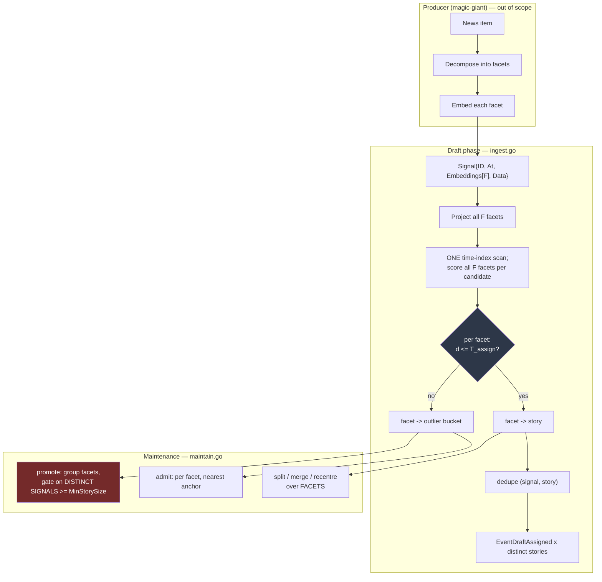

# SDD Spec: Multi-Facet Signals & Many-to-Many Membership

## Metadata
* **Status:** `COMPLETED`
* **Author:** Consigliere
* **Created:** 2026-08-18
* **Last Updated:** 2026-08-18
* **Approver:** Codefather

> **Implemented and approved.** All sixteen tasks are done and verified. One
> Phase 4 item is closed as a known limitation rather than as a pass: the change
> is benchmarked only against `MemStore`, whose scan sorts the whole key space,
> so the ingest budget in §2.4 is unmeasured on a production store. See
> [`performance.md`](performance.md).

---

## Phase 1: Proposal (Rough Idea)

### 1.1 Problem Statement

A signal carries exactly one embedding, and a signal belongs to exactly one
story. Both assumptions fail on real input.

**One vector cannot hold two meanings.** The producer collapses everything it
knows about an item into a single string and embeds it once. In `magic-giant`
this is `synthesizeContext` (`internal/worker/worker.go:236`): title, body, and
one insight per attached image, concatenated, then handed to a single
`GenerateEmbedding` call. An item whose text covers one subject and whose chart
image covers another produces the *mean* of two directions. That mean sits
between both story centroids and inside neither: it clears no story's
`calcThreshold` radius and lands in the outlier bucket.

Centred space sharpens the failure rather than softening it. `MeanRemoval`
(`points.go:27`) subtracts the corpus mean before any comparison. An averaged
vector already has depressed projection onto each of its parent directions;
removing the shared component removes more of what little agreement remained.
The item is not merely mis-assigned — it is unassignable, and every threshold
in `threshold.go` is powerless because the information was destroyed upstream
of the comparison.

**One story cannot hold a signal that means two things.** Even given a vector
that did preserve both meanings, the store forbids the outcome. Assignment is
argmin over centroids with a single winner, in the Draft phase
(`ingest.go:192`) and in batch admission (`maintain.go:133`) alike. The location
index encodes one destination per signal —
`keys.EncodeSignalLoc(storyID, isOutlier)` (`internal/keys/keys.go:168`) — and
the signal's payload lives under exactly one story prefix,
`s:{storyID}:s:{signalID}`. Multi-membership is not expressible.

The cost of doing nothing is measured in orphans. Signals with genuinely
composite meaning accumulate in the outlier bucket, fail promotion because they
do not resemble each other either, and are deleted at `OutlierTTL`. The
downstream consumer never sees them, and the stories they belonged to are
narrated from partial evidence.

### 1.2 Proposed Solution

Split the atom. A signal stops being one point and becomes a **bag of facets**,
each facet one embedding vector over the same dimensionality.

Two units, cleanly separated:

* A **facet** is the unit of *assignment and geometry*. It is compared to story
  centroids, it is admitted or held as an outlier, it contributes to a
  centroid, a radius, and a σ. A facet belongs to **exactly one** story, or to
  none.
* A **signal** is the unit of *identity and membership*. It belongs to the
  union of the stories its facets landed in — therefore to zero, one, or many.

Assignment logic itself does not change. Every existing rule — nearest
centroid, adaptive threshold, promotion by growth, admission, split, merge,
hysteresis — applies to a facet exactly as it applies to a signal today. The
work is not in the decision; it is in the aggregation underneath it and the
schema underneath that.

**The library never invents, merges, or collapses facets.** How an item is
decomposed is the producer's judgment: `magic-giant` knows that text and image
insight are different evidence and can say so, and it may equally decide an
item is one facet. `streaming-story` receives a bag of vectors and treats each
as given. A one-facet signal must behave identically to a signal under spec
006, and that identity is a test obligation (§3.1), not an aspiration.

### 1.3 Scope & Requirements

* **In Scope:**
  * `Signal.Embedding []float32` becomes `Signal.Embeddings []Embedding`, over a new
    `Embedding = []float32` alias. Breaking.
  * `Ingest` returns the set of stories a signal's facets landed in.
  * Facet-granular key schema: canonical signal record, facet membership
    entries, facet-granular outlier bucket, set-valued location index.
  * All geometry — centroid, recent centroid, radius, σ, mean distance, corpus
    mean, σ_global — computed over facets.
  * `MinStorySize` counts **distinct signals**, not facets, everywhere it gates
    a decision.
  * Facet-granular promotion, admission, split, merge, retire, and eviction.
  * Per-`(signal, story)` event de-duplication.
  * Read API traversing membership in both directions, at identity level
    (`StoriesOf`, `SignalsOf`) and at facet level (`FacetsOfSignal`,
    `FacetsOfStory`); `SignalsOf` de-duplicated.
  * `Signals()` whole-corpus iterator: a lossless dump for re-ingestion.
  * Deterministic story-ID derivation extended to facet identity.

* **Out of Scope:**
  * **How facets are produced.** Decomposition strategy, prompt design, and
    facet count policy belong to `magic-giant` and warrant their own spec
    there. This document specifies only the contract.
  * **Facet collapsing inside the library.** Deliberately excluded — see §2.6.
  * **In-place store migration.** Existing stores are rebuilt by replay; see §2.5.
  * **Any change to assignment or threshold policy.** `threshold.go` is
    untouched. If orphan rate is still unacceptable after this lands, that is a
    separate spec.
  * The missing `Outliers()` iterator that `query.go:88` already documents.
    Pre-existing gap, unrelated to this work.

---

## Phase 2: System Design (SDD)

### 2.1 Architecture & Components

The change is a widening, not a redirection. Every arrow that carried one
vector now carries `F` of them; every decision node is unchanged.



**Package responsibilities are unchanged.** `internal/dist` and `internal/geom`
already operate on bare vectors and need no edit at all. `internal/cluster`
gains facet identity on its `Point` and a distinct-signal reading of `MinSize`.
`internal/keys` absorbs the schema change. The root package carries the rest.

### 2.2 Data Structures & Interfaces

#### 2.2.1 The invariants

These five statements are the whole design. Everything below is mechanism.

1. **A facet belongs to at most one story.** Assignment is still argmin.
2. **A signal belongs to the union of its facets' stories** — zero, one, or many.
3. **Geometry is over facets. Each facet is counted exactly once.**
4. **`MinStorySize` counts distinct signals.**
5. **The library never creates, reorders, merges, or drops a facet** of its
   own accord. It drops one only where the producer withdraws it, by
   re-delivering the signal with fewer facets (see *Re-ingest* below).

Invariant 3 has a consequence worth stating out loud, because it is the one
place a reader may expect otherwise. When two stories merge, a signal that held
a facet in each now holds two facets in the survivor. Both facets remain, and
both contribute to the survivor's centroid. That signal therefore carries twice
the geometric weight of a single-facet member of the same story. This is
intended: the item genuinely produced two pieces of evidence pointing there, and
the alternative — silently dropping one — would discard evidence to flatter a
weighting intuition. Facets are the atoms; no atom is ever counted twice, and
none is ever counted zero times.

#### 2.2.2 Public types

```go
// Embedding is one facet's vector. It is an alias rather than a defined type:
// every vector in this library and in its callers is already []float32, and a
// defined type would force a conversion at each of those boundaries while
// adding nothing a conversion could catch. The alias names the concept —
// [][]float32 does not say what its outer dimension means — and stays freely
// interchangeable with []float32, so internal/geom, internal/dist, and
// internal/cluster need no edit to accept one.
type Embedding = []float32

// Signal is the atomic unit of input.
type Signal[T any] struct {
    ID uuid.UUID
    At time.Time

    // Embeddings holds one Embedding per facet: the semantically distinct
    // components the producer extracted from this item. Every facet must
    // share the dimensionality established by the first ingested signal.
    //
    // Order is significant and stable: facet i is Embeddings[i], and that
    // index is the facet's persistent identity in the store. A producer that
    // re-ingests an item must emit its facets in the same order, or the
    // re-ingested facets are different facets.
    //
    // At least one facet is required. A single-facet signal behaves exactly
    // as a signal did before this spec.
    Embeddings []Embedding

    Data T
}
```

`Ingest` returns the distinct stories the signal's facets reached:

```go
// Ingest processes a signal and returns the provisional story IDs its facets
// were assigned to, sorted, de-duplicated, and empty when every facet went to
// the outlier bucket.
func (t *Tracker[T]) Ingest(ctx context.Context, sig Signal[T]) ([]uuid.UUID, error)
```

#### 2.2.3 Read API: both directions of membership

Membership is now a many-to-many relation, so the read API must traverse it
from either end. It does so at two levels of detail, and the levels are
deliberately separate: most callers want identity — *which stories is this item
in?* — and a minority want the evidence — *which part of it put it there?*
Folding the second into the first would make every caller pay for facet detail
it does not read.

```go
// Placement is one facet's membership: the atom of the many-to-many relation.
// StoryID is uuid.Nil for a facet still in the outlier bucket.
type Placement struct {
    SignalID uuid.UUID
    Facet    int
    StoryID  uuid.UUID
}
```

**Signal → stories.**

```go
// StoriesOf returns the stories signalID currently has at least one facet in,
// sorted and de-duplicated. An empty slice means every facet is an outlier or
// the signal is unknown; use Signal to distinguish the two.
func (t *Tracker[T]) StoriesOf(signalID uuid.UUID) ([]uuid.UUID, error)

// FacetsOfSignal returns one Placement per facet of signalID, in facet order,
// including facets still held as outliers. It is the detailed form of
// StoriesOf: it reports not just which stories claimed the signal but which of
// its facets each story claimed, and which facets nothing claimed at all.
func (t *Tracker[T]) FacetsOfSignal(signalID uuid.UUID) ([]Placement, error)
```

**Story → signals.**

```go
// SignalsOf yields each member signal exactly once, however many facets it
// contributed to the story. Signature unchanged from spec 006.
func (t *Tracker[T]) SignalsOf(storyID uuid.UUID) iter.Seq2[Signal[T], error]

// FacetsOfStory yields one Placement per facet the story holds, ordered by
// (signal, facet). A signal contributing two facets appears twice — which is
// the point: this is the view that shows a story's true geometric membership,
// the same set the centroid and radius are computed over.
func (t *Tracker[T]) FacetsOfStory(storyID uuid.UUID) iter.Seq2[Placement, error]
```

**Unchanged in signature, changed in mechanism.**

```go
// Signal reads the canonical record directly. It no longer consults the
// location index, and no longer needs to: the record exists independently of
// where its facets live.
func (t *Tracker[T]) Signal(id uuid.UUID) (Signal[T], error)
```

`Signal()`'s pre-spec doc comment — "wherever it currently lives: attached to a
story or held in the outlier bucket" — is deleted. With facets in several
places at once the question has no single answer. `StoriesOf` answers it at
identity level and `FacetsOfSignal` at facet level.

The two directions are not symmetric in cost, and cannot be made so. Signal →
stories is a single `Get` on `l:{signalID}`, because the location index *is*
that direction materialised. Story → signals is a prefix scan of
`s:{storyID}:f:`, with one `Get` on `g:{signalID}` per distinct signal for
`SignalsOf`; `FacetsOfStory` needs no payload read at all and is pure scan. See
§2.4 for what this costs relative to today.

`FacetsOfStory` exists partly for the invariant tests: it is the only API that
exposes the facet multiset a story's geometry is actually computed over, which
is what a test asserting invariant 3 needs to see.

**Whole-corpus enumeration.**

```go
// Signals yields every signal in the store exactly once, in signal-ID order,
// independently of where — or whether — its facets are placed. Members,
// partially placed signals, and signals whose every facet is still an outlier
// all appear; a signal appears once regardless of facet count.
//
// The yielded value is complete: ID, At, Embeddings, and Data are the same
// values that were ingested. Signals is therefore a lossless dump, and
// replaying it through Ingest against a fresh store is a full rebuild that
// needs no access to the original source and no re-embedding.
func (t *Tracker[T]) Signals() iter.Seq2[Signal[T], error]
```

This is the read the canonical record was already going to make possible, and
it is worth naming as a first-class capability rather than leaving callers to
discover it. Under the pre-spec schema no such iterator could exist honestly: a
signal's payload lived under its owning story, so enumerating signals meant
walking every story prefix plus the outlier bucket and hoping the union was
complete. With `g:{signalID}` the dump is one prefix scan over the authoritative
copy, and the lifetime rule (§2.3.1) is what guarantees the scan is neither
missing a live signal nor yielding a dead one.

`Signals()` is the mechanism §2.5 relies on. See there for which kinds of
rebuild it does and does not cover.

#### 2.2.4 Internal types

`batchSignal` becomes `batchFacet`, the unit collected for a run:

```go
// batchFacet is one facet of one collected signal. Its embedding is in centred
// space from the moment collection finishes; the stored copy stays raw.
type batchFacet struct {
    sig     uuid.UUID // owning signal
    facet   int       // index into Signal.Embeddings
    at      time.Time // the owning signal's timestamp
    emb     Embedding
    storyID uuid.UUID // uuid.Nil for an unplaced facet
    outlier bool
}
```

`cluster.Point` gains facet identity. `ID` keeps its present meaning — the
signal — so that counting distinct signals is a matter of counting distinct
`ID`s:

```go
type Point struct {
    ID    uuid.UUID // the signal that owns this facet
    Facet int       // facet index within that signal
    At    time.Time
    Vec   []float32 // story.Embedding is unnameable here: root imports cluster
}
```

Deterministic ordering and tie-breaking sort by `(ID, Facet)`. `Params.MinSize`
is redefined in place: *the number of **distinct `Point.ID`s** a group needs to
exist, and which each side of a split needs to be worth cutting.* This affects
`Grow` and `Split`. `Cliques` is **not** touched: it groups whole stories, takes
a bare `minSize` with no `Point` in sight, and is called only by `PlanMerges`
with a hardcoded 2. The distinct-signal rule is the single edit that
satisfies invariant 4.

Two size gates deliberately stay in facet terms. `Grow`'s opening `n <
p.MinSize` is a cheap conservative pre-gate — distinct signals never exceed
facet count. `Split`'s `len(pts) < 2*p.MinSize` must stay a facet count: each
side needs `MinSize` distinct signals and so at least that many facets, but the
*total* distinct-signal count can be far lower, because one signal may put
facets on both sides. Gating that on distinct IDs would reject exactly the
splits that create multi-membership. Without it a three-facet item promotes itself into a
private story of one — the most likely and least visible bug in this change.

#### 2.2.5 Configuration

One new knob:

```go
// MaxFacetsPerSignal bounds the facets one signal may carry. Ingest cost is
// linear in facet count and the key schema encodes the index in four digits,
// so the bound is real rather than defensive. Ingest returns ErrTooManyFacets
// above it. Default 8; must be in [1, 9999].
MaxFacetsPerSignal int
```

New sentinel error:

```go
// ErrTooManyFacets is returned by Ingest when a signal carries more facets
// than Config.MaxFacetsPerSignal permits.
var ErrTooManyFacets = errors.New("story: too many facets")
```

`ErrDimensionMismatch` widens to cover a signal whose facets disagree with each
other, not only one that disagrees with the corpus. No other knob changes
meaning — but see §2.5 on why their *values* no longer mean what they did.

### 2.3 Protocol / API Changes

#### 2.3.1 Key schema

Today the signal payload lives under its owning story, `s:{storyID}:s:{signalID}`.
Many-to-many would copy that payload once per story — and in `magic-giant` the
payload is `StoredNewsItem`, carrying full article text and stored images.
Duplicating it per membership is the wrong trade. The payload is therefore
lifted into a canonical record and membership becomes thin index entries.

```
  c:state                              — calibration state                          (unchanged)
  s:{storyID}:m                        — story metadata                             (unchanged)
  s:{storyID}:f:{signalID}:{facet}     — facet membership marker                    (NEW)
  g:{signalID}                          — canonical signal record, one copy          (NEW)
  o:{signalID}:{facet}                 — unplaced facet marker                       (was o:{signalID}, held payload)
  l:{signalID}                         — location index: per-facet placement         (value shape changed)
  t:{unix_sec}:{storyID}               — story time index                            (unchanged)
```

* `{facet}` is zero-padded to four digits (`%04d`) so facet keys of one signal
  sort in facet order, matching the 9999 ceiling on `MaxFacetsPerSignal`.
* Membership and outlier entries carry no payload; both use the single-byte
  sentinel the `Store` contract already requires for the time index.
* `g:{signalID}` holds the codec-encoded `Signal[T]`, including every facet
  vector, written once on first ingest and never rewritten.
* The old `s:{storyID}:s:{signalID}` form is retired. `SignalPrefix` and
  `ParseSignal` are replaced by facet-prefix equivalents; `ParseStoryIDFromSignal`
  and `ParseSignalIDFromLoc` are re-pointed at the new shapes.

`l:{signalID}` becomes set-valued — a JSON array indexed by facet, each element
either `"s:{storyID}"` or `"o"`:

```json
["s:2f1c…", "o", "s:9ab4…"]
```

It remains a derived index, rebuildable in full from the `s:*:f:*` and `o:*`
spaces, exactly as it is today. `EncodeSignalLoc` / `ParseSignalLoc` change
shape accordingly.

**Lifetime rule.** `g:{signalID}` is deleted only when the signal has no
remaining facet anywhere — no membership marker under any story, no entry in
the outlier bucket. A signal with one facet promoted and one facet evicted at
`OutlierTTL` keeps its record.

#### 2.3.2 Draft phase

`findNearestStory` becomes `findNearestStories`, scoring every facet inside the
single existing `ScanRange` walk of the time index. The scan is the expensive
part and must not be repeated per facet — that is the difference between `O(S)`
and `O(F·S)` store reads on the hot path, for no gain.

Per facet, the existing rule stands verbatim: nearest eligible story, admitted
when `d <= calcThreshold(story)`, outlier otherwise.

**Re-ingest.** Today re-ingesting a signal that already belongs to a story is a
strict no-op, because batch placements are authoritative; a signal sitting in
the outlier bucket is re-assigned. That rule lifts to the signal level: **if any
facet is currently placed in a story, the whole signal is a no-op.** Only a
signal whose every facet is unplaced is re-assigned. Choosing signal-level over
facet-level here keeps the guarantee that a batch decision is never partially
overwritten by a late duplicate delivery.

**Shrinking re-delivery.** A signal's facet set is otherwise fixed at first
ingest: the canonical record is written once, and a facet index in a marker key
is only meaningful against it. The exception is a re-delivery carrying *fewer*
facets, which withdraws the ones past its end. That withdrawal is applied ahead
of the no-op rule above — a signal whose facets are already placed is precisely
the case that needs it — and it removes every trace in the same transaction: the
membership or outlier markers, their entries in the location index, and their
vectors in the record. Only the embeddings are truncated; `At` and `Data` keep
their stored values, so the payload stays write-once and a late duplicate still
cannot overwrite what a batch run clustered.

Truncating the location index alone is not enough, and was the original defect:
the index is derived state, so markers left behind by a shorter index are
resolvable by nothing and reachable by no eviction, and they outlive the record
itself. Eviction and the canonical-record GC therefore read the **markers** as
authoritative and treat the index purely as a cache.

A re-delivery carrying *more* facets than the record is not a growth path: the
extra facets are ignored while any facet is placed, per the no-op rule. Growing
a signal's facet set is out of scope here.

**`LastSignalAt`** advances once per touched story, monotonically, as today —
several facets landing in one story advance it once.

**Events.** `EventDraftAssigned` is emitted once per distinct `(signal, story)`
pair. Three facets into one story is one event: it is still one signal joining
one story, and `magic-giant`'s analysis engine must not see it three times.
`EventSignalReassigned` follows the identical rule in the batch path.

#### 2.3.3 Maintenance phase

Every step keeps its present rule and changes only what it iterates over.

| Step | Change |
| :--- | :--- |
| `collectBatch` | Scans `s:{id}:f:` per story and `o:` for unplaced facets; decodes each canonical `g:` record once and slices out the referenced vector. |
| Eviction | `OutlierTTL` is a property of the signal's timestamp, so all unplaced facets of an aged signal are evicted together. `g:` is deleted only under the lifetime rule (§2.3.1). |
| `promoteOutliers` | Groups facets. Gates on **distinct signals** ≥ `MinStorySize`. |
| `admitOutliers` | Per facet, unchanged. Anchors and thresholds are still computed once from pre-admission membership, so admission still cannot chain. |
| `splitStory` | Partitions the story's facet set. Two facets of one signal landing on opposite sides put that signal in both children — this is where multi-membership is *created*, and it requires no special code beyond not de-duplicating before the cut. |
| `planMerges` / `migrateSignals` | Migrates facet markers. Two facets of one signal converging in the survivor cannot collide: the key carries the facet index. |
| `recentreStory` | Over facets. |
| Retire | When the story's facet set empties. |

`deriveStoryID` must fold facet index into the derived name alongside the
signal UUID, sorting by `(ID, Facet)`. Without it, two different facet sets
drawn from the same set of signals derive the same story ID — and the salting
loop would then quietly paper over a genuine collision as if it were an
ordinary one.

`BatchSummary` counters keep their names and switch to counting facets, except
`StoriesCreated`, `StoriesMerged`, `StoriesSplit`, and `StoriesRetired`, which
are already story-scoped. The distinction is documented on the type.

### 2.4 Real-Time & Resource Impacts

Let `F` be the mean facet count per signal. `F = 1` reproduces spec 006 exactly,
in behavior and in cost.

**Ingest latency.** One store scan, unchanged — the time-index walk is still
driven by candidate story count, not by facets. Cosine work rises to `F` per
candidate story. At 3072 dimensions and the expected `F` of 2–3 this is the
dominant CPU term of the call and rises proportionally. Allocation rises by `F`
projected vectors per ingest. Budget: **ingest wall time must stay within
1.5× the `F = 1` baseline at `F = 3`**, verified by `bench_test.go`.

> **Measured: the budget is missed at `F = 1` already (+58%), and the cause is
> the test store rather than the design.** `MemStore` sorts its entire key space
> on every scan, and the schema adds one key per signal (+48.9% on the benchmark
> fixture), which predicts the slowdown to within a few percent. bbolt seeks
> instead of sorting and does not pay it. The consequence is that this change is
> **unbenchmarked on a production store** — see
> [`performance.md`](performance.md).

**Batch cost.** Collected point count rises to `F·N`. Most of the pass is
linear in that. The exception is `cluster.TwoMedoids`, which is `O(n²)` in the
size of the story being split — so split cost on a given story rises by `F²`.
On the reference corpus, stories are tens of members; at `F = 3` this is
hundreds of pairs and remains negligible. It becomes the first thing to measure
if story sizes grow by an order of magnitude, and it is the reason
`MaxFacetsPerSignal` exists.

**Storage.** Expected to *fall* relative to a naive many-to-many, and to sit
close to today's for `F = 1`: the payload — the large part, article text and
stored images — is stored once at `g:` instead of once per owning story, and
membership costs one empty-valued key per facet. Facet vectors add `F` vectors
per signal where there was one, which is genuine new cost and is the price of
the feature.

**Read cost.** The direction a query runs now matters.

| Query | Cost |
| :--- | :--- |
| `StoriesOf`, `FacetsOfSignal` | One `Get` on `l:{signalID}`. `O(1)`. |
| `FacetsOfStory` | One prefix scan of `s:{storyID}:f:`. No payload decode. |
| `SignalsOf` | That scan, plus one `Get` on `g:` per **distinct** signal. |
| `Signals()` | One prefix scan of `g:`. |

`SignalsOf` is the one regression: it was a single prefix scan returning
payloads inline, and becomes a scan plus a random `Get` per member. That is the
price of storing the payload once rather than once per membership, and it buys
`Signals()` and the dump path in §2.5. On bbolt a `Get` is a B+tree descent
against a memory-mapped page, and story membership is tens to low hundreds, so
the added cost is small and bounded by story size — but it is a real change in
shape, from sequential to random, and should not be discovered later by someone
profiling the inspection UI.

**No pre-change benchmark baseline exists** — the open item carried over from
spec 006. Capturing one on `main` before the first commit of this work is
Task 0 of the implementation plan, not an afterthought. `SignalsOf` belongs in
that baseline for the reason above.

### 2.5 Migration & Recalibration

**There is no in-place migration.** The signal payload moves out from under the
story prefix, the outlier bucket re-keys, and the location index changes value
shape. A converter is possible but would be written once, run once, and then be
dead code carrying the old schema in its head — and it could not do the part
that actually matters.

That part is calibration. `corpusMeanOf` (`points.go:48`) now averages facets
rather than signals, which moves the corpus mean; σ_global is measured against
that mean, and every adaptive radius in `threshold.go` is a multiple of
σ_global. `AssignThreshold`, `MergeThreshold`, `SplitThreshold`,
`InitialSigmaGlobal`, and `SigmaFloor` therefore no longer mean what their
current values were tuned to mean — even at `F = 1`, because facet-space and
signal-space coincide there only when every signal has exactly one facet, which
is precisely the case the feature exists to leave behind.

The honest path is a rebuild: replay signals through `Ingest` against a fresh
store, then re-derive the thresholds from the reference corpus. Story IDs are a
deterministic function of the input stream (`deriveStoryID`), so a replay of
unchanged input reproduces the same IDs — which is what makes a rebuild
tolerable rather than a data loss event.

Where the replay input comes from depends on which rebuild is being run, and
the two cases are not equally cheap.

**Rebuilds after this spec lands** are served by `Signals()` (§2.2.3): dump the
canonical records, drop the store, replay the dump. Embeddings are carried in
the dump, so no producer is involved, no LLM is called, and nothing costs money.
This covers every future threshold re-tune and every subsequent schema change —
which is the recurring case, and the reason `Signals()` is specified here rather
than left for a caller to improvise.

**The 006 → 007 migration itself cannot use it.** A `Signals()` dump can only be
taken from a store already in the new schema, and the store being migrated is by
definition in the old one. That one-time migration must be driven from the
producer's own retained source — `magic-giant` holds its items in the durable
ingest queue — and if real multi-facet decomposition is being adopted at the
same time, the producer must re-embed regardless, because the facet vectors it
will now emit have never existed in any store. The one-time cost is real. It is
paid once, and `Signals()` is what stops it from being paid again.

Re-tuning against `testdata/corpus_embeddings.txt` was treated as a gating
task, and it was run: see [`calibration.md`](calibration.md).

**The measurement did not support the argument above.** σ_global measures
0.2559 at `F = 1` against a 0.25 default, and the `F = 1` clustering is
identical to spec 006, so every threshold was left unchanged. The reasoning
holds in principle — averaging facets does move the corpus mean — but at
`F = 1` facet space and signal space are the same space, and no corpus
decomposed by a real extractor exists yet to measure the effect at `F > 1`.
Re-tuning therefore remains open, blocked on `magic-giant`'s facet extraction
rather than on this change.

### 2.6 Why the Library Does Not Collapse Facets

A tempting addition: when two facets of one signal sit close together, merge
them, on the grounds that the producer over-decomposed. It is deliberately
excluded, for a reason stronger than scope.

Collapsing requires a distance, and every distance here is measured in centred
space against the corpus mean. At ingest that mean may not exist yet — `t.mean`
is empty until the first batch run measures one (`record.go`, `calibState.Mean`),
so `Projector.Project` is the identity for the opening window of a fresh store.
A collapse decided at ingest and a collapse decided during maintenance would
therefore disagree on the same input, and the disagreement would be a function
of *when* the signal arrived. That breaks the property spec 006 was built to
guarantee and `deriveStoryID` exists to express: a re-run over unchanged data
changes nothing.

The producer has no such problem. It decides facet count from the item's own
structure — text is one thing, an image insight is another — with no dependence
on corpus geometry, no dependence on arrival time, and full knowledge of what
the item actually is. Facet count is an editorial judgment, and this library is
not the editor.

### 2.7 Alternatives Considered

**Improve the distance function instead** (asymmetric containment: score
whether a signal's vector *contains* a story's direction rather than sits near
its centroid). Requires no schema change and no producer change. Rejected: it
cannot recover information the averaging already destroyed, and every vector
has non-zero projection on every direction, so the false-positive rate is
governed by a threshold with no principled setting. It would trade orphans for
stories that bleed into each other — a worse failure, because it is invisible.

**Keep single membership, adjudicate orphans with an LLM.** Cheap, targeted,
and reuses machinery `magic-giant` already has in `internal/analysis`.
Rejected as the primary fix for the same reason: with one owner per signal, a
genuinely two-subject item is still forced into one story or left out. It
remains available as a *later* refinement on top of this design, where its
verdict has somewhere to be recorded.

**Primary story plus weak secondary links.** Keeps the existing geometry
untouched and records extra stories in a side index. Rejected: the diluted
vector still pollutes the primary story's centroid, which is the failure this
spec exists to remove.

---

## Phase 3: Implementation Plan (IP)

The ordering is governed by one rule: **the tree builds and the suite passes
after every task.** No task may leave the repository in a state where `go test
./...` is expected to fail, because a broken intermediate makes every later
failure ambiguous.

Tasks 1–2 are pure packages that land without touching the root. Task 3 is the
mechanical API break, behaviour-preserving. Tasks 4–5 move the schema while
still storing one facet per signal. Only Task 6 makes `F > 1` mean anything.
That sequencing is deliberate: it puts the two riskiest changes — the schema
and the semantics — in different commits, so a corpus regression can be
attributed to one or the other.

No project tooling exists (`AGENTS.md`: "No Makefile or custom tooling exists
yet"), so verification is plain `go`. `go vet ./...` and `go build ./...` are
implied after every task and are not repeated per line.

### 3.1 Task Breakdown

- [x] **Task 0:** Capture the missing benchmark baseline on `main`
  - Record `BenchmarkBatch`, `BenchmarkIngestSteadyState`,
    `BenchmarkIngestDuringApply`, and a `SignalsOf` benchmark added for the
    read-shape change in §2.4. This is spec 006's open item; without it the
    `1.5×` ingest budget and the `SignalsOf` regression are unmeasurable.
  - **Files:** `bench_test.go`, `spec/007_multi_facet_signals/baseline.txt`
  - **Verification:** `go test -bench . -benchmem -count 10 -timeout 30m . > spec/007_multi_facet_signals/baseline.txt`
  - **Done.** All four benchmarks × 10 runs captured. Capturing the baseline
    exposed a latent deadlock in `BenchmarkIngestDuringApply`: it set
    `applyInProgress` and pushed into `ingestBuffer` with no drainer, so past
    `IngestBufferCap` sends it blocked forever. It had never been run at
    `-count 10`, so it had never reached the cap. Fixed by draining the channel
    for the benchmark's duration, which is what the batch goroutine does in
    production; the benchmark now completes 4.2M iterations where it used to
    hang at 1M.

- [x] **Task 1:** `internal/cluster` — facet identity and distinct-signal `MinSize`
  - Add `Point.Facet int`. Sort and tie-break by `(ID, Facet)` everywhere
    `ID` alone is used today. Redefine `Params.MinSize` as a count of
    **distinct `Point.ID`s** in `Grow` and `Split` (`Cliques` is story-level,
    takes no `Point`, and is untouched).
  - Source-compatible with the root package: `clusterPoints`
    (`points.go:67`) constructs `Point` with named fields, so the new field
    defaults to zero and root behaviour is unchanged at `F = 1`.
  - Unit tests must cover the distinct-signal rule directly — three points
    sharing one `ID` must not satisfy `MinSize` 3.
  - **Files:** `internal/cluster/cluster.go`, `internal/cluster/cluster_test.go`
  - **Verification:** `go test ./internal/cluster/... && go test ./...`

- [x] **Task 2:** `internal/keys` — the new schema, added alongside the old
  - Add `CanonicalSignal`, `FacetMember`, `FacetPrefix`, `OutlierFacet`, their
    parsers, and the set-valued `EncodeSignalLoc` / `ParseSignalLoc`. Leave the
    existing functions in place; Task 5 removes them once nothing calls them.
  - Facet index is `%04d` zero-padded so a signal's facet keys sort in facet
    order. Parser tests must cover the padding boundary and reject malformed
    input rather than returning a zero-valued facet.
  - **Files:** `internal/keys/keys.go`, `internal/keys/keys_test.go`
  - **Verification:** `go test ./internal/keys/... && go test ./...`

- [x] **Task 3:** `Embedding` alias and `Signal.Embeddings` — API break, no behaviour change
  - Add `type Embedding = []float32`. Change `Signal.Embedding []float32` to
    `Signal.Embeddings []Embedding`. Update every call site to read
    `Embeddings[0]`, including `examples/simple`, `examples/iterators`,
    `examples/subscribers`, and the whole test suite.
  - Validate at `Ingest`: at least one facet, every facet non-empty, all facets
    agreeing on dimensionality (`ErrDimensionMismatch` widens to cover
    facet-to-facet disagreement).
  - `Ingest` returns `([]uuid.UUID, error)` — at this task the slice holds zero
    or one ID. Storage and clustering are untouched.
  - Large and mechanical. Behaviour must be bit-identical; this is the task the
    existing suite is best placed to police.
  - **Files:** `types.go`, `ingest.go`, `batch.go`, `points.go`, `query.go`,
    `codec_test.go`, `examples/*/main.go`, all `*_test.go`
  - **Verification:** `go test ./... && go test -run TestStability -v .`

- [x] **Task 4:** Canonical signal record and `Signals()`
  - Write the encoded `Signal[T]` to `g:{signalID}` on first ingest, once,
    never rewritten. Point `Signal()` at it and drop its location-index lookup.
  - Add `Signals() iter.Seq2[Signal[T], error]` over the `g:` prefix.
  - Story membership still writes the payload under `s:{storyID}:s:{signalID}`
    at this task; both copies exist. Task 5 removes the second.
  - **Files:** `record.go`, `query.go`, `ingest.go`, `query_test.go`
  - **Verification:** `go test ./... && go test -run 'TestSignals|TestStability' -v .`

- [x] **Task 5:** Schema cutover — facet membership, facet outliers, set-valued location
  - Replace `s:{storyID}:s:{signalID}` with the payload-free marker
    `s:{storyID}:f:{signalID}:{facet}`. Re-key the outlier bucket to
    `o:{signalID}:{facet}`, payload-free. Make `l:{signalID}` the per-facet
    array of §2.3.1. Apply the lifetime rule: `g:{signalID}` is deleted only
    when the signal has no facet under any story and none in the outlier
    bucket, in the same transaction as the last facet delete.
  - Update `collectBatch`, `moveSignal`, `migrateSignals`, and eviction to the
    new spaces. Still exactly one facet per signal, so clustering results must
    not move.
  - Delete the now-unreferenced key helpers left behind by Task 2.
  - Add the store-invariant test: after a batch run, no `g:` key lacks a
    referencing facet, and no facet marker lacks a `g:` record.
  - **Files:** `internal/keys/keys.go`, `record.go`, `batch.go`, `maintain.go`,
    `ingest.go`, `query.go`, `memstore_test.go`, `maintain_test.go`
  - **Verification:** `go test ./... && go test -run 'TestStability|TestStoreInvariants' -v .`

- [x] **Task 6:** Draft phase — multi-facet assignment and event de-duplication
  - `findNearestStory` becomes `findNearestStories`: one `ScanRange` walk of
    the time index scoring every facet per candidate story. Place each facet
    independently against `calcThreshold`; unplaced facets go to the outlier
    bucket.
  - Signal-level re-ingest no-op: any placed facet makes the whole signal a
    no-op (§2.3.2).
  - `LastSignalAt` advances once per touched story. `EventDraftAssigned` is
    emitted once per distinct `(signal, story)`.
  - `Ingest` now returns the sorted, de-duplicated story set.
  - First task at which `F > 1` does anything. Tests must assert a two-facet
    signal reaching two stories, and one event per story rather than per facet.
  - **Files:** `ingest.go`, `batch.go`, `tracker_behavior_test.go`
  - **Verification:** `go test ./... && go test -run 'TestIngest|TestEvent' -v .`

- [x] **Task 7:** Maintenance phase — facets end to end
  - `batchSignal` becomes `batchFacet` (§2.2.4). Promote, admit, split, merge,
    recentre, retire, and evict over facets. `promoteOutliers` gates on
    distinct signals via Task 1's `MinSize`. `deriveStoryID` folds the facet
    index into the derived name and sorts by `(ID, Facet)`.
  - `EventSignalReassigned` de-duplicated per `(signal, story)`.
  - `BatchSummary` counters switch to counting facets except the four
    story-scoped ones; document the distinction on the type.
  - Split test: two facets of one signal driven to opposite sides must leave
    that signal in both children.
  - **Files:** `maintain.go`, `points.go`, `types.go`, `maintain_test.go`,
    `batch_test.go`
  - **Verification:** `go test ./... && go test -run 'TestMaintain|TestSplit|TestMerge' -v .`

- [x] **Task 8:** Read API — both directions, both levels
  - Add `Placement`, `FacetsOfSignal`, `FacetsOfStory`, `StoriesOf`. De-duplicate
    `SignalsOf`. Delete `Signal()`'s stale "wherever it currently lives" doc.
  - Tests must cover a signal in two stories from both ends, and a partially
    placed signal whose `FacetsOfSignal` reports `uuid.Nil` for the unplaced
    facet.
  - **Files:** `query.go`, `types.go`, `query_test.go`
  - **Verification:** `go test ./... && go test -run 'TestStoriesOf|TestFacetsOf|TestSignalsOf' -v .`

- [x] **Task 9:** Config — `MaxFacetsPerSignal` and `ErrTooManyFacets`
  - Add the knob (default 8, valid `[1, 9999]`), its `validate()` rule, and the
    `Ingest` rejection path.
  - **Files:** `config.go`, `types.go`, `config_test.go`
  - **Verification:** `go test ./... && go test -run TestConfig -v .`

- [x] **Task 10:** Controlling test — backward identity at `F = 1`
  - A corpus replayed at `F = 1` must produce **identical clustering** to spec
    006 on the same input: the same story count holding the same memberships.
    Story IDs are excluded — §2.3.3's facet-aware `deriveStoryID` changes every
    derived ID once, by design (see §3.2 for why that is the requirement that
    wins). Covers most of the ways this change can go wrong silently. The
    spec 006 reference is committed at `testdata/spec006_corpus_snapshot.txt`;
    the corpus loader is gated behind the `CORPUS` env var.
  - **Files:** `stability_test.go`, `testdata/`
  - **Verification:** `CORPUS=testdata/corpus_embeddings.txt REF006=testdata/spec006_corpus_snapshot.txt go test -run TestStability -v .`

- [x] **Task 11:** Controlling test — `Signals()` dump round-trip
  - Dump a settled store through `Signals()`, replay through `Ingest` into a
    fresh store, assert identical story IDs **and identical facet-level
    membership**. Run at `F > 1`: a single-facet round-trip does not exercise
    facet identity at all.
  - Proves §2.5 is a supported path rather than a hopeful paragraph — that the
    canonical record is lossless and no placement lives only in a derived index.
  - **Files:** `stability_test.go`
  - **Verification:** `go test -run TestStability_DumpRoundTrip -v .`

- [x] **Task 12:** Recalibration against the reference corpus
  - Re-measure σ_global over facets. Re-derive `AssignThreshold`,
    `MergeThreshold`, `SplitThreshold`, `InitialSigmaGlobal`, `SigmaFloor`.
    Record before/after orphan rate and largest-story size. Gating, not a
    follow-up (§2.5).
  - **Files:** `config.go`, `spec/007_multi_facet_signals/calibration.md`
  - **Verification:** `CORPUS=testdata/corpus_embeddings.txt go test -run TestCorpusProbe -v .`

- [x] **Task 13:** Performance verification against Task 0
  - Confirm the §2.4 budget: ingest wall time within `1.5×` the `F = 1`
    baseline at `F = 3`. Record the `SignalsOf` scan-to-random-read change.
  - **Files:** `bench_test.go`, `spec/007_multi_facet_signals/baseline.txt`
  - **Verification:** `go test -bench . -benchmem -count 10 . | tee /tmp/after.txt`
    then `go run golang.org/x/perf/cmd/benchstat@latest spec/007_multi_facet_signals/baseline.txt /tmp/after.txt`
    — `go run` rather than an installed binary, since the repo has no tooling
    to install into.

- [x] **Task 14:** Documentation
  - `DESIGN.md` and `README.md` for facets and many-to-many membership;
    `AGENTS.md` package table for the new key spaces.
  - **Files:** `DESIGN.md`, `README.md`, `AGENTS.md`
  - **Verification:** `go build ./... && go vet ./...`

- [x] **Task 15:** `magic-giant` adoption at `F = 1`
  - Adopt the new `Signal` shape and `Ingest` signature. Mechanical, no
    behaviour change: `synthesizeContext` still produces one string, now
    wrapped as a single facet. Facet extraction is a separate spec in that
    repo and is **not** part of this task.
  - **Files:** `magic-giant/internal/worker/worker.go`,
    `magic-giant/internal/worker/worker_test.go`, `magic-giant/go.mod`
  - **Verification:** `cd ../magic-giant && go build ./... && go test ./...`

### 3.2 Risks & Mitigation

| Risk | Detection | Mitigation |
| :--- | :--- | :--- |
| **Self-promoting signal.** A signal with ≥ `MinStorySize` facets founds a story alone. Plausible-looking output, wrong. | Unit test: one 3-facet signal, `MinStorySize` 3, must not promote. | Distinct-signal `MinSize` in `cluster` (§2.2.4) — the single point of enforcement. |
| **Threshold values silently stale.** σ_global is now measured over facets, so every adaptive radius in `threshold.go` shifts under unchanged config. | Orphan rate and largest-story size on the reference corpus move without a code cause. | §2.5 recalibration is a gating task, not a follow-up. Old values must be re-derived, not carried. |
| **Event storms downstream.** Missing de-duplication multiplies `magic-giant` synthesis calls by `F`. | Assert event count per `(signal, story)` in the tracker behavior tests. | §2.3.2 de-duplication rule. |
| **Orphaned canonical records.** `g:` entries surviving every facet's removal; a slow store leak. | A store-invariant test asserting no `g:` key lacks a referencing facet after a batch run. | The lifetime rule in §2.3.1, applied in the same transaction as the last facet delete. |
| **Split determinism lost.** Facet-index tie-breaks omitted, so replay diverges. | The `F = 1` byte-identity test (§3.1) plus a multi-facet replay test. | `(ID, Facet)` ordering everywhere a sort exists today, including `deriveStoryID`. |
| **Lossy dump.** `Signals()` omits a field, or placement survives only in a derived index, so a replayed dump silently reclusters differently. Discovered during a rebuild, when the old store is already gone. | The dump round-trip test (§3.1), run at `F > 1`. | The canonical record is the authoritative copy and carries the whole `Signal[T]`; `l:` stays derived and rebuildable. |
| **Blast radius.** The change touches every root file and the store schema. | — | Land 1 and 2 first as independently reviewable, independently tested pure packages. |

---

## Phase 4: Execution & Verification
- [x] All per-task verification steps pass.
- [x] Linter / vet clean (`go vet ./...`, `gofmt -l .` empty in both repos).
- [x] Unit tests pass.
- [x] Build targets compile.
- [x] Neighbor packages unaffected (`magic-giant` builds and its suite passes).
- [x] `F = 1` replay clusters identically to spec 006 on the reference corpus
      (32 stories, same memberships; story IDs change by design — §3.2).
- [x] `Signals()` dump round-trips to identical story IDs and facet membership,
      verified at `F = 1` and `F = 3`.
- [x] Orphan rate measured on the reference corpus, before and after
      ([`calibration.md`](calibration.md)).
- [ ] **Open: benchmarked only on `MemStore`.** The §2.4 ingest budget is missed
      at `F = 1` (+58%), fully accounted for by `MemStore` sorting its whole key
      space per scan against a schema holding one extra key per signal. bbolt
      seeks and does not pay it, but that has not been measured. See
      [`performance.md`](performance.md).
- [ ] Approved by Codefather.

---

## Phase 5: Completed
- [x] All Phase 4 items `[x]`, except the bbolt benchmark, accepted as a known
      limitation and recorded in [`performance.md`](performance.md).
- [x] No regressions: `F = 1` clustering is identical to spec 006 on the
      reference corpus, and `magic-giant` builds and passes unchanged.
- [x] Spec document reflects the implementation, including the three places the
      design as written did not survive contact: `Cliques` is story-level and
      untouched (§2.2.4), story IDs necessarily change (§3.2), and the
      recalibration §2.5 called mandatory was measured and declined
      ([`calibration.md`](calibration.md)).
- [x] `DESIGN.md`, `README.md`, and `AGENTS.md` updated for facets.
- [x] `spec/README.md` updated to `COMPLETED`.
- [x] Approved by Codefather.

### Follow-up work, not part of this spec

1. **Benchmark on bbolt.** The one open measurement (§2.4, `performance.md`).
2. **Facet extraction in `magic-giant`.** This change makes multi-facet
   clustering possible; nothing produces facets yet, so the orphan rate is
   untouched until that lands. Needs its own spec in that repository.
3. **Orphan-rate evidence.** No corpus decomposed by a real extractor exists, so
   whether facets reduce orphaning is unmeasured (`calibration.md`).
