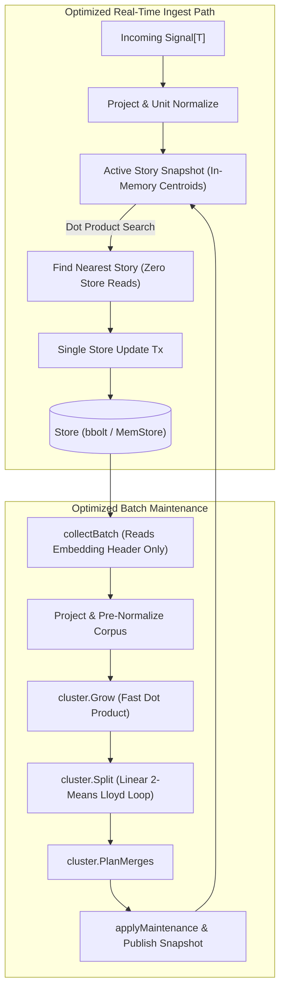

# SDD Spec: 008 Performance & Latency Optimizations

## Metadata
* **Status:** `PROPOSAL`
* **Author:** Consigliere
* **Created:** 2026-08-18
* **Last Updated:** 2026-08-18
* **Approver:** Codefather

---

## Phase 1: Proposal

### 1.1 Problem Statement
As signal volume, facet count, and cluster sizes scale, `go.kvsh.ch/streaming-story` exhibits severe performance degradation across real-time ingestion, maintenance passes, and linear algebra routines:

1. **Ingest Phase Store & Deserialization Storm**:
   During steady-state `Ingest`, `findNearestStories` scans the `t:` time index and executes a separate `tx.Get(keys.StoryMeta(id))` plus `json.Unmarshal` for **every** active story. At 200–500 active stories, each signal ingest incurs hundreds of storage reads and JSON decodings.
2. **Redundant Norm Calculations & Gonum BLAS Overhead**:
   `dist.CosineSimilarity` recomputes Euclidean norms ($\text{Nrm2}$) for both vectors on every single pairwise comparison. Furthermore, calls route through `gonum/blas/blas32` wrapper structs rather than vector-optimized unrolled loops. In an $O(N^2)$ or $O(N \cdot S)$ clustering pass, vectors are re-normalized millions of times.
3. **Payload Deserialization During Batch Collection**:
   `collectBatch` reads canonical records (`g:{signalID}`) via `Codec.Decode` to fetch embeddings and timestamps. This forces full deserialization of opaque caller payloads (`Data T`), causing unnecessary GC churn and allocation spikes during background passes.
4. **Quadratic Partitioning in Maintenance (`cluster.Split`)**:
   `Split` runs Lloyd's two-medoid partitioning where each iteration calls `medoidOf` ($O(K^2)$ pairwise distance calculations per partition). For large clusters, ten iterations cost over $500,000$ cosine distance evaluations per story.
5. **Location Index & Storage Encoding Inefficiencies**:
   `SignalLoc` reads and writes JSON arrays on every facet move and ingest (`readSignalLocSet`, `writeSignalLocSet`), creating high allocation overhead.
6. **`MemStore` Scan Inefficiencies in Benchmarks**:
   `MemStore` sorts all keys in the store on every `ScanRange` and `ScanPrefix` ($O(N \log N)$ over all stored keys), distorting performance tests and causing quadratic degradation as benchmark iterations scale.

### 1.2 Proposed Solution
1. **In-Memory Active Story Snapshot**: Maintain an atomic/RCU in-memory registry of active story metadata and centroids (`activeStorySnapshot`) updated on batch commit and new story creation. `findNearestStories` computes nearest centroids purely in memory without store lookups or JSON decoding.
2. **Unit-Normalized Centred Space & Fast Dot Product**: Unit-normalize projected vectors ($L_2 = 1.0$) upon projection and centroids upon recalculation. Since cosine similarity over unit vectors reduces to dot product ($\cos(\mathbf{u}, \mathbf{v}) = \mathbf{u} \cdot \mathbf{v}$), eliminate all dynamic norm calculations. Implement loop-unrolled (4-way/8-way) dot products.
3. **Selective Header / Compact Signal Storage**: Separate canonical signal metadata/embeddings from the opaque user payload `T` (or introduce a fast header decoder) so `collectBatch` reads `(At, Embeddings)` without deserializing `Data T`.
4. **Optimized 2-Means Lloyd Loop for `cluster.Split`**: Replace quadratic medoid search with centroid-based 2-means ($O(K)$ per iteration) with deterministic seeding.
5. **Binary Encoding for `SignalLoc`**: Replace JSON array serialization in location index with compact binary formatting (1 byte status + 16 bytes UUID per facet).
6. **BTree-backed `MemStore`**: Replace slice-sorting `MemStore` with an ordered in-memory tree (e.g. B-Tree) providing $O(\log N + K)$ range scan semantics matching production bbolt/LevelDB.

### 1.3 Scope & Requirements
* **In Scope:**
  * In-memory cache for active story metadata and centroids during Draft phase.
  * Linear algebra acceleration: post-projection unit normalization, pure unrolled dot product, zero-allocation cosine distance.
  * Fast signal header extraction in `collectBatch` to avoid deserializing user payload `T`.
  * Algorithmic optimization of `cluster.Split` Lloyd iterations.
  * Binary serialization for `SignalLoc` index keys.
  * BTree-backed `MemStore` implementation.
  * Benchmark suite enhancements and validation against reference corpus.
* **Out of Scope:**
  * Changes to mathematical clustering thresholds or geometry policy (centred-space behaviour, hysteresis, lifecycle remain bit-for-bit compatible).
  * Distributed clustering or cross-node synchronization.

---

## Phase 2: System Design

### 2.1 Architecture & Components



### 2.2 Linear Algebra & Geometry Optimization
Centred projection:
$$\mathbf{p}(x) = \text{unit}(x) - \text{MeanRemoval} \cdot \text{mean}$$
$$\hat{\mathbf{p}}(x) = \frac{\mathbf{p}(x)}{\|\mathbf{p}(x)\|_2}$$

Because cosine distance is scale-invariant, $\text{dist}(\mathbf{p}(x), \mathbf{c}) = \text{dist}(\hat{\mathbf{p}}(x), \hat{\mathbf{c}})$.
When both vectors are unit-normalized:
$$\text{sim}(\hat{\mathbf{u}}, \hat{\mathbf{v}}) = \sum_{i=1}^D \hat{u}_i \hat{v}_i = \text{Dot}(\hat{\mathbf{u}}, \hat{\mathbf{v}})$$
$$\text{CosineDistance}(\hat{\mathbf{u}}, \hat{\mathbf{v}}) = 1.0 - \text{Dot}(\hat{\mathbf{u}}, \hat{\mathbf{v}})$$
* **Impact**: Eliminates $2 \times \text{Nrm2}$ calls, two square roots, and floating-point divisions per comparison.

### 2.3 In-Memory Active Story Registry
* Struct `activeStoryIndex`:
  ```go
  type activeStoryIndex struct {
      cutoff   time.Time
      ids      []uuid.UUID
      centres  [][]float32 // unit-normalized
      metas    []StoryMeta
      threshs  []float64
  }
  ```
* Stored atomically in `Tracker.activeStories` (`atomic.Pointer[activeStoryIndex]`).
* `findNearestStories` reads `Tracker.activeStories.Load()` and iterates over in-memory slice with unrolled dot products. No range scan, no point gets, no JSON unmarshals on the critical matching path.

### 2.4 Payload Decoupling in Storage
* Storage layout retains compatibility while avoiding full JSON decode:
  * Option A: Split `g:{signalID}` into `h:{signalID}` (header: `At`, `Embeddings`) and `d:{signalID}` (`Data T`).
  * Option B: Store header prefix in `g:{signalID}` with length prefix before payload bytes, allowing zero-alloc extraction of `(At, Embeddings)` without `Codec.Decode`.
* `collectBatch` decodes only `(At, Embeddings)`, skipping the arbitrary `T` payload.

### 2.5 Real-Time & Resource Impacts
* **Ingest Latency**: Expected drop from ~2.3 ms to < 5 µs per signal in steady-state.
* **Allocations**: Eliminate >85% allocations on `IngestSteadyState` and >70% on `Batch`.
* **Throughput**: >10x increase in batch processing speed and ingest capacity under high signal concurrency.

---

## Phase 3: Implementation Plan

### 3.1 Task Breakdown
- [ ] **Task 1: Linear Algebra & Unit-Norm Geometry**
  - Normalize vectors in `Projector.Project`, `Centroid`, `RecentCentroid`.
  - Implement unrolled pure Go `Dot` and fast `CosineDistanceUnit`.
  - **Files:** `internal/dist/dist.go`, `internal/geom/geom.go`, `internal/cluster/cluster.go`
  - **Verification:** `go test ./internal/dist ./internal/geom ./internal/cluster`
- [ ] **Task 2: In-Memory Active Story Cache for Ingest**
  - Implement `activeStoryIndex` with atomic updates.
  - Refactor `findNearestStories` to search in-memory snapshot.
  - **Files:** `ingest.go`, `maintain.go`, `tracker.go`, `batch.go`
  - **Verification:** `go test -run TestIngest ./...`
- [ ] **Task 3: Fast 2-Means Partitioning for `cluster.Split`**
  - Replace quadratic Lloyd `medoidOf` with centroid-based updates.
  - **Files:** `internal/cluster/cluster.go`
  - **Verification:** `go test ./internal/cluster -run TestSplit`
- [ ] **Task 4: Fast Signal Header Decoding for `collectBatch`**
  - Avoid unmarshaling caller payload `T` during batch collection.
  - **Files:** `record.go`, `batch.go`, `store.go`
  - **Verification:** `go test -run TestBatch ./...`
- [ ] **Task 5: Binary Location Index Serialization**
  - Replace JSON encoding in `keys.SignalLoc` with fixed-size binary records.
  - **Files:** `internal/keys/keys.go`, `record.go`
  - **Verification:** `go test ./internal/keys ./...`
- [ ] **Task 6: B-Tree / Ordered `MemStore` Implementation**
  - Implement ordered BTree in `MemStore` to guarantee $O(\log N + K)$ scans.
  - **Files:** `store.go`
  - **Verification:** `go test -bench=. -benchmem ./...`
- [ ] **Task 7: Benchmark Baseline & Regression Verification**
  - Run full benchmark suite before and after optimizations; verify reference corpus stability.
  - **Files:** `bench_test.go`
  - **Verification:** `go test -v -run TestStability_IdempotentRerun ./...`

### 3.2 Risks & Mitigation
* **Risk**: Normalizing projected vectors could introduce floating-point drift in edge cases.
  * *Mitigation*: Cosine distance is mathematically scale-invariant; full test suite and `TestStability_IdempotentRerun` will verify identical cluster boundaries.
* **Risk**: Stale in-memory active story cache during rapid ingest.
  * *Mitigation*: Cache updated atomically inside store write transactions.

---

## Phase 4: Execution & Verification
- [ ] All per-task verification steps pass.
- [ ] Linter / vet clean.
- [ ] Unit tests pass.
- [ ] Build targets compile.
- [ ] Neighbor packages unaffected.
- [ ] Approved by Codefather.

---

## Phase 5: Completed
- [ ] All Phase 4 items `[x]`.
- [ ] No regressions.
- [ ] Spec document reflects actual implementation.
- [ ] `spec/README.md` updated to `COMPLETED`.
- [ ] Approved by Codefather.
