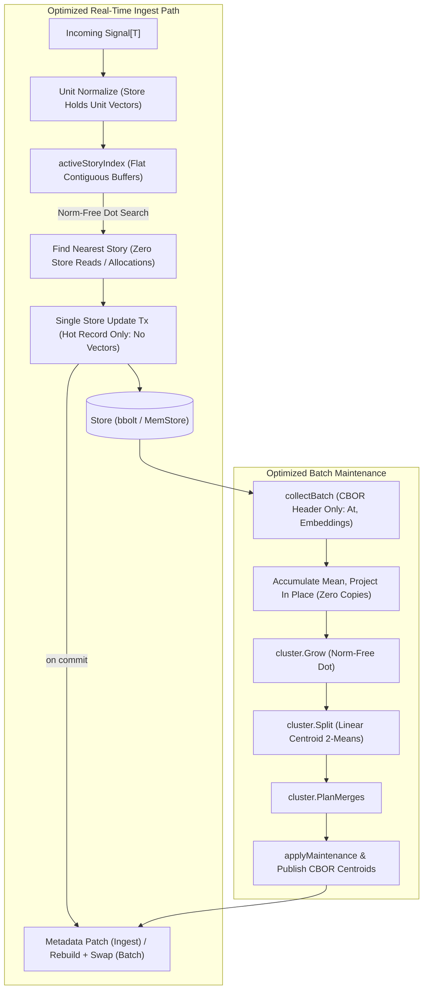

# SDD Spec: 008 Performance & Latency Optimizations

## Metadata
* **Status:** `EXECUTION`
* **Author:** Consigliere
* **Created:** 2026-08-18
* **Last Updated:** 2026-08-20
* **Approver:** Codefather

---

## Phase 1: Proposal (Rough Idea)

### 1.1 Problem Statement
As signal volume, facet count, and story populations scale, `go.kvsh.ch/streaming-story` exhibits severe performance bottlenecks across real-time ingestion, maintenance passes, serialization, and linear algebra routines:

1. **Ingest Phase Store & Deserialization Storm**:
   During steady-state `Ingest`, `findNearestStories` scans the `t:` time index and executes a separate `tx.Get(keys.StoryMeta(id))` plus JSON deserialization for **every** active story ([`ingest.go:284-315`](file:///home/ksharlaimov/dev/kampff-net/streaming-story/ingest.go)). At 200–500 active stories, each signal ingest incurs hundreds of storage lookups and JSON decodings inside the write transaction.
2. **Text-Based JSON Overhead Across Embeddings & Records**:
   JSON serializes 32-bit floating point embeddings (`[]float32`) into bloated ASCII decimal strings (e.g. `"-0.012345678"`), costing 10–15 bytes per float and heavy `strconv.ParseFloat` CPU conversions. Story metadata (`storyRecord`), calibration state (`calibState`), and signal location indexes (`SignalLoc`) all suffer from high JSON allocation and encoding overhead.
3. **Redundant Norm Computation on Every Comparison**:
   `dist.CosineSimilarity` ([`dist.go:16-32`](file:///home/ksharlaimov/dev/kampff-net/streaming-story/internal/dist/dist.go))
   recomputes Euclidean norms ($\text{Nrm2}$) for **both** vectors on every
   pairwise comparison, then divides. In $O(N^2)$ or $O(N \cdot S)$ clustering
   passes, that is millions of redundant norm passes over vectors whose lengths
   never change.

   The cost is asymmetric, and the asymmetry decides what is worth fixing.
   Verified against the pinned dependency (`gonum@v0.17.0`):
   * The **dot product is already vectorized** on `amd64` —
     `internal/asm/f32/dotunitary_amd64.s`, dispatched via
     `internal/asm/f32/stubs_amd64.go:67`. It is not a scalar Go loop.
   * The **norm is not**. `blas32.Nrm2` routes to `f32.L2NormUnitary` in
     `internal/asm/f32/l2norm.go`, a pure Go loop carrying an overflow-safe
     rescaling branch per element — the most expensive path in the function.

   So the win here is **deleting the norms**, not replacing the dot product.
   Two of the three operations per comparison disappear when both vectors are
   known to be unit, and the third is already assembly. A third-party SIMD
   kernel would contest only the operation gonum already vectorizes; it is out
   of scope (§1.3) with the reasoning in §2.4.
4. **Payload Deserialization During Batch Collection**:
   `collectBatch` reads canonical records (`g:{signalID}`) via `Codec.Decode` ([`batch.go:155`](file:///home/ksharlaimov/dev/kampff-net/streaming-story/batch.go)) to fetch embeddings and timestamps. This forces full deserialization of opaque caller payloads (`Data T`), causing unnecessary GC churn and allocation spikes during background passes.
Two further costs were measured against their risk and **deferred to their own
specs**, so this one lands with less behavioral surface:

* **`cluster.Split`'s Lloyd loop.** Each of up to ten iterations calls
  `medoidOf` twice ([`cluster.go:356`](file:///home/ksharlaimov/dev/kampff-net/streaming-story/internal/cluster/cluster.go),
  `cluster.go:397`), each an $O(K^2)$ pass over its part. Replacing it with
  centroid 2-means removes a ~10x constant but not the complexity class — the
  `TwoMedoids` seed (`cluster.go:382`) is $O(K^2)$ and would stay — and it moves
  which partition a borderline point lands in. A behavioral change with its own
  `corpus_probe` and stability cycle, for a constant factor on a function
  guarded by the `MaxAngularSeparation` pre-gate that skips most groups, is the
  worst cost-to-risk ratio in this spec. It goes to its own spec, where the
  profile that justifies it can be presented alongside it.
* **`setFacetLoc`'s quadratic rewrite** of a signal's location set, described in
  §2.2.5.

**Task 1 finding — gonum, re-verified against the pinned `v0.17.0`.** Both
halves of §1.1's premise hold:

* `f32.DotUnitary` ships `amd64` assembly. The declaration is in
  `internal/asm/f32/stubs_amd64.go:67` with the implementation in
  `dotunitary_amd64.s`; the pure Go fallback in `stubs_noasm.go:70` is reached
  only off `amd64`. Nothing this spec does displaces it — `Dot` keeps routing
  through `blas32`, and no SIMD library was added (§2.4).
* `Nrm2` routes to `f32.L2NormUnitary`, which is pure Go in
  `internal/asm/f32/l2norm.go:10`. No build tag, no assembly, no alternative
  implementation.

That asymmetry is the whole result. The dot product was already vectorized and
the two norm passes were not, so removing the norms removed nearly all of the
cost: 4829 ns to 123.5 ns at 1536 dimensions, a factor of 39 rather than the
two-to-three §2.7 expected. gonum stays pinned; a bump that changes either file
invalidates this finding and the number with it.

`MemStore`'s $O(N \log N)$ key sort per scan was considered and dropped from scope: it is test-only infrastructure, and its cost is a constant factor on the benchmark harness rather than on any production path. Benchmarks are read as relative before/after measurements on the same store, never as absolute throughput.

### 1.2 Proposed Solution
1. **Full CBOR Standardization**: Drop legacy JSON database backward compatibility and standardize all serialization on canonical CBOR (`github.com/fxamacker/cbor/v2`), using integer keys (`keyasint`) to match the sibling `magic-giant` repo. Float vectors serialize directly as 4-byte IEEE-754 binary chunks, eliminating decimal-string conversions. `CBORCodec[T]` replaces `JSONCodec[T]`, which is removed rather than demoted. **This is a breaking change to both the on-disk format and the public codec contract, accepted deliberately for the performance it buys** (§2.6).
2. **Unit Embeddings at the Boundary**: `Ingest` unit-normalizes every facet on entry, so the store holds unit vectors and the invariant is a property of the data rather than a discipline every reader must keep. Cosine distance then reduces to one dot product and a subtraction: $\text{dist}(\hat{\mathbf{u}}, \hat{\mathbf{v}}) = 1.0 - \text{Dot}(\hat{\mathbf{u}}, \hat{\mathbf{v}})$. Both norm passes and the division disappear; the dot product keeps using gonum's existing `amd64` assembly. No new dependency and no runtime CPU dispatch, so results are identical on every machine of a given architecture (§2.5). Costs a public promise, declared in §2.6.
3. **In-Memory Story Index**: Maintain an in-memory registry of story metadata and unit-normalized centroids (`activeStoryIndex`) in flat contiguous `[]float32` buffers. `findNearestStories` computes nearest centroids purely in memory without store lookups or deserialization. It **replaces** the existing `draftSnapshot` (`batch.go:349-415`) rather than sitting beside it, so one index answers both the steady-state and apply-window paths under one recency rule.
4. **Payload-Free Header Extraction in `collectBatch`**: Decode into a header struct that declares only the keys the batch needs to extract `(At, Embeddings)`. The payload key is not declared at all, so CBOR skips it without allocating or retaining it.
5. **Collect-Phase Geometry, Computed In Place**: Because stored vectors are unit, the corpus mean accumulates during collection and the projection is a single in-place pass over the collected facets. `corpusMeanOf` and `projectAll` go away, and with them two of the three `dim`-sized allocations each facet costs today.
6. **CBOR Location Index**: Replace the hand-assembled JSON array in location index values (`l:{signalID}`) with a CBOR-encoded `[]FacetLoc`, deleting the bespoke encoder and parser rather than replacing them with a bespoke binary one.

### 1.3 Scope & Requirements
* **In Scope:**
  * Complete migration from JSON to CBOR (`github.com/fxamacker/cbor/v2`) across all internal records and the default public codec (`CBORCodec[T]`), with `keyasint` field numbering.
  * Unit normalization at ingest, making the store's embeddings unit and the invariant structural; `ErrZeroEmbedding` for the one input that cannot satisfy it.
  * Collect-phase mean accumulation and in-place projection, replacing `corpusMeanOf` and `projectAll`.
  * Unit-normalized centroid storage and norm-free distance evaluation through new `*Unit` entry points in `internal/dist`.
  * Split story record: batch-owned geometry (`s:{id}:m`) apart from the small hot record (`s:{id}:h`) the ingest path writes.
  * In-memory index of story metadata and recency centroids, in a contiguous buffer, serving the Draft phase and subsuming `draftSnapshot`.
  * Fast signal header extraction in `collectBatch` skipping caller payload `T`.
  * CBOR serialization for `SignalLoc` index values, replacing the hand-written JSON encoder and parser in `internal/keys`.
  * Full benchmark suite verification across ingest and batch passes.
* **Out of Scope:**
  * `MemStore` internals. Test-only infrastructure; its scan cost is a benchmark constant, not a production path.
  * In-place migration of legacy JSON stores (existing stores are cleanly rebuilt via replay, consistent with Spec 007).
  * **Third-party SIMD vector libraries and hand-written assembly kernels.**
    Deferred, with the reasoning in §2.4: gonum already ships `amd64` assembly
    for the one operation such a kernel would replace, and a second dot-product
    implementation makes clustering results depend on which code path the CPU
    dispatched to. This spec takes the norm-removal win, which is larger and
    costs no portability.
  * CGo or external C/C++ dependencies, under any justification.
  * Distributed clustering or cross-node synchronization.
  * **`cluster.Split`'s partitioning algorithm.** Deferred to its own spec with the reasoning in §1.1.
  * Changing core clustering threshold policies (adaptive assignment, hysteresis, merge admission, lifecycle state machine). Note that §2.5 does change measured geometry as a consequence of unit-norm centroids; that is declared there, not smuggled in here.

---

## Phase 2: System Design (SDD)

### 2.1 Architecture & Components



### 2.2 Data Structures & Interfaces

#### 2.2.1 CBOR Serialization Schema

All structured serialization standardizes on canonical `github.com/fxamacker/cbor/v2`
with **integer keys**, matching `magic-giant`'s convention (`cbor:"N,keyasint"`).
String keys would put a field name beside every float vector in a store whose
whole point is compactness.

**Task 1 findings — verified before any encoding code was written**, and covered
by the three tests in `cbor_test.go`:

* **`uuid.UUID` encodes as a byte string, not a 16-element array.** It is
  `[16]byte` and implements `encoding.BinaryMarshaler`, which cbor honours: the
  encoded form is 17 bytes, `0x50` (major type 2, length 16) followed by the raw
  bytes. No explicit marshaling was needed
  (`TestCBOR_UUIDEncoding`).
* **`TimeRFC3339Nano` round-trips to nanosecond fidelity** through both the
  lenient and the strict decode mode (`TestCBOR_TimeNanosecondRoundTrip`). The
  option is pinned in `mustEncMode` alongside `TimeTag = EncTagNone`; the
  default would have truncated to whole seconds.
* **`ExtraDecErrorUnknownField` behaves as assumed on `keyasint` structs.** A
  value carrying key `2` decodes cleanly under `cborDecMode` and errors under
  `cborStrictDecMode` (`TestCBOR_StrictUnknownField`), which is exactly the
  split the two modes were introduced for.

```go
// Encode and decode options are pinned explicitly. The defaults are wrong for
// this store in one specific way — see the timestamp note below — and a silent
// change of default in a future cbor release must not change what lands on
// disk.
var (
    cborEncMode = mustEncMode()

    // cborDecMode decodes caller-facing values: Signal[T], whose Data field is
    // the caller's own type. Lenient, because a caller that drops a field from
    // T must still be able to read records written before the drop.
    cborDecMode = mustDecMode(cbor.DecOptions{})

    // cborStrictDecMode decodes this library's own records, whose schema only
    // this repo changes. A key the current schema does not know is a downgrade
    // or a corrupt value, and failing loudly beats decoding a partial record.
    cborStrictDecMode = mustDecMode(cbor.DecOptions{
        ExtraReturnErrors: cbor.ExtraDecErrorUnknownField,
    })
)

func mustEncMode() cbor.EncMode {
    opts := cbor.CanonicalEncOptions()
    opts.Time = cbor.TimeRFC3339Nano
    opts.TimeTag = cbor.EncTagNone
    m, err := opts.EncMode()
    if err != nil {
        panic("story: cbor enc mode: " + err.Error())
    }
    return m
}

func mustDecMode(opts cbor.DecOptions) cbor.DecMode {
    m, err := opts.DecMode()
    if err != nil {
        panic("story: cbor dec mode: " + err.Error())
    }
    return m
}
```

##### Timestamps must not be encoded as `TimeUnix`

`cbor.EncOptions` defaults `Time` to `TimeUnix`: **whole seconds, sub-second
precision discarded**. That default is unusable here. Timestamps are not
decoration in this store:

* `LastSignalAt` advances monotonically and only when `sig.At` is strictly
  after it ([`ingest.go:195-198`](file:///home/ksharlaimov/dev/kampff-net/streaming-story/ingest.go)).
  Truncated to seconds, a burst of signals inside one second stops advancing it,
  and out-of-order detection changes meaning.
* `keys.TimeIndex` is already second-granular, but it is derived from the
  stored value; truncating the value as well makes the delete-then-write index
  update in `writeStoryMeta` ([`record.go:106-120`](file:///home/ksharlaimov/dev/kampff-net/streaming-story/record.go))
  compare a truncated new value against an untruncated in-memory old one.
* `geom.Stats.LatestAt`, `earliest()` in `cluster`, and every ordering
  assertion in the test suite compare timestamps for equality.

`TimeRFC3339Nano` is chosen over `TimeUnixDynamic` deliberately: it round-trips
the monotonic-stripped wall clock exactly, and it is what `magic-giant` writes.
The cost is bytes on a handful of scalar fields, not on the vectors. **A
round-trip test asserts nanosecond fidelity** through `storyRecord`,
`storyHot`, `calibState`, and `Signal[T]`; a test that only checks second-granularity
equality does not count.

1. **The story record splits in two** (§2.2.2 explains why). One key holds the
   geometry and is written only by batch maintenance; one holds the small
   mutable fields the ingest path advances:

   ```go
   // storyRecord (s:{storyID}:m) — written only by applyMaintenance.
   // Ingest never writes this key, so no ingest path can zero a centroid.
   type storyRecord struct {
       Centroid           []float32 `cbor:"0,keyasint"`
       RecentCentroid     []float32 `cbor:"1,keyasint,omitempty"`
       Radius             float64   `cbor:"2,keyasint"`
       CreatedAt          time.Time `cbor:"3,keyasint"`
       MeanDistance       float64   `cbor:"4,keyasint,omitempty"`
       Sigma              float64   `cbor:"5,keyasint,omitempty"`
       SignalCount        int       `cbor:"6,keyasint,omitempty"`
       FrozenMeanDistance float64   `cbor:"7,keyasint,omitempty"`
       FrozenSigma        float64   `cbor:"8,keyasint,omitempty"`

       // StatsAt is when the four statistics above were computed. It is what
       // makes reactivation a write to the hot record instead of a rewrite of
       // this one: statistics older than ReactivatedAt are stale by
       // definition, and every reader treats them as absent.
       StatsAt time.Time `cbor:"9,keyasint"`
   }

   // storyHot (s:{storyID}:h) — a few dozen bytes, no vectors, ever.
   // Written by applyMaintenance for lifecycle transitions and by Ingest for
   // the two fields it owns.
   type storyHot struct {
       State         StoryState `cbor:"0,keyasint"`
       LastSignalAt  time.Time  `cbor:"1,keyasint"`
       ReactivatedAt time.Time  `cbor:"2,keyasint,omitempty"`
   }
   ```

   `keys.StoryHot(id)` returns `s:{storyID}:h`, with `keys.ParseStoryHot` beside
   the existing `ParseStoryMeta`. `:h` sorts before `:m` and both sit under the
   existing `s:{storyID}:` prefix, so `StoryPrefix` still covers a whole story
   and the facet keys (`s:{id}:f:…`) are unaffected. Every site that deletes a
   story deletes both keys — `maintain.go:397` and `maintain.go:479`.

   **Cold-start rule, stated once**: story statistics are live when
   `StatsAt.After(ReactivatedAt)`, and absent otherwise. `calcThreshold`
   (`threshold.go:19-45`) applies exactly the test it applies today for
   `SignalCount < ColdStartMinSignals`; it just derives staleness instead of
   reading fields a previous ingest zeroed.
2. **`calibState` (`c:state`)**:
   ```go
   type calibState struct {
       SigmaGlobal float64   `cbor:"0,keyasint"`
       Dim         int       `cbor:"1,keyasint"`
       LastBatchAt time.Time `cbor:"2,keyasint"`
       Mean        []float32 `cbor:"3,keyasint,omitempty"`
   }
   ```
3. **`Signal[T]` — public type, gains CBOR tags.** The header trick in §2.2.4
   reads fields by key, so the keys must exist and must be stable. `Data` keeps
   the caller's own tags on `T`.
   ```go
   type Signal[T any] struct {
       ID         uuid.UUID   `cbor:"0,keyasint"`
       At         time.Time   `cbor:"1,keyasint"`
       Embeddings []Embedding `cbor:"2,keyasint"`
       Data       T           `cbor:"3,keyasint"`
   }
   ```
4. **`CBORCodec[T]` (the shipped `Codec[T]` implementation)**:
   ```go
   type CBORCodec[T any] struct{}

   func (CBORCodec[T]) Encode(sig Signal[T]) ([]byte, error) {
       return cborEncMode.Marshal(sig)
   }

   func (CBORCodec[T]) Decode(b []byte) (Signal[T], error) {
       var sig Signal[T]
       err := cborDecMode.Unmarshal(b, &sig)
       return sig, err
   }
   ```
   `JSONCodec[T]` is **deleted**. Keeping it would leave a second on-disk format
   the library claims to support, a second encoding path for every test to pick
   between, and a standing invitation to write a store this spec's whole premise
   says should not exist. `Codec[T]` remains a public interface, so a caller with
   a genuinely non-CBOR payload writes their own — twelve lines, and their format
   choice is then theirs to own rather than the library's to carry.

##### `uuid.UUID` encoding is a verification item, not an assumption

`uuid.UUID` is `[16]byte`. Whether fxamacker writes it as a 17-byte CBOR byte
string (honoring `encoding.BinaryMarshaler`) or as a 16-element array of
integers (up to ~33 bytes) decides part of §2.7's footprint target, and every
signal record and location value carries one. Task 1 measures which, and if the
result is the array form, `Signal[T].ID` gets an explicit
`cbor.Marshaler`/`cbor.Unmarshaler` pair over the raw 16 bytes rather than
leaving the encoding to chance. Either way the answer is recorded here.

#### 2.2.2 In-Memory Story Index (`activeStoryIndex`)

##### It replaces `draftSnapshot`; it does not sit beside it

The tracker already holds an in-memory story index: `draftSnapshot`
([`batch.go:349-415`](file:///home/ksharlaimov/dev/kampff-net/streaming-story/batch.go),
field at [`tracker.go:51`](file:///home/ksharlaimov/dev/kampff-net/streaming-story/tracker.go)),
published for the duration of an Apply transaction so `Ingest` can answer a
Draft lookup without touching a store that Apply holds locked.

Adding `activeStoryIndex` next to it would leave two indexes with two build
points and two recency rules — `provisionalStory` reads `s.meta.RecentCentroid`
directly ([`batch.go:409`](file:///home/ksharlaimov/dev/kampff-net/streaming-story/batch.go))
while `findNearestStories` applies the `recentOrCentroid` fallback — free to
disagree about which story claims a facet depending only on whether a batch
happened to be running. One index, or the bug is scheduled rather than fixed.

**`draftSnapshot`, `snapshotStory`, `newDraftSnapshot`, `publishDraftSnapshot`,
and `clearDraftSnapshot` are deleted.** `provisionalStory` computes against
`activeStoryIndex` like every other lookup. What survives is the reason
`draftSnapshot` existed, which is unrelated to where the vectors live:
`applyInProgress` still gates `Ingest` into the staging buffer
([`ingest.go:77`](file:///home/ksharlaimov/dev/kampff-net/streaming-story/ingest.go),
[`batch.go:43-51`](file:///home/ksharlaimov/dev/kampff-net/streaming-story/batch.go)),
because the Store contract still does not promise `View` may run concurrently
with `Update`. `beginApplyWindow` keeps setting the flag and drops the
snapshot publish; the index it would have published is already live.

Consequence for the apply window: the index still describes pre-Apply geometry
throughout, which is exactly what `draftSnapshot` provided — last-batch
centroids — and the buffered signals are re-ingested authoritatively after
commit ([`batch.go:110`](file:///home/ksharlaimov/dev/kampff-net/streaming-story/batch.go)).

##### Structure: immutable vectors, mutable metadata

The naive form — one immutable value, atomically swapped on every change —
costs a full copy of both flat buffers per ingested signal: at 500 stories and
1536 dimensions, ~6 MB of `memcpy` per signal to advance one timestamp. That is
worse than the deserialization it replaces.

The two halves have different write frequencies, so they are separated:

```go
type activeStoryIndex struct {
    // Immutable after construction. Rebuilt wholesale and swapped through an
    // atomic.Pointer; never mutated in place, so a search in flight keeps
    // reading a consistent set of vectors.
    dim int
    ids []uuid.UUID

    // recents is a flat buffer: story i occupies [i*dim:(i+1)*dim], unit
    // normalized. It holds the recency centroid, with the recentOrCentroid
    // fallback already resolved (below).
    //
    // Only this one. Admission compares against the recency centroid; merge,
    // split, radius, and sigma are measured against the lifetime centroid, and
    // all four are batch-phase decisions that read the store record directly.
    // The ingest path never needs a lifetime centroid — verified: it reads
    // Centroid at exactly one place today, the write-back at ingest.go:182,
    // which the split record deletes.
    recents []float32

    // Mutable, index-aligned with ids. Patched in place under mu by the
    // ingest path, which changes no vector.
    mu    sync.RWMutex
    metas []activeStoryMeta
}

type activeStoryMeta struct {
    state              StoryState
    createdAt          time.Time
    lastSignalAt       time.Time
    reactivatedAt      time.Time
    statsAt            time.Time
    radius             float64
    meanDistance       float64
    sigma              float64
    signalCount        int
    frozenMeanDistance float64
    frozenSigma        float64
}
```

Lookup by ID is a linear scan of `ids`. At a few hundred to a few thousand
stories that is a scalar comparison over a contiguous slice, on a path that is
already opening a store transaction; a map would have to be rebuilt on every
swap to save it.

This split mirrors the store's: **every write that changes a vector, creates a
story, or archives one happens inside `applyMaintenance`**
([`maintain.go:243`](file:///home/ksharlaimov/dev/kampff-net/streaming-story/maintain.go),
state transitions at `maintain.go:503-530`), and after §2.2.1 those writes land
on a key `Ingest` does not touch. `Ingest` writes `LastSignalAt` and the
dormant→active flip — both fields of `storyHot`, both fields of
`activeStoryMeta`, neither a vector.

The in-memory split and the on-disk split therefore have the same boundary, and
a future change that moved a centroid on the ingest path would have to write
`s:{id}:m` to do it, which the round-trip test below forbids.

##### Concurrency

`Ingest` holds no tracker-wide lock — only `closeMu.RLock`
([`ingest.go:35`](file:///home/ksharlaimov/dev/kampff-net/streaming-story/ingest.go))
— so concurrent `Ingest` calls are permitted and the store is what serializes
their writes. The index must therefore be safe for concurrent readers and
writers on its own:

* **Vectors**: read through `atomic.Pointer[activeStoryIndex].Load()`, never
  written after publication. A search holds the loaded pointer for its whole
  walk, so a mid-search rebuild cannot tear it.
* **Metadata**: `mu.RLock` for the search's filter and threshold reads,
  `mu.Lock` for a patch. Contention is negligible — the critical section is a
  handful of scalar field writes, and the vector arithmetic that dominates the
  search runs outside it. Concretely, the search copies out the small
  `activeStoryMeta` values it needs under `RLock` and releases before computing
  distances.
* **Ordering between concurrent commits**: two `Ingest` calls may commit in one
  order and reach their patch in the other, so a patch must not blindly
  overwrite. `lastSignalAt` is advanced with a monotonic guard — the patch
  writes only if the new value is `After` the stored one — which mirrors what
  the persisted record already does (`ingest.go:195-198`) and makes the patch
  order-independent. State transitions are not order-sensitive in the same way:
  only dormant→active happens here, and it is idempotent.
* **Rebuild versus patch**: a rebuild publishes a new pointer while a patch may
  be in flight against the old one. That patch is lost. It is bounded and
  harmless — the rebuild is built from the committed store state, which already
  contains the patched value, since the swap happens strictly after commit.

##### Update points and ordering

The swap or patch happens **only after the owning transaction commits**. A
transaction that returns an error must leave the index untouched: it would
otherwise describe state the store rolled back.

| Event | Where | Effect |
|---|---|---|
| Tracker open | `NewTracker` | Full build from the store (see cold start below). |
| Batch apply, incl. creation, merge, split, archival, eviction | `applyMaintenance` | Full rebuild and pointer swap: vectors, membership, lifecycle. Writes both `:m` and `:h`. |
| `LastSignalAt` advance | `Ingest` | Metadata patch under `mu`, monotonic guard. |
| Dormant → Active reactivation | `Ingest` ([`ingest.go:203-210`](file:///home/ksharlaimov/dev/kampff-net/streaming-story/ingest.go)) | Metadata patch: state and `reactivatedAt`. No statistic is cleared; staleness is derived from `statsAt` (§2.2.1). |
| Buffered signals drained after an apply window | `drainBuffer` → `Ingest` | Nothing extra; the ordinary ingest patches apply. |

Reactivation is the trap: it happens on the ingest write path, not at batch
commit, and an implementation that refreshes only on batch commit leaves a
reactivated story mis-stated — wrong state, stale statistics feeding
`calcThreshold` — for a whole batch interval.

Centroids themselves are never moved by `Ingest`, so index centroid staleness is
bounded by the batch interval by construction, which is what makes this design
viable at all.

##### Cold start

`NewTracker` ([`tracker.go:61-79`](file:///home/ksharlaimov/dev/kampff-net/streaming-story/tracker.go))
currently loads calibration state and starts the batch loop. It gains a full
index build in the same sequence, after `loadCalibState` and before
`go t.batchLoop()`. Without it a restarted process searches an empty index,
matches nothing, and creates duplicate stories for a whole batch interval — a
silent data-quality failure, not a performance one.

The build is one `View` over the `s:` prefix, the same scan `collectBatch`
already performs ([`batch.go:168-180`](file:///home/ksharlaimov/dev/kampff-net/streaming-story/batch.go)),
minus the facet walk. It now reads two keys per story — `:m` for the recency
centroid and the statistics, `:h` for state and timestamps — which the single
prefix scan yields adjacently, since `:h` and `:m` sort together under
`s:{storyID}:`. A build failure fails `NewTracker`; a tracker that cannot see
its own stories must not start. A test opens a tracker over a store
populated by a previous tracker and asserts the first `Ingest` matches an
existing story rather than creating one.

##### Membership and memory

**Membership rule**: every story whose `storyHot.State` is not
`StoryStateArchived` and whose `storyRecord.Centroid` is non-empty — including dormant stories. This matches both
existing filters exactly (`ingest.go:308`, `newDraftSnapshot` at `batch.go:365`).
Dormant stories must be present or nothing can ever reactivate them, which is
why the type's name refers to the Active Context it serves and not to
`StoryStateActive`.

Recency is **not** a membership criterion. It is applied per lookup (below), so
a story quiet for longer than `ActiveContextWindow` stays in the index and
becomes a candidate again the moment the window is reconfigured or a
reactivating signal arrives.

**Memory**: one `float32` buffer of `dim` per member, so `4 × dim` bytes plus
~160 bytes of metadata per story. At `dim = 1536` that is ~6.3 KB per story:
3 MB at 500 stories, 63 MB at 10,000. The footprint scales with non-archived
story count, and archival is the only thing that bounds it.

Halving it is what the split record bought (§2.2.1): with the lifetime centroid
no longer needed on the ingest path, the index carries one buffer rather than
two.

The remaining figure is an operational limit, recorded in §2.7 rather than
solved here, and it is the smaller of the two memory ceilings this library has —
the collect set is roughly an order of magnitude larger (§2.7). Deployments
retaining a large non-archived population must size for it; the number belongs
in `README.md` alongside the archival configuration. Evicting from the index is
not the seam to pull if it ever needs bounding, since that reintroduces the
store read this spec exists to remove.

##### Recency fallback and layout

* **Recency fallback is resolved at build time.** A story with no
  `RecentCentroid` gets a copy of its `Centroid` written into `recents`, so the
  search loop has no branch and no nil case — the same rule `recentOrCentroid`
  applies today, applied once per rebuild instead of once per comparison. This
  is also why dropping the lifetime buffer costs nothing: the one case that
  needed it is resolved here, into the buffer that remains.
* **Memory layout**: one contiguous allocation, so comparisons load sequentially
  instead of chasing pointers.

##### The candidate set changes; this is declared, not accidental

Today's `findNearestStories` bounds its scan by a `t:` index key built from
`time.Now().Add(-ActiveContextWindow)` ([`ingest.go:290`](file:///home/ksharlaimov/dev/kampff-net/streaming-story/ingest.go)),
and those keys are second-granular
(`keys.TimeIndex`, [`keys.go:51`](file:///home/ksharlaimov/dev/kampff-net/streaming-story/internal/keys/keys.go)).
The index instead filters on the value itself:

```go
meta.lastSignalAt.After(now.Add(-t.cfg.ActiveContextWindow))
```

evaluated against `time.Now()` per call, so the window stays dynamic and no
cutoff is baked into a rebuild. Two differences follow, both accepted:

1. **Sub-second boundary**: a story whose `LastSignalAt` sits inside the
   truncated second at the window edge was included by the key scan and is
   excluded by the value comparison (or the reverse). The affected set is one
   second wide at a window measured in hours.
2. **A stale index entry cannot leak in.** `writeStoryMeta` deletes the old key
   and writes a new one on every advance (`record.go:106-120`), keyed on the
   `oldLastSignalAt` the caller passed. The value comparison does not depend on
   that bookkeeping being correct.

The `t:` index itself is **kept**, not removed: `writeStoryMeta` still maintains
it and the cold-start build could use it. Removing it is a separate change with
its own replay implications.

##### The write-back hazard, deleted rather than guarded

`Ingest` today rebuilds a **full** `storyRecord` — centroids included — from the
`StoryMeta` its scan carried, and writes it back
([`ingest.go:180-215`](file:///home/ksharlaimov/dev/kampff-net/streaming-story/ingest.go)),
precisely so the record does not have to be re-read. Serving that scan from an
index is what makes the hazard: an index that does not carry both centroid
vectors would write zeroes over every touched story.

An earlier draft of this spec answered that by carrying both vectors in the
index and asserting byte equality in a round-trip test. The split record
(§2.2.1) answers it better: **`Ingest` writes only `s:{id}:h`, which has no
vector fields, so there is no code path from the ingest write to a centroid.**
The hazard is not mitigated, it is unrepresentable.

What follows from that:

* The index needs only `recents`, halving its memory (§2.7).
* Ingest stops writing ~12 KB of CBOR per touched story per signal — two
  1536-dimension vectors it never changed — and writes a few dozen bytes
  instead. This is a latency and write-amplification win on top of the removed
  reads, and on a durable store it is the larger of the two.
* Reactivation stops clearing statistics it does not own. It stamps
  `ReactivatedAt` in the hot record; `StatsAt` in the batch-owned record already
  says when the statistics were computed, and anything older is stale by
  definition (§2.2.1). Same semantics, derived instead of mutated.

The round-trip test survives in a narrower form: after an ingest touches a
story, `s:{id}:m` must be **byte-identical** to what it held before. That is a
stronger and simpler assertion than the field-by-field comparison it replaces,
and it is the guard against a future change quietly reintroducing a full-record
write.

Schema drift is caught the same way it was: a field added to `storyHot` and not
to `activeStoryMeta` fails the reactivation test.

##### Single-writer assumption

The index is authoritative only because one `Tracker` owns its store. Two
`Tracker` values over one store diverge silently: each patches its own index and
neither sees the other's commits. Documented on `NewTracker`. It was already
true of nothing else, and is now load-bearing.

#### 2.2.3 Unit Embeddings, Collect-Phase Geometry, Norm-Free Distance

In centred space:
$$\mathbf{p}(x) = \text{unit}\big(\text{unit}(x) - \text{Strength} \cdot \mu\big)$$

For two **unit** vectors, $\text{dist}(\hat{\mathbf{u}}, \hat{\mathbf{v}}) = 1.0 - \text{Dot}(\hat{\mathbf{u}}, \hat{\mathbf{v}})$.

##### The invariant is established once, at ingest

**Embeddings are unit-normalized when they enter the system, and the store holds
unit vectors.** `Ingest` normalizes each facet immediately after dimension
validation ([`ingest.go:41-60`](file:///home/ksharlaimov/dev/kampff-net/streaming-story/ingest.go))
— before the canonical record is written, before the location index is touched,
before the draft projection. One place, so nothing can bypass it.

This replaces an earlier design in which stored vectors kept the producer's
magnitudes and every reader normalized defensively. The difference is not
cosmetic:

* There is no state in which a stored vector is non-unit, so the
  "pre-first-batch hole" this section previously spent a page patching —
  `projectAll` returning early with raw facets, `Projector.Project` taking its
  identity path — **cannot occur**. Both special cases are deleted rather than
  fixed.
* The corpus mean becomes a plain average of stored values. That is not a
  change in meaning: `geom.Mean` already normalizes every input before summing
  ([`geom.go:104-119`](file:///home/ksharlaimov/dev/kampff-net/streaming-story/internal/geom/geom.go)),
  so it computes the same vector with one fewer copy per facet.
* Every future reader inherits the invariant instead of having to know about it.

Magnitude is used nowhere in the library. Cosine distance, the corpus mean, the
centroids, and every threshold are scale-invariant, so normalizing at the door
discards nothing any decision consumes.

**Zero vectors are rejected.** A zero embedding has no direction, cannot be
normalized, and today is silently accepted to sit at distance 1.0 from
everything. `Ingest` returns `ErrZeroEmbedding`, named and exported alongside
`ErrDimensionMismatch`.

**What this costs is a public promise** — `Signals()` currently states the dump
returns "the values that were ingested" — and is declared in §2.6.

##### Geometry is computed during collect, in place

Because the store holds unit vectors, the whole batch geometry collapses into
the collect loop and one pass after it. `corpusMeanOf` and `projectAll`
([`points.go:38-53`](file:///home/ksharlaimov/dev/kampff-net/streaming-story/points.go))
are replaced by:

1. **During collect**: each decoded facet is already unit. Accumulate it into a
   running `sum []float32` and a count as it is appended to the batch. No copy,
   no `Unit` call.
2. **After collect**: $\mu = \text{sum} / n$. Summed in collection order, which
   is the order `geom.Mean` sums in today, so the value is unchanged.
3. **One in-place pass** over the collected facets, skipped entirely when
   `Strength == 0` or no mean exists:
   ```go
   // ProjectInPlace centres v against mean and renormalizes it, without
   // allocating. v must be unit on entry and is unit on return.
   func ProjectInPlace(v, mean []float32, strength float32)
   ```

The allocation accounting, per facet per batch run:

| | Today | After |
|---|---|---|
| Decode | 1 | 1 |
| `geom.Mean` → `Unit(v)` | 1 | 0 |
| `Projector.Project` → `Unit(emb)` | 1 | 0 |
| `corpusMeanOf`'s `[][]float32` | 1 slice header | 0 |

Three `dim`-sized allocations per facet become one. At 100,000 facets and 1536
dimensions that is ~614 MB resident either way, against ~1.8 GB of churn today
— which matters more than anything else in §2.7, since the collect set is the
real memory ceiling of this library (§2.7).

`Projector` and `Projector.Project` **stay** for the ingest path, where a single
signal is projected against the persisted `calibState.Mean` and one allocation
per facet is irrelevant. Its internal `Unit` call is kept: it costs nothing on
an already-unit input and it keeps the function correct for any caller off the
ingest path.

##### Centroids are still normalized explicitly

A centroid of unit vectors is **not** itself unit — averaging shortens it. So
the rule stands: centroids are unit-normalized before being written to
`storyRecord`, and the index normalizes as it fills its buffers (§2.2.2). No
information is lost; every centroid is recomputed from full membership on the
next run anyway, in a space defined by that run's mean.

##### Where the norm-free entry points are used

* `dist.CosineDistance(a, b)` — unchanged contract. Guards zero norms, clamps to
  $[-1, 1]$, normalizes internally. Any caller that does not own the invariant
  uses this.
* `dist.DotUnit(a, b)` / `dist.CosineDistanceUnit(a, b)` — requires both inputs
  unit. Used by the batch clustering passes, the index search, and `geom`'s
  member-to-centroid measurements. Both keep the length guard and the
  $[-1, 1]$ clamp — those cost nothing — and drop only the two `Nrm2` passes and
  the division:

  ```go
  // CosineDistanceUnit returns the cosine distance between two vectors the
  // caller guarantees are unit length. It is 1 - Dot with no norm computed;
  // passing a non-unit vector returns a meaningless number rather than an
  // error, which is why the name says Unit and §2.2.3 says where that holds.
  func CosineDistanceUnit(a, b []float32) float64 {
      return 1.0 - float64(DotUnit(a, b))
  }
  ```

  `Dot` keeps routing through `blas32`, which dispatches to gonum's `amd64`
  assembly (§1.1). No new kernel and no dispatch of our own: which
  implementation runs is fixed at compile time by `GOARCH`, so two machines of
  the same architecture compute the same bits (§2.5).

A test asserts the invariant directly: every vector reaching a `*Unit` function
has $\lVert v \rVert \in 1 \pm 10^{-5}$. A second drives a batch run with no
established mean — the case that used to take the identity path — and asserts
the collected facets are unit on the way into clustering.

##### Dimension mismatches are dropped at collect

`geom.Mean` skips a wrong-length vector but `projectAll` keeps it, and
`Project` returns it **unchanged** on a length mismatch
([`geom.go:66-70`](file:///home/ksharlaimov/dev/kampff-net/streaming-story/internal/geom/geom.go)),
so today such a facet reaches clustering with an arbitrary magnitude. Harmless
while every distance renormalizes; wrong once `1 - Dot` assumes unit.

`Ingest` pins dimensionality on the first signal and rejects any mismatch
(`ingest.go:57-60`), so a mismatched stored facet means corruption or a
hand-written record. Collect drops it and counts it in the batch summary rather
than feeding it to the clustering.

**Zero vectors** stay zero: `geom.Unit` returns a zero copy for a zero input by
contract (`geom.go:79-80`), and `1 - Dot` against it is 1.0 to everything. With
`ErrZeroEmbedding` in place this is unreachable for ingested data and is
retained only as the defined behavior for a degenerate centroid (§2.2.5).

##### In-place projection must not write through store memory

Step 3 above mutates embeddings in place, which is safe only if those slices
belong to the batch and not to the transaction that produced them.

The `Store` interface does not say who owns the bytes it hands out. `Get` and
the scans return `[]byte` with no stated lifetime
([`store.go:40-58`](file:///home/ksharlaimov/dev/kampff-net/streaming-story/store.go)),
so an implementation is free to return a slice of an mmap'd page — which is what
`bbolt`, the store the README points production at, does. Such bytes are
read-only and invalid once the transaction ends. Writing through them is a
fault, not a wrong number; retaining them past the transaction is a silent
correctness bug.

`MemStore` copies on every read (`store.go:119-127`, `store.go:154-168`), so
**no test using it can catch either mistake**. Rules, and the test that enforces
them:

1. Decoded embeddings are owned by the batch. `Codec.Decode` gives this for free
   by allocating fresh slices, and CBOR decoding into `[]Embedding` does the
   same; the header path in §2.2.4 must keep it that way rather than inherit it
   by luck.
2. The `Store` interface gains the ownership rule it currently leaves unstated:
   reads are valid only until the transaction returns, and must be treated as
   read-only.
3. `hostileStore`, in the test package: a `MemStore` wrapper that hands `Get`
   and the scans a slice of a scratch buffer it **overwrites with `0xFF` as soon
   as the transaction returns**. A batch run and an ingest against it must
   produce results identical to the same run against `MemStore`. Any retained or
   mutated store slice shows up as corrupt geometry immediately, and this is
   cheaper and more portable than taking a `bbolt` dependency purely to be
   punished by an mmap.

#### 2.2.4 Payload Decoupling in Batch Collection (`cborSignalHeader`)

```go
// cborSignalHeader is the part of a Signal[T] a batch run needs. Key 0 (ID) and
// key 3 (Data) are deliberately absent: a key the struct does not declare is
// skipped by the decoder without being allocated, copied, or retained. The
// signal's ID is already in hand from the membership key that named it.
type cborSignalHeader struct {
    At         time.Time   `cbor:"1,keyasint"`
    Embeddings []Embedding `cbor:"2,keyasint"`
}
```

* `collectBatch` unmarshals into this, parsing only timestamp and embeddings —
  no allocation of `T`, no caller code invoked.
* **`Data` is not declared as `cbor.RawMessage`.** A `RawMessage` field is not
  free: it allocates and retains a copy of the payload bytes, which is the
  entire cost this section exists to avoid, and it would keep every payload in
  the batch alive for the length of the collect — the same leak the
  `cachedSignal` comment already warns about
  ([`batch.go:141-147`](file:///home/ksharlaimov/dev/kampff-net/streaming-story/batch.go)).
  Skipping the key outright is both cheaper and simpler.
* This header decode is one of the two places §2.2.1's strict decode mode must
  **not** be used: an undeclared key is the normal case here, by design. It uses
  `cborDecMode`.
* The decoded `Embeddings` must be owned by the batch, not by the transaction
  (§2.2.3). `cbor` allocates fresh slices when decoding into `[]Embedding`, so
  this holds by construction; the test named in §2.2.3 is what keeps it holding.
* **Fallback is mandatory and explicit**: when the configured codec is not
  `CBORCodec[T]`, `collectBatch` falls back to `Codec.Decode` — exactly today's
  behavior, correct but unoptimized. A test drives a custom JSON codec through a
  batch to prove the fallback works.
* **No `HeaderDecoder` extension point.** An earlier draft let a custom codec
  advertise its own header decode. That is public API surface, a second
  optimized path, and a test, for a case no caller in this repo has — and the
  fallback already makes such a codec correct. It can be added the day someone
  asks, against a real requirement rather than an imagined one.

#### 2.2.5 CBOR Location Index (`keys.SignalLoc`)

The location value (`l:{signalID}`) is one entry per facet, currently a JSON
array of strings hand-assembled and hand-parsed in `internal/keys`
([`keys.go:226-271`](file:///home/ksharlaimov/dev/kampff-net/streaming-story/internal/keys/keys.go)).
It becomes a CBOR-encoded `[]FacetLoc` with `keyasint` tags — no bespoke format:

```go
type FacetLoc struct {
    StoryID   uuid.UUID `cbor:"0,keyasint,omitempty"`
    IsOutlier bool      `cbor:"1,keyasint,omitempty"`
}
```

* **Size**: ~21 bytes for a placed facet against ~40 for the JSON string form.
  A fixed 17-byte binary record would save ~4 more bytes per facet, and was
  rejected: the location value is a handful of entries per signal, and the
  saving does not pay for an encoder, a parser, and a validation matrix this
  repo would then own forever.
* **Validation** is the decoder's. A malformed value, a truncated value, or a
  legacy JSON value fails to decode and `ParseSignalLocSet` returns `ok=false`.
  There is no hand-written length or status check to get wrong.
* **The empty-value hazard does not arise.** CBOR encodes an empty slice as one
  byte (`0x80`), so a zero-entry location set is still a legal store value —
  unlike a fixed `F × 17` layout, which produces zero bytes and trips the Store
  contract's "value must not be empty"
  ([`store.go:42`](file:///home/ksharlaimov/dev/kampff-net/streaming-story/store.go)).
  `Ingest` rejects zero-facet signals anyway (`ingest.go:43-45`), so this is
  belt and braces rather than a live path.
* Round-trip test covers all three states — placed, outlier, and the zero-value
  `FacetLoc` — plus rejection of a truncated value and of a legacy JSON value.

##### Known cost, accepted and not fixed here

`setFacetLoc` read-modify-writes the **whole** set to change one entry
([`batch.go:296-306`](file:///home/ksharlaimov/dev/kampff-net/streaming-story/batch.go)),
so moving all `F` facets of a signal costs `F` decodes and `F` encodes of an
`F`-entry set — quadratic in facets per signal, and `migrateFacets` hits it for
every facet of a retiring story on every merge.

A fixed-width binary layout could patch bytes `[facet*17 : facet*17+17]` in
place and make this `O(1)`; CBOR cannot. The trade was made knowingly, because
the better fix is available to both formats and is not a format change at all:
**group the location updates for one signal and write the set once**. The apply
loop already iterates facets per signal in `migrateFacets`
([`batch.go:311-333`](file:///home/ksharlaimov/dev/kampff-net/streaming-story/batch.go)).
That is a change to the apply path's shape rather than to the key schema, it is
out of scope here, and it is recorded so the quadratic is a known deferral
rather than a discovery.

### 2.3 Protocol / API Changes

* `CBORCodec[T]` becomes the default `Codec[T]`. `JSONCodec[T]` is removed from the public API — a compile break, not a silent one.
* `Signal[T]` gains CBOR struct tags (§2.2.1). Field set and signatures unchanged.
* **`Signal.Embeddings` is normalized on ingest and stored unit.** The field set,
  the type, and every signature are unchanged; what changes is the value a
  reader gets back. Documented on the field (`types.go:52-63`) and on
  `Signals()` (`query.go:200-208`), whose "lossless dump" promise is restated:
  lossless for replay, not byte-identical to the submitted vector (§2.6).
* `ErrZeroEmbedding` is added and exported, alongside `ErrDimensionMismatch`.
  `Ingest` returns it for a facet with no direction.
* `geom` gains `ProjectInPlace`; `corpusMeanOf` and `projectAll` are deleted
  (both unexported). `Projector` and `Projector.Project` stay, for the ingest
  path.
* `Tracker[T]` public signatures unchanged.
* `dist` gains `DotUnit` and `CosineDistanceUnit`; `CosineDistance` and
  `CosineSimilarity` keep their current contracts and **all** of their callers.
  The `*Unit` pair was moved onto the clustering passes, `geom.Measure`/`Radius`,
  and the index search, and then moved back — every one of those paths measures
  a projected residual, which is not unit (§2.5). The pair ships unused: it is
  correct, tested, and benchmarked, and the invariant it needs holds for stored
  embeddings before projection, which is where a future caller will find it.
  Nothing in the library calls it today.
* No new module dependency beyond `github.com/fxamacker/cbor/v2`. `gonum`
  remains the vector math, at its pinned version.
* Internal only, listed because a reader of §2.2.2 will look for them:
  `draftSnapshot`, `snapshotStory`, `newDraftSnapshot`, `publishDraftSnapshot`,
  and `clearDraftSnapshot` are deleted; `provisionalStory` keeps its signature
  and changes its source of truth.

### 2.4 Settled Decisions

Approved by the Codefather on 2026-08-19, recorded so they are not reopened:

| Question | Decision | Alternative rejected |
|---|---|---|
| ~~SIMD implementation~~ | **Superseded 2026-08-19.** No SIMD dependency. `gonum` already ships `amd64` assembly for the float32 dot product (§1.1), so a third-party kernel would contest the one operation already vectorized while making clustering results depend on which code path the CPU dispatched to — the SIMD path and its pure-Go fallback sum in different orders, so the same corpus could group differently on two machines. The win taken instead is norm removal, which is larger and portable. | `github.com/viterin/vek` (the earlier decision); hand-written assembly kernels with a pure Go reference |
| Index versus the existing `draftSnapshot` | `activeStoryIndex` replaces it outright; `draftSnapshot` and its helpers are deleted (§2.2.2) | Keeping both, with `draftSnapshot` serving the apply window — two indexes, two recency rules, free to disagree |
| Index concurrency | Immutable vector buffers behind an `atomic.Pointer`, mutable metadata patched under an `RWMutex` (§2.2.2) | One immutable value swapped on every change, which copies both flat buffers per ingested signal; per-story atomic slots, which still need a lock for the multi-field reactivation |
| Where the unit invariant is established | **`Ingest` normalizes on entry; the store holds unit vectors** (§2.2.3). One boundary, structural rather than disciplinary, and it deletes both projection special cases outright | `Projector.Project` normalizing on every path (the earlier decision), which left the store holding two kinds of vector and every reader responsible for knowing which; normalizing each facet at collect, which keeps the producer's magnitudes but pays a copy per facet per run |
| Losing the producer's embedding magnitudes | Accepted. Magnitude is consumed by nothing in the library, most providers already emit unit vectors, and the release is breaking regardless (§2.6) | Preserving originals and normalizing on every read |
| Ingest write-back | **The story record splits**, so `Ingest` writes a vector-free hot record and the hazard is unrepresentable (§2.2.1). Halves index memory and removes ~12 KB of write per touched story per signal | Carrying both centroid buffers in the index and rebuilding the full record from them, guarded by a round-trip test (the earlier decision); re-reading the record for the stories a signal touches |
| Location index format | CBOR `[]FacetLoc`, deleting the hand-written codec (§2.2.5) | A 17-byte fixed binary record, which saves ~4 bytes per facet and would allow in-place patching of one entry, at the cost of owning an encoder, a parser, and a validation matrix |
| `HeaderDecoder` extension point | Not shipped (§2.2.4) | A public interface letting custom codecs supply their own header decode, for a caller that does not exist yet |
| Geometry acceptance | Record the delta and judge at review; determinism and idempotency must hold exactly | A numeric tolerance gate; a separation-must-not-regress gate |

### 2.5 Declared Behavioral Changes

**None. This section previously declared two, and both were withdrawn after the
differential test in Task 8 measured them.** The record of what was claimed and
what was found is kept here, because the claim was wrong in a way worth
remembering.

**What was claimed.** That renormalizing the projected residual moves cluster
boundaries, that this is intended rather than a regression, and that normalizing
at ingest "changes nothing on its own" so "the corpus mean and every pairwise
distance are bit-wise unaffected by where that normalization happened."

**What was found.** The second half of that claim was false. Three logic changes
had entered a spec whose whole premise (§1.2, §2.6) is that only the storage
format changes:

1. **The corpus mean was unit-normalized** (`batch.go`, `mean = geom.Unit(mean)`).
   `geom.Mean` returns a mean of unit vectors, which is itself **not** unit —
   its length falls as the corpus spreads. `Project` subtracts `Strength × Mean`,
   so normalizing the mean changed how much of the shared direction was removed:
   at the default `MeanRemoval = 0.9`, roughly 0.72 became 0.90. This was the
   dominant cause and was never declared anywhere.
2. **The projected residual was renormalized** (`geom.ProjectInPlace`). This one
   was declared. Cosine distance is scale-invariant, so no pairwise distance
   moved — but `Centroid` averages residuals, and a mean is not scale-invariant.
   The old residual lengths (measured: 0.4254 to 0.5196, a 1.22x spread) were
   implicit per-member weights; renormalizing set them all to 1.
3. **A reactivation-staleness branch in `calcThreshold`** (`threshold.go`).
   Investigated and cleared, not a defect. Pre-008, `Ingest` rewrote the whole
   story record on reactivation and zeroed `MeanDistance`, `Sigma`,
   `SignalCount` and both frozen fields; `calcThreshold` then fell through its
   `SignalCount >= ColdStartMinSignals` test and returned
   `AssignmentK × σ_global`. The record split makes that impossible — `Ingest`
   writes only `s:{id}:h` and does not own the statistics — so staleness is
   derived from `ReactivatedAt` versus `StatsAt` instead. **The threshold is the
   same value by either route.** Task 6 specified it and
   `TestTracker_Ingest_ReactivateClearsStats` asserts it. What changes is that
   the statistics survive rather than being destroyed, so a caller reading a
   just-reactivated story sees its real `SignalCount` instead of zero. **Kept.**

**Resolution.** Items 1 and 2 were reverted; item 3 was cleared on inspection. The reference corpus now reproduces
the pre-change clustering on every digit, and `TestStability_SingleFacetMatchesSpec006`
passes against spec 006's pinned snapshot. The revert cost nothing measurable:
every benchmark moved within noise (`geomean -0.96%`, all comparisons `p > 0.05`).
The `≥2x` distance target in §2.7 was met by the primitive in isolation and then
made moot, because no production path holds unit vectors at the point it measures.

**Acceptance, restated.** This spec changes the on-disk format and the public
codec contract. It changes **no** geometry. `corpus_probe` and the stability
suite must reproduce the pre-change grouping exactly, and `geometry_delta.txt`
records that they do.

### 2.6 Compatibility

This release breaks three things, all approved:

* **On-disk format.** Existing stores do not load. Policy is unchanged from Spec
  007: rebuild by replay from the upstream ingest queue.
* **The default codec contract.** Caller payload types must be CBOR-encodable;
  `encoding/json` tags are ignored by fxamacker, so on-disk field naming for `T`
  changes. `JSONCodec[T]` is gone, so a caller who needs JSON on disk implements
  `Codec[T]` themselves; the interface is unchanged and the implementation is a
  dozen lines.
* **The stored and returned embedding value.** `Ingest` normalizes every facet,
  so `Signal()` and `Signals()` return unit vectors rather than the exact
  `[]float32` submitted. Direction is preserved exactly; magnitude is not.

  What the dump promises is unchanged in substance: replaying it through
  `Ingest` against a fresh store still reproduces the same clustering, because
  normalizing an already-unit vector is a no-op. What is lost is byte fidelity
  for a caller using `Signals()` as their embedding system of record. Such a
  caller keeps their own copy or re-embeds; the doc comment on `Signals()` says
  so plainly rather than continuing to claim "the values that were ingested".

  A zero-magnitude embedding is now rejected at `Ingest` with
  `ErrZeroEmbedding` instead of being accepted and sitting at distance 1.0 from
  everything.

All three go in the release notes and `HISTORY.md` as a breaking release.

### 2.7 Performance Targets

These are **targets to be verified against the Task 0 baseline**, not measured
results. No baseline exists until Task 0 runs.

| Metric | Target | Measured on |
|---|---|---|
| `findNearestStories` | Zero store reads, zero decodes, zero allocations per facet | Either store; it no longer touches one |
| Steady-state `Ingest` latency | ≥10x reduction | `MemStore` |
| `BenchmarkBatch` / `BenchmarkBatchFacets` | ≥5x | `MemStore` |
| Store footprint | ≥50% reduction | Sum of encoded value bytes, all keys |
| Steady-state ingest allocations | ≥90% reduction | `MemStore` |
| `dist.CosineDistanceUnit` vs `dist.CosineDistance` | ≥2x at 1536 dimensions — **moot**: met by the primitive (39x), but no production path holds unit vectors where it measures (§2.5) | n/a |
| Batch collect allocations | ≥60% reduction (three `dim`-sized allocations per facet become one, §2.2.3) | `MemStore` |
| Peak batch heap | No transient copy of the collected set; resident ≈ facets × dim × 4 bytes + payload-free overhead | `MemStore`, reported in absolute terms at the corpus size the stability suite uses |
| Resident memory of `activeStoryIndex` | ≤ `8 × dim + 128` bytes per non-archived story, and reported in absolute terms at 500 and 10,000 stories | n/a |

Three of these deserve their reasoning stated, because a target that cannot be
hit is worse than no target:

* **Ingest latency is a `MemStore` number and must be read as one.** `MemStore`
  is the only `Store` in this repo; `bbolt` is what the README points production
  at and is not a dependency here. The work this spec removes is entirely on the
  read side, so on a durable store the remaining write transaction — page
  allocation and `fsync` — sets the floor, and the end-to-end improvement there
  will be materially smaller than 10x. No `bbolt` figure is targeted because
  none can be measured in this repo; the release notes say this plainly rather
  than letting a `MemStore` benchmark be read as a production promise.
* **The collect set, not the index, is the memory ceiling.** Every facet's
  embedding is resident for the whole batch run by design — membership is read
  in full because the lifetime centroid is the mean of all of it
  ([`batch.go:126-133`](file:///home/ksharlaimov/dev/kampff-net/streaming-story/batch.go)).
  At 100,000 facets and 1536 dimensions that is ~614 MB, against the 6–124 MB
  the index costs. Today the run also churns roughly triple that in transient
  copies; §2.2.3 removes the churn but not the ceiling. Bounding the ceiling
  itself would mean windowed or streaming collection, which changes what a
  centroid means and belongs to its own spec. It is recorded here so the number
  is known rather than discovered.
* **Footprint is measured as encoded bytes, not file size.** Summing the encoded
  value bytes over every key is store-independent, deterministic, and immune to
  page rounding and free-list slack. A `bbolt` file-size comparison would measure
  `bbolt`.
* **Distance throughput is measured against what we actually replace.** The
  earlier "≥5x vs `blas32`" was written believing gonum ran a scalar Go loop; it
  does not (§1.1). The honest comparison is the whole distance call before and
  after — two `Nrm2` passes and a division removed, one already-vectorized dot
  product kept — which is a factor of roughly two to three, not five.

Task 7 accepts on these numbers. Any figure quoted elsewhere is superseded by
this table.

---

## Phase 3: Implementation Plan (IP)

### 3.1 Task Breakdown

- [x] **Task 0: Capture Pre-Optimization Benchmark Baseline**
  - Run the existing benchmark suite; record timings and allocations.
  - Record the machine alongside the numbers — CPU model, `GOARCH`, Go version,
    and whether the machine was otherwise idle. A `-count 5` run compared across
    two different machines measures the machines.
  - Record the pre-change store footprint by the §2.7 measure (sum of encoded
    value bytes over every key), so Task 7 has something to divide by.
  - **Files:** `bench_test.go`, `spec/008_performance_optimizations/baseline.txt`
  - **Verification:** `go test -bench=. -benchmem -count 5 ./... | tee spec/008_performance_optimizations/baseline.txt`, and `benchstat` is used for every before/after comparison in Task 7 — a bare pair of numbers from `-count 5` is not a result.

- [x] **Task 1: Add and Verify the CBOR Dependency**
  - Add `github.com/fxamacker/cbor/v2` at **v2.7.0** — the version `magic-giant`
    pins, confirmed present in the local module cache, so this task needs no
    network access.
  - **No SIMD library is added** (§2.4). Confirm and record in §1.1 that the
    pinned `gonum` still ships `amd64` assembly for `f32.DotUnitary` and that
    `Nrm2` still routes to the pure Go `L2NormUnitary`; if a future gonum bump
    changes either, §1.1's premise changes with it.
  - Verify and record in §2.2.1, before writing any encoding code:
    - How `uuid.UUID` encodes — byte string or 16-element array — and add
      explicit marshaling if it is the array form.
    - That `TimeRFC3339Nano` round-trips a `time.Time` to nanosecond fidelity
      through both modes.
    - That `ExtraDecErrorUnknownField` behaves as assumed on `keyasint` structs.
  - **Files:** `go.mod`, `go.sum`, this spec (§1.1, §2.2.1)
  - **Verification:** `go mod tidy && go build ./... && go vet ./...`, plus a scratch round-trip test for each of the three items above

- [x] **Task 2: Full CBOR Cutover**
  - Replace `json` marshaling in `record.go:88`, `record.go:99`, `record.go:399`,
    `record.go:425`, `ingest.go:305`, `query.go:47`, `batch.go:174` with
    `cborEncMode` / `cborStrictDecMode` (§2.2.1). Internal records use the strict
    decode mode; `Signal[T]` uses the lenient one.
  - Retag `storyRecord`, `calibState`, and `Signal[T]` with `keyasint` numbering
    per §2.2.1, and pin the encode options rather than taking the defaults.
    `storyRecord` keeps its current field set here; the split into
    `storyRecord` + `storyHot` is Task 6's, so this task stays mechanical.
  - Add the nanosecond round-trip test for all record types (§2.2.1). A test
    asserting second-granularity equality does not discharge this.
  - Add `CBORCodec[T]` as the default; delete `JSONCodec[T]` and migrate every
    in-repo use. The full list, by `grep -rl JSONCodec`: `codec_test.go` (whose
    `TestJSONCodec` becomes `TestCBORCodec`), `config_test.go`,
    `facet_shrink_test.go`, `bench_test.go`, `batch_error_test.go`,
    `tracker_behavior_test.go`, `tracker_test.go`, `snapshot_test.go`,
    `maintain_test.go`, `query_test.go`, and `store.go` itself — including the
    package doc reference at `store.go:11`. The `examples/` programs declare
    their own local `JSONCodec` types in `package main`; switch them to
    `story.CBORCodec[T]` so the shipped examples demonstrate the shipped path.
  - Note the break in `HISTORY.md`.
  - **Files:** `store.go`, `record.go`, `query.go`, `batch.go`, `ingest.go`, `types.go`, `HISTORY.md`, `examples/*/main.go`, `*_test.go`
  - **Verification:** `go test -v ./...`, and `grep -rn JSONCodec .` returns nothing

- [x] **Task 3: CBOR Location Index**
  - Replace the hand-written JSON encoder and parser in `internal/keys` with
    CBOR-tagged `[]FacetLoc` (§2.2.5). `EncodeSignalLocSet` and
    `ParseSignalLocSet` become thin wrappers over the shared encode/decode
    modes; the bespoke validation goes away with the bespoke format.
  - **Files:** `internal/keys/keys.go`, `internal/keys/keys_test.go`
  - **Verification:** `go test -v ./internal/keys ./...`, including round-trip of all three facet states and rejection of a truncated value and a legacy JSON value

- [x] **Task 4: Payload-Free Header Extraction for `collectBatch`**
  - Implement `cborSignalHeader` **without a `Data` field** (§2.2.4) and the
    mandatory full-decode fallback for any codec that is not `CBORCodec[T]`,
    with a test that exercises the fallback through a custom codec. No
    header-decode interface.
  - **Files:** `batch.go`, `record.go`, `codec_test.go`
  - **Verification:** `go test -v -run TestBatch ./...` plus an allocation assertion showing the header path allocates nothing proportional to payload size — measured with a large `T`, since a small one hides the difference

- [x] **Task 5: Unit Embeddings, Collect-Phase Geometry, Norm-Free Distance**
  - **Normalize at ingest** (§2.2.3): unit-normalize every facet in `Ingest`
    immediately after dimension validation, before the canonical write and
    before the draft projection. Add and export `ErrZeroEmbedding`; reject a
    zero-magnitude facet.
  - Restate the contract on `Signal.Embeddings` (`types.go:52-63`) and on
    `Signals()` (`query.go:200-208`): stored and returned unit; lossless for
    replay, not byte-identical. Update the two tests that assert byte equality
    of returned embeddings — `query_test.go:96` and `tracker_test.go:421` — to
    compare against the normalized input rather than weakening the assertion.
  - Note the break in `HISTORY.md` alongside Task 2's.
  - **Collect-phase geometry**: accumulate the corpus mean during collection and
    add `geom.ProjectInPlace`; delete `corpusMeanOf` and `projectAll`. Drop
    dimension-mismatched facets at collect and count them in the summary.
    `Projector` and `Projector.Project` stay for the ingest path.
    **The accumulated mean must not be unit-normalized** — `geom.Mean` returns a
    non-unit mean and `Project` subtracts a scaled multiple of it, so
    normalizing changes how much of the shared direction is removed (§2.5).
    **`ProjectInPlace` must not renormalize the residual**, for the same reason
    the old `Project` did not.
  - Add `DotUnit` / `CosineDistanceUnit` in `internal/dist` alongside the
    existing guarded entry points, keeping the length guard and the clamp and
    dropping only the norms and the division. No new dependency; `Dot` keeps
    routing through `blas32`.
  - ~~Move only the call sites §2.3 enumerates onto the `*Unit` pair.~~
    **Withdrawn (Task 8).** Every one of those paths measures a projected
    residual, which is not unit. Making them unit required renormalizing the
    residual, which moved every cluster boundary (§2.5). All call sites stay on
    `CosineDistance`; the `*Unit` pair ships unused.
  - Unit-normalize centroids at write time in `geom` and `record.go`. Retained:
    `Centroid` returns `Unit(sum)` where it previously returned `sum/n`, which is
    the same direction and therefore the same cosine — verified at 0.000 deg.
  - Add the invariant test (§2.2.3), and the no-established-mean batch test that
    covers the case which used to take the identity path.
  - Add `hostileStore` and run a batch and an ingest against it (§2.2.3);
    document read-byte ownership on the `Store` interface.
  - Rewrite the `Project` doc comment, which currently states the opposite of
    what §2.5 declares.
  - **Files:** `ingest.go`, `types.go`, `query.go`, `points.go`, `batch.go`, `record.go`, `store.go`, `HISTORY.md`, `internal/dist/dist.go`, `internal/dist/dist_test.go`, `internal/geom/geom.go`, `internal/geom/geom_test.go`, `query_test.go`, `tracker_test.go`, `memstore_test.go`
  - **Verification:** `go test -v ./internal/dist ./internal/geom ./...`, then `corpus_probe` and stability; record the delta (§2.5) and the collect-phase allocation counts for §2.7

- [x] **Task 6: Split Story Record & In-Memory Story Index**
  - **Split the story record** per §2.2.1: `storyRecord` (`s:{id}:m`, batch-owned,
    gains `StatsAt`) and `storyHot` (`s:{id}:h`, state and timestamps). Add
    `keys.StoryHot` and `keys.ParseStoryHot`.
  - Rewrite `writeStoryMeta` as two writers: one for the hot record, which keeps
    maintaining the `t:` time index, and one for the batch-owned record. Every
    story deletion drops both keys (`maintain.go:397`, `maintain.go:479`), and
    `readStoryMeta` / `StoryMeta` assembly reads both.
  - **`Ingest` writes only the hot record.** Replace the full-record rebuild at
    `ingest.go:180-215`; reactivation stamps `ReactivatedAt` instead of zeroing
    statistics it does not own.
  - Derive statistic staleness in `calcThreshold` (`threshold.go:19-45`):
    statistics are live only when `StatsAt.After(ReactivatedAt)`, else the story
    is treated as cold-start. A test covers reactivation followed by a threshold
    computation before the next batch.
  - Add the round-trip test: after an ingest touches a story, `s:{id}:m` is
    **byte-identical** to what it held before.
  - Implement `activeStoryIndex` per §2.2.2: immutable `ids` and `recents`
    behind an `atomic.Pointer`, mutable `metas` under an `RWMutex`, ID lookup by
    linear scan.
  - **Delete `draftSnapshot`, `snapshotStory`, `newDraftSnapshot`,
    `publishDraftSnapshot`, and `clearDraftSnapshot`**; point `provisionalStory`
    at the index. `beginApplyWindow` keeps setting `applyInProgress` and stops
    publishing a snapshot.
  - Build the index in `NewTracker`, after `loadCalibState` and before the batch
    loop starts; a build failure fails `NewTracker`. Add the restart test: a
    tracker opened over a populated store matches an existing story on its first
    `Ingest` rather than creating one.
  - Refactor `findNearestStories` to search the index with the dynamic window
    filter, taking `mu.RLock` only for the metadata it copies out.
  - Wire every update point in §2.2.2's table, including reactivation inside
    `Ingest`, with the swap or patch strictly after commit and neither on error.
  - Advance `lastSignalAt` under the monotonic guard so concurrent ingests are
    order-independent.
  - Add a race test: concurrent `Ingest` calls against one tracker, run under
    `-race`, with a batch running concurrently.
  - Document the single-writer assumption on `NewTracker`, and the index memory
    cost in `README.md` beside the archival configuration.
  - **Files:** `internal/keys/keys.go`, `record.go`, `tracker.go`, `ingest.go`, `batch.go`, `maintain.go`, `threshold.go`, `query.go`, `README.md`, `tracker_behavior_test.go`, `snapshot_test.go`, `internal/keys/keys_test.go`
  - **Verification:** `go test -race -v -run 'TestIngest|TestBatch|TestTracker|TestSnapshot' ./...`, then the full suite

- [x] **Task 7: Benchmark Suite Verification & Corpus Stability**
  - Run the full suite against §2.7's targets on the Task 0 machine; compare with
    `benchstat`; record in `comparison.txt` together with the store-footprint
    measurement and the measured `activeStoryIndex` memory at 500 and 10,000
    stories.
  - **Files:** `bench_test.go`, `stability_test.go`, `spec/008_performance_optimizations/comparison.txt`, `geometry_delta.txt`
  - **Verification:** `go test -v -run TestStability ./... && go test -bench=. -benchmem -count 5 ./...`, compared against `baseline.txt` with `benchstat`

- [x] **Task 8: Differential Test Against the Pre-Change Geometry**
  - Premise under test: this spec breaks the database format, not the logic, so
    every geometric quantity must be reproducible from the pre-change tree.
  - Compare `geom` and `dist` from both trees on identical inputs, function by
    function, in one scratch module so both versions link at once: `Unit`,
    `Mean`, `Centroid`, `Project`, pairwise distance after projection, the
    distance primitive on genuinely unit vectors, and `Measure`'s statistics.
    Report angular divergence, not equality — a bare `!=` on float32 measures
    `acos` noise rather than a change in the math.
  - Bisect anything that diverges at the system level: revert one candidate at a
    time against the reference corpus until the probe reproduces the pre-change
    grouping, so each change is attributed rather than the set of them.
  - Re-benchmark the reverted tree. A revert that costs throughput is a
    trade-off to be decided; one that costs nothing is a bug fix.
  - Findings and resolution in §2.5. Result: two changes reverted; a third
    candidate (`calcThreshold`'s reactivation branch) was traced to the record
    split, shown to produce the same threshold as the pre-008 path, and kept.
  - **Files:** `batch.go`, `index.go`, `internal/geom/geom.go`,
    `internal/geom/geom_test.go`, `internal/cluster/cluster.go`,
    `spec/008_performance_optimizations/geometry_delta.txt`
  - **Verification:** `CORPUS=… go test -run TestCorpusProbe -v .` reproduces the pre-change grouping on every digit; `CORPUS=… REF006=… go test -run TestStability -v .` fully green; `benchstat` before/after the revert shows no significant change

### 3.2 Sequencing

Tasks 2, 3, 4 are mechanical and behavior-neutral: land them first, in any
order.

Tasks 5 and 6 each move behavior and must land **separately**, with
`corpus_probe` and stability re-run between them — two changes landed together
make a regression unattributable. Task 5 moves cluster boundaries (§2.5); Task 6
moves no geometry at all, but it rewrites the record schema and the ingest write
path, so it gets its own before/after for the same reason.

Task 5 before Task 6 is not optional: the index holds unit-normalized centroids
and the round-trip test asserts `s:{id}:m` is untouched by ingest, which is only
meaningful once Task 5 has settled what a stored centroid looks like.

Order: 0 → 1 → 2 → 3 → 4 → 5 → 6 → 7 → 8.

Task 8 was not in the original plan. It exists because Task 7's `geometry_delta.txt` recorded a boundary shift as "expected" on the strength of §2.5's declaration, and the declaration turned out to be wrong about its own cause. A declared behavioral change still needs its cause measured, not just its effect noted.

### 3.3 Risks & Mitigation

| Risk | Mitigation |
|---|---|
| **Ingest write-back zeroes centroids** | Unrepresentable after the record split: `Ingest` writes `s:{id}:h`, which has no vector fields (§2.2.1). Round-trip test in Task 6 asserts `s:{id}:m` is byte-identical after an ingest. |
| **Wrong centroid used for admission** | The single `recents` buffer has the `recentOrCentroid` fallback resolved at index build (§2.2.2). One index, so `provisionalStory` and `findNearestStories` cannot disagree. |
| **Per-signal index patch costs a full buffer copy** | Vectors are immutable and rebuilt only at batch apply; the ingest patch touches scalar metadata under `mu` (§2.2.2). Verified by the allocation target in §2.7. |
| **Concurrent ingests race the index, or patch out of commit order** | `atomic.Pointer` for vectors, `RWMutex` for metadata, monotonic guard on `lastSignalAt`; `-race` test with concurrent ingest and a concurrent batch in Task 7. |
| **Index empty after restart, so every signal creates a duplicate story** | Built in `NewTracker` before the batch loop starts; a build failure fails `NewTracker`. Restart test in Task 6. |
| **Index memory grows with the non-archived story population** | One buffer rather than two after the record split; bounded formula and absolute figures in §2.7, measured in Task 7, documented in `README.md`. Named as an operational limit rather than solved. Smaller than the collect-set ceiling either way. |
| **Reactivation reads statistics a previous run computed** | Staleness is derived from `StatsAt` versus `ReactivatedAt` rather than by zeroing fields (§2.2.1); test covers reactivation followed by a threshold computation before the next batch. |
| **`setFacetLoc` stays quadratic in facets per signal** | Accepted and recorded (§2.2.5) with the fix named — group a signal's location updates in the apply path — and deferred to its own spec rather than answered with a bespoke binary format. |
| **`1 - Dot` applied to non-unit vectors** | The risk was real and the mitigation was wrong: the store holds unit vectors, but every `*Unit` call site measured a **projected** vector, which is not. Resolved by reverting the call sites (Task 8), not by maintaining the invariant. |
| **In-place projection writes through a store-owned slice** | Decoded embeddings are batch-owned; ownership rule stated on the `Store` interface; `hostileStore` test, since `MemStore` copies and would hide it (§2.2.3). |
| **A caller depended on the embedding magnitudes they submitted** | Accepted and declared (§2.6). Nothing in the library consumes magnitude, the dump stays lossless for replay, and `Signals()`'s doc comment stops claiming byte fidelity. |
| **Zero-magnitude embedding cannot satisfy the stored invariant** | Rejected at `Ingest` with `ErrZeroEmbedding` rather than stored and silently sitting at distance 1.0 from everything. |
| **Timestamps truncated to whole seconds by the CBOR default** | Encode options pinned to `TimeRFC3339Nano`, not defaulted; nanosecond round-trip test in Task 2 (§2.2.1). |
| **Header decode allocates or retains the payload** | The header struct does not declare the payload key at all (§2.2.4); allocation assertion in Task 4 measured with a large `T`. |
| **Empty location-index value rejected by the Store contract** | CBOR encodes an empty slice as one byte, so the value is never empty; zero-facet signals are rejected at ingest regardless (§2.2.5). |
| **Index swapped or patched on a rolled-back tx** | Strictly after commit; neither on error (§2.2.2). |
| **Reactivation invisible to the index** | Explicit patch point in the update table; it happens in `Ingest`, not at batch commit. |
| **Two Trackers over one store** | Documented single-writer assumption on `NewTracker`. |
| **Cluster boundaries move** | They did, and it was a bug rather than a declared change. Reverted in Task 8; the reference corpus now reproduces the pre-change grouping exactly and `TestStability_SingleFacetMatchesSpec006` passes (§2.5). The mitigation that failed was declaring the change instead of measuring its cause. |
| **A gonum bump removes the `amd64` dot assembly, invalidating §1.1** | The claim is re-verified in Task 1 against the pinned version and recorded there; gonum stays pinned. |
| **Database incompatibility on upgrade** | Accepted (§2.6). Replay migration, per Spec 007 policy. |
| **Caller payloads not CBOR-encodable** | Accepted (§2.6). `Codec[T]` stays a public interface, so such a caller writes their own; noted in `HISTORY.md`. |

---

## Phase 4: Execution & Verification
- [x] All per-task verification steps pass.
- [x] Linter / vet clean.
- [x] Unit tests pass.
- [x] Build targets compile.
- [x] Neighbor packages unaffected.
- [x] `-race` suite passes, including the concurrent ingest test from Task 6.
- [x] `baseline.txt`, `comparison.txt`, and `geometry_delta.txt` committed, each naming the machine it was measured on.
- [x] §2.7 targets met, or the shortfall explained. The `MemStore`-only scope of the latency numbers is stated in the release notes.
- [x] `TestStability_SingleFacetMatchesSpec006` passes against the committed
      spec-006 reference. It failed until Task 8; the reference snapshot was not
      touched, the code was.
- [ ] Approved by Codefather.

---

## Phase 5: Completed
- [ ] All Phase 4 items `[x]`.
- [ ] No regressions. One stands open: `BenchmarkIngestDuringApply` at +32%
      time / +207% bytes, traced to the `cands` staging slice in
      `findNearestStories` (`index.go`) and recorded in `comparison.txt`. The
      geometry regression is closed (Task 8).
- [x] Spec document reflects actual implementation, including Task 1's findings in §1.1 and §2.2.1.
- [ ] `spec/README.md` updated to `COMPLETED`.
- [ ] Approved by Codefather.
