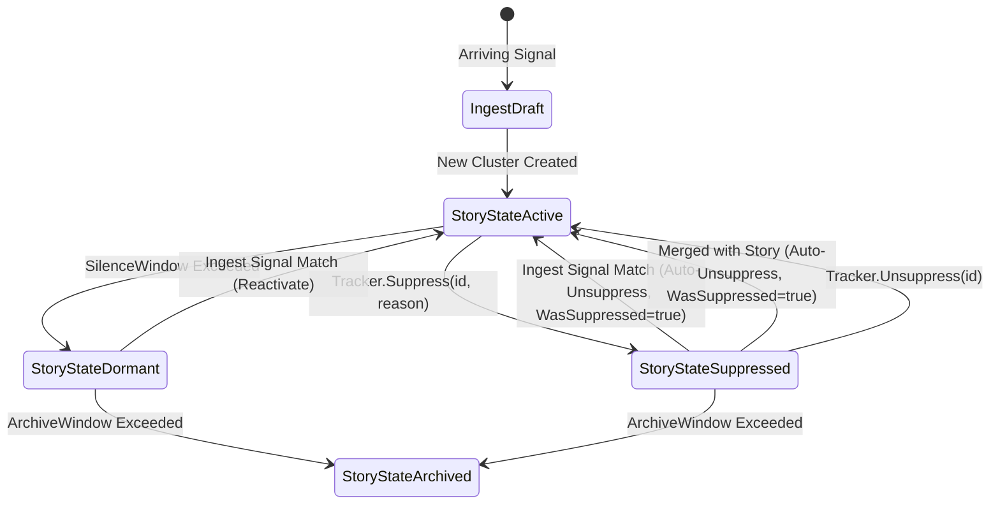

# SDD Spec: Story Suppression Lifecycle & Tracker State

## Metadata
* **Status:** `APPROVED`
* **Author:** Consigliere
* **Created:** 2026-08-19
* **Last Updated:** 2026-08-19
* **Approver:** Codefather

---

## Phase 1: Proposal (Rough Idea)

### 1.1 Problem Statement

`streaming-story` clusters signals purely based on geometric proximity in embedding space. In real-world data pipelines (e.g. RSS news, Telegram intelligence feeds), non-news noise—such as fundraising appeals, greetings, channel advertisements, and routine administrative chatter—shares dense geometric proximity and naturally forms valid clusters.

Downstream consumers (such as semantic synthesizers like `magic-giant`) evaluate the news-worthiness of clusters. When a cluster is identified as non-news chatter:
1. It currently remains in `StoryStateActive` inside `streaming-story`.
2. Downstream query streams (`tracker.Stories(StoryStateActive)`) are flooded with noise clusters unless downstream services implement complex pagination refill loops and out-of-band state stores.
3. Periodic downstream reconcile scanners continually re-scan idle noise clusters, creating ongoing compute and LLM token overhead.

### 1.2 Proposed Solution

Elevate story suppression to a **first-class lifecycle state** directly within `streaming-story`:

1. **`StoryStateSuppressed` Lifecycle State**:
   - Add `StoryStateSuppressed` to [`StoryState`](file:///home/ksharlaimov/dev/kampff-net/streaming-story/types.go#L27-L36).
   - Track `WasSuppressed: bool` and `SuppressionReason: string` in [`StoryMeta`](file:///home/ksharlaimov/dev/kampff-net/streaming-story/types.go#L69) and [`storyRecord`](file:///home/ksharlaimov/dev/kampff-net/streaming-story/record.go#L19).

2. **Explicit Suppression API**:
   - `Tracker.Suppress(id uuid.UUID, reason string) error`: Marks an active story as suppressed.
   - `Tracker.Unsuppress(id uuid.UUID) error`: Restores a suppressed story to `StoryStateActive`.

3. **Auto-Unsuppression on Ingest & Merge**:
   - **Signal Join**: Suppressed story centroids remain searchable in the Draft phase vector search. When an incoming signal matches a suppressed story's threshold, [`ingest.go`](file:///home/ksharlaimov/dev/kampff-net/streaming-story/ingest.go) assigns the signal, automatically transitions `StoryStateSuppressed -> StoryStateActive`, and sets `WasSuppressed = true`.
   - **Story Merger**: Merging two stories always unsuppresses both. If either story was suppressed (`State == StoryStateSuppressed` or `WasSuppressed == true`), the resulting surviving story is set to `StoryStateActive` with `WasSuppressed = true`.

4. **Maintenance Sweeper Invariant**:
   - In [`maintain.go`](file:///home/ksharlaimov/dev/kampff-net/streaming-story/maintain.go), `maintainStoryMeta` preserves `StoryStateSuppressed` rather than resetting it to `StoryStateActive` on recent signal activity. It only transitions `StoryStateSuppressed -> StoryStateArchived` after `ArchiveWindow`.

5. **Event Emission**:
   - Add `EventStorySuppressed` and `EventStoryUnsuppressed` to [`EventKind`](file:///home/ksharlaimov/dev/kampff-net/streaming-story/types.go#L107-L120).

### 1.3 Scope & Requirements

* **In Scope:**
  * Extend `StoryState` with `StoryStateSuppressed`.
  * Extend `StoryMeta` and `storyRecord` with `WasSuppressed bool` and `SuppressionReason string`.
  * Implement `Tracker.Suppress(id, reason)` and `Tracker.Unsuppress(id)` methods.
  * Ingest auto-reactivation: `StoryStateSuppressed -> StoryStateActive` in `ingest.go`.
  * Merge auto-reactivation: unsuppress surviving story in `maintain.go` and cluster mapping.
  * Sweeper guard in `maintain.go` to retain suppression state.
  * Add `EventStorySuppressed` and `EventStoryUnsuppressed` event kinds.
  * Unit and integration tests covering state transitions, queries, auto-unsuppress on ingest, auto-unsuppress on merge, and sweeper invariants.

* **Out of Scope:**
  * Semantic policy or prompt evaluation (semantic judgment belongs exclusively to downstream consumers like `magic-giant`).
  * Changing geometric distance or HDBSCAN clustering math.

---

## Phase 2: System Design (SDD)

### 2.1 Architecture & State Machine



### 2.2 Data Structures & Interfaces

#### A. Lifecycle States & Events ([`types.go`](file:///home/ksharlaimov/dev/kampff-net/streaming-story/types.go))

```go
type StoryState uint8

const (
    StoryStateAny StoryState = iota
    StoryStateActive
    StoryStateDormant
    StoryStateArchived
    StoryStateSuppressed
)

func (s StoryState) String() string {
    switch s {
    case StoryStateActive:
        return "active"
    case StoryStateDormant:
        return "dormant"
    case StoryStateArchived:
        return "archived"
    case StoryStateSuppressed:
        return "suppressed"
    default:
        return "unknown"
    }
}

type EventKind uint8

const (
    EventDraftAssigned EventKind = iota
    EventSignalReassigned
    EventStoryCreated
    EventStorySplit
    EventStoryMerged
    EventStoryRetired
    EventStoryDormant
    EventStoryArchived
    EventStorySuppressed
    EventStoryUnsuppressed
    EventBatchComplete
    EventBufferOverflow
)
```

#### B. Metadata and Persistent Record ([`types.go`](file:///home/ksharlaimov/dev/kampff-net/streaming-story/types.go) / [`record.go`](file:///home/ksharlaimov/dev/kampff-net/streaming-story/record.go))

```go
type StoryMeta struct {
    ID                 uuid.UUID
    State              StoryState
    Centroid           []float32
    RecentCentroid     []float32
    Radius             float64
    CreatedAt          time.Time
    LastSignalAt       time.Time
    MeanDistance       float64
    Sigma              float64
    SignalCount        int
    FrozenMeanDistance float64
    FrozenSigma        float64
    WasSuppressed      bool
    SuppressionReason  string
}

type storyRecord struct {
    State              StoryState `json:"state"`
    Centroid           []float32  `json:"centroid"`
    RecentCentroid     []float32  `json:"recent_centroid,omitempty"`
    Radius             float64    `json:"radius"`
    CreatedAt          time.Time  `json:"created_at"`
    LastSignalAt       time.Time  `json:"last_signal_at"`
    MeanDistance       float64    `json:"mean_distance,omitempty"`
    Sigma              float64    `json:"sigma,omitempty"`
    SignalCount        int        `json:"signal_count,omitempty"`
    FrozenMeanDistance float64    `json:"frozen_mean_distance,omitempty"`
    FrozenSigma        float64    `json:"frozen_sigma,omitempty"`
    WasSuppressed      bool       `json:"was_suppressed,omitempty"`
    SuppressionReason  string     `json:"suppression_reason,omitempty"`
}
```

#### C. Tracker Suppression API ([`tracker.go`](file:///home/ksharlaimov/dev/kampff-net/streaming-story/tracker.go))

```go
// Suppress marks a story as suppressed non-news chatter with a descriptive reason.
// Emits EventStorySuppressed upon successful transition.
func (t *Tracker[T]) Suppress(id uuid.UUID, reason string) error

// Unsuppress clears the suppression state and marks the story active.
// Emits EventStoryUnsuppressed upon successful transition.
func (t *Tracker[T]) Unsuppress(id uuid.UUID) error
```

### 2.3 Transition Semantics

#### 1. Ingest Auto-Unsuppress ([`ingest.go`](file:///home/ksharlaimov/dev/kampff-net/streaming-story/ingest.go))
During the real-time Draft phase, candidate centroids of `StoryStateSuppressed` stories are searched alongside `StoryStateActive` and `StoryStateDormant`.
When a signal drafts into a suppressed story:
```go
if rec.State == StoryStateSuppressed {
    rec.State = StoryStateActive
    rec.WasSuppressed = true
    // SuppressionReason is intentionally retained to preserve why the story was suppressed.
}
```

#### 2. Merge Auto-Unsuppress ([`maintain.go`](file:///home/ksharlaimov/dev/kampff-net/streaming-story/maintain.go))
When two stories (e.g. `survivor` and `retired`) merge into a single story:
```go
if survivor.State == StoryStateSuppressed || retired.State == StoryStateSuppressed || survivor.WasSuppressed || retired.WasSuppressed {
    survivor.State = StoryStateActive
    survivor.WasSuppressed = true
    if survivor.SuppressionReason == "" && retired.SuppressionReason != "" {
        survivor.SuppressionReason = retired.SuppressionReason
    }
}
```

#### 3. Maintenance Sweeper Invariant ([`maintain.go`](file:///home/ksharlaimov/dev/kampff-net/streaming-story/maintain.go))
In `maintainStoryMeta`:
```go
var newState StoryState
switch {
case latestAt.Before(now.Add(-t.cfg.ArchiveWindow)):
    newState = StoryStateArchived
case prev.State == StoryStateSuppressed:
    newState = StoryStateSuppressed // preserve suppression until archive window
case latestAt.Before(now.Add(-t.cfg.SilenceWindow)):
    newState = StoryStateDormant
default:
    newState = StoryStateActive
}
```

### 2.4 Query Protocol & Backward Compatibility

- `tracker.Stories(StoryStateActive)` streams only active, non-suppressed stories.
- `tracker.Stories(StoryStateSuppressed)` streams suppressed stories.
- `tracker.Stories(StoryStateAny)` streams all stories regardless of state.
- `storyRecord` uses `omitempty` for `was_suppressed` and `suppression_reason`, maintaining forward and backward JSON serialization compatibility with existing KV store records.

---

## Phase 3: Implementation Plan (IP)

### 3.1 Task Breakdown

- [ ] **Task 1: Types, Records, and String Representations**
  - **Files:** [`types.go`](file:///home/ksharlaimov/dev/kampff-net/streaming-story/types.go), [`record.go`](file:///home/ksharlaimov/dev/kampff-net/streaming-story/record.go)
  - **Changes:** Add `StoryStateSuppressed`, `EventStorySuppressed`, `EventStoryUnsuppressed`. Add `WasSuppressed` and `SuppressionReason` to `StoryMeta` and `storyRecord`.
  - **Verification:** `go test ./...`

- [ ] **Task 2: Tracker Suppress / Unsuppress API**
  - **Files:** [`tracker.go`](file:///home/ksharlaimov/dev/kampff-net/streaming-story/tracker.go), `tracker_test.go`
  - **Changes:** Implement `Tracker.Suppress` and `Tracker.Unsuppress` with transactional metadata write and event emission.
  - **Verification:** `go test -run TestSuppress ./...`

- [ ] **Task 3: Ingest Auto-Unsuppression**
  - **Files:** [`ingest.go`](file:///home/ksharlaimov/dev/kampff-net/streaming-story/ingest.go), `ingest_test.go`
  - **Changes:** Automatically transition `StoryStateSuppressed -> StoryStateActive` and set `WasSuppressed = true` when an arriving signal drafts to a suppressed story.
  - **Verification:** `go test -run TestIngest ./...`

- [ ] **Task 4: Merge Auto-Unsuppression & Sweeper Invariants**
  - **Files:** [`maintain.go`](file:///home/ksharlaimov/dev/kampff-net/streaming-story/maintain.go), `maintain_test.go`
  - **Changes:** Implement auto-unsuppress on story merge; protect `StoryStateSuppressed` from being overwritten by `maintainStoryMeta` unless past `ArchiveWindow`.
  - **Verification:** `go test -run TestMaintain ./...`

- [ ] **Task 5: Iterators and Query Filtering**
  - **Files:** [`query.go`](file:///home/ksharlaimov/dev/kampff-net/streaming-story/query.go), `query_test.go`
  - **Changes:** Verify `Stories(StoryStateActive)` excludes suppressed stories and `Stories(StoryStateSuppressed)` iterates them.
  - **Verification:** `go test -run TestQuery ./...`

---

## Phase 4: Execution & Verification
- [ ] All per-task verification steps pass.
- [ ] Linter / `golangci-lint` clean.
- [ ] Unit tests pass with 100% success rate.
- [ ] Benchmarks verify no latency regression on Ingest draft path.
- [ ] Approved by Codefather.

---

## Phase 5: Completed
- [ ] All Phase 4 items `[x]`.
- [ ] No regressions.
- [ ] Spec document reflects actual implementation.
- [ ] `spec/README.md` updated to `COMPLETED`.
- [ ] Approved by Codefather.
