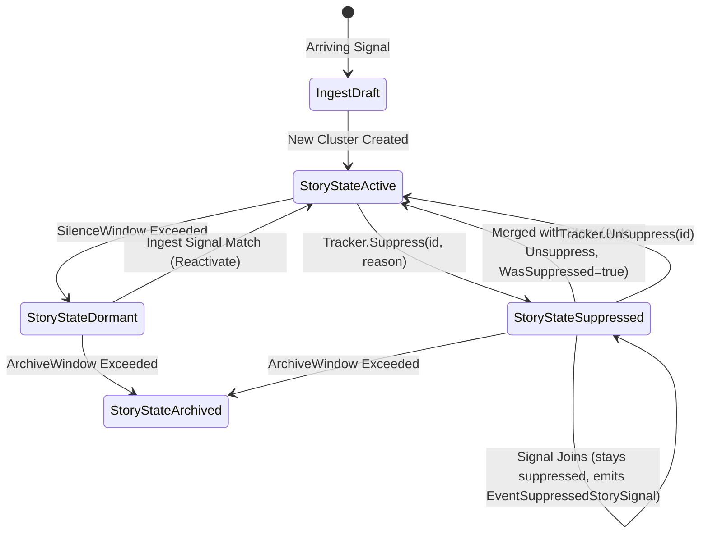

# SDD Spec: Story Suppression Lifecycle & Tracker State

## Metadata
* **Status:** `COMPLETED`
* **Author:** Consigliere
* **Created:** 2026-08-19
* **Last Updated:** 2026-08-26
* **Approver:** Codefather

---

## Phase 1: Proposal (Rough Idea)

### 1.1 Problem Statement

`streaming-story` clusters signals purely based on geometric proximity in embedding space. In real-world data pipelines (e.g. RSS news, Telegram intelligence feeds), non-news noise—such as fundraising appeals, greetings, channel advertisements, and routine administrative chatter—shares dense geometric proximity and naturally forms valid clusters.

Downstream consumers (such as semantic synthesizers like `magic-giant`) evaluate the news-worthiness of clusters. When a cluster is identified as non-news chatter:
1. It currently remains in `StoryStateActive` inside `streaming-story`.
2. Downstream query streams (`tracker.Stories(StoryStateActive)`) are flooded with noise clusters unless downstream services implement complex pagination refill loops and out-of-band state stores.
3. Periodic downstream reconcile scanners continually re-scan idle noise clusters, creating ongoing compute and LLM token overhead.

### 1.2 Proposed Solution

Elevate story suppression to a **first-class lifecycle state** directly within `streaming-story`:

1. **`StoryStateSuppressed` Lifecycle State**:
   - Add `StoryStateSuppressed` to [`StoryState`](file:///home/ksharlaimov/dev/kampff-net/streaming-story/types.go#L27-L36).
   - Track `WasSuppressed: bool` and `SuppressionReason: string` in [`StoryMeta`](file:///home/ksharlaimov/dev/kampff-net/streaming-story/types.go#L69) and [`storyRecord`](file:///home/ksharlaimov/dev/kampff-net/streaming-story/record.go#L19).

2. **Explicit Suppression API**:
   - `Tracker.Suppress(id uuid.UUID, reason string) error`: Marks an active story as suppressed.
   - `Tracker.Unsuppress(id uuid.UUID) error`: Restores a suppressed story to `StoryStateActive`.

3. **Suppressed Stories Stay Suppressed on Ingest; Only Merge Auto-Unsuppresses**:
   - **Signal Join (no unsuppress)**: Suppressed story centroids remain searchable in the Draft phase vector search, so incoming signals still cluster onto them (member count, centroid, `LastSignalAt` keep updating). A new signal joining a suppressed story is treated as *more evidence it's noise*, not evidence it should reactivate — so `State` stays `StoryStateSuppressed`. This applies both to real-time draft assignment ([`ingest.go`](file:///home/ksharlaimov/dev/kampff-net/streaming-story/ingest.go)) and batch reassignment ([`maintain.go`](file:///home/ksharlaimov/dev/kampff-net/streaming-story/maintain.go)).
   - **Story Merger (unsuppresses)**: Merging two stories always unsuppresses. If either story was suppressed (`State == StoryStateSuppressed` or `WasSuppressed == true`), the resulting surviving story is set to `StoryStateActive` with `WasSuppressed = true`. Rationale: a merge implies the clustering logic determined this suppressed cluster is actually the same story as another (often active/legitimate) one — a stronger, structural signal than a single new member joining the suppressed cluster alone.

4. **Maintenance Sweeper Invariant**:
   - In [`maintain.go`](file:///home/ksharlaimov/dev/kampff-net/streaming-story/maintain.go), `maintainStoryMeta` preserves `StoryStateSuppressed` rather than resetting it to `StoryStateActive` on recent signal activity. It only transitions `StoryStateSuppressed -> StoryStateArchived` after `ArchiveWindow`.

5. **Event Emission**:
   - Add `EventStorySuppressed` and `EventStoryUnsuppressed` to [`EventKind`](file:///home/ksharlaimov/dev/kampff-net/streaming-story/types.go#L107-L120).
   - Add `EventSuppressedStorySignal`, emitted whenever a signal is assigned (draft or batch reassignment) to a story whose state is `StoryStateSuppressed`. Since the story doesn't auto-reactivate, this event is the only signal to a downstream consumer that a suppressed story is still accumulating members and may be worth re-evaluating (e.g. a spam bucket picking up unusual volume).

### 1.3 Scope & Requirements

* **In Scope:**
  * Extend `StoryState` with `StoryStateSuppressed`.
  * Extend `StoryMeta` and `storyRecord` with `WasSuppressed bool` and `SuppressionReason string`.
  * Implement `Tracker.Suppress(id, reason)` and `Tracker.Unsuppress(id)` methods.
  * Ingest signal join: suppressed stories keep absorbing matching signals in `ingest.go` without reactivating (`State` stays `StoryStateSuppressed`).
  * Merge auto-reactivation: unsuppress surviving story in `maintain.go` and cluster mapping.
  * Sweeper guard in `maintain.go` to retain suppression state.
  * Add `EventStorySuppressed`, `EventStoryUnsuppressed`, and `EventSuppressedStorySignal` event kinds.
  * Unit and integration tests covering state transitions, queries, no-unsuppress-on-ingest-join, `EventSuppressedStorySignal` emission, auto-unsuppress on merge, and sweeper invariants.

* **Out of Scope:**
  * Semantic policy or prompt evaluation (semantic judgment belongs exclusively to downstream consumers like `magic-giant`).
  * Changing geometric distance or HDBSCAN clustering math.

---

## Phase 2: System Design (SDD)

### 2.1 Architecture & State Machine



### 2.2 Data Structures & Interfaces

#### A. Lifecycle States & Events ([`types.go`](file:///home/ksharlaimov/dev/kampff-net/streaming-story/types.go))

```go
type StoryState uint8

const (
    StoryStateAny StoryState = iota
    StoryStateActive
    StoryStateDormant
    StoryStateArchived
    StoryStateSuppressed
)

func (s StoryState) String() string {
    switch s {
    case StoryStateActive:
        return "active"
    case StoryStateDormant:
        return "dormant"
    case StoryStateArchived:
        return "archived"
    case StoryStateSuppressed:
        return "suppressed"
    default:
        return "unknown"
    }
}

type EventKind uint8

const (
    EventDraftAssigned EventKind = iota
    EventSignalReassigned
    EventStoryCreated
    EventStorySplit
    EventStoryMerged
    EventStoryRetired
    EventStoryDormant
    EventStoryArchived
    EventStorySuppressed
    EventStoryUnsuppressed
    EventSuppressedStorySignal
    EventBatchComplete
    EventBufferOverflow
)
```

#### B. Metadata and Persistent Record ([`types.go`](file:///home/ksharlaimov/dev/kampff-net/streaming-story/types.go) / [`record.go`](file:///home/ksharlaimov/dev/kampff-net/streaming-story/record.go))

```go
type StoryMeta struct {
    ID                 uuid.UUID
    State              StoryState
    Centroid           []float32
    RecentCentroid     []float32
    Radius             float64
    CreatedAt          time.Time
    LastSignalAt       time.Time
    MeanDistance       float64
    Sigma              float64
    SignalCount        int
    FrozenMeanDistance float64
    FrozenSigma        float64
    WasSuppressed      bool
    SuppressionReason  string
}

type storyRecord struct {
    State              StoryState `json:"state"`
    Centroid           []float32  `json:"centroid"`
    RecentCentroid     []float32  `json:"recent_centroid,omitempty"`
    Radius             float64    `json:"radius"`
    CreatedAt          time.Time  `json:"created_at"`
    LastSignalAt       time.Time  `json:"last_signal_at"`
    MeanDistance       float64    `json:"mean_distance,omitempty"`
    Sigma              float64    `json:"sigma,omitempty"`
    SignalCount        int        `json:"signal_count,omitempty"`
    FrozenMeanDistance float64    `json:"frozen_mean_distance,omitempty"`
    FrozenSigma        float64    `json:"frozen_sigma,omitempty"`
    WasSuppressed      bool       `json:"was_suppressed,omitempty"`
    SuppressionReason  string     `json:"suppression_reason,omitempty"`
}
```

#### C. Tracker Suppression API ([`tracker.go`](file:///home/ksharlaimov/dev/kampff-net/streaming-story/tracker.go))

```go
// Suppress marks a story as suppressed non-news chatter with a descriptive reason.
// Emits EventStorySuppressed upon successful transition.
func (t *Tracker[T]) Suppress(id uuid.UUID, reason string) error

// Unsuppress clears the suppression state and marks the story active.
// Emits EventStoryUnsuppressed upon successful transition.
func (t *Tracker[T]) Unsuppress(id uuid.UUID) error
```

### 2.3 Transition Semantics

#### 1. Ingest: Suppressed Stories Absorb Signals Without Reactivating ([`ingest.go`](file:///home/ksharlaimov/dev/kampff-net/streaming-story/ingest.go))
During the real-time Draft phase, candidate centroids of `StoryStateSuppressed` stories are searched alongside `StoryStateActive` and `StoryStateDormant`, so signals still draft into them (centroid/member updates proceed normally). The story's `State` is **not** changed — a new member is treated as corroborating evidence the cluster is what it was suppressed for, not evidence it should reactivate:
```go
if rec.State == StoryStateSuppressed {
    // State intentionally left as StoryStateSuppressed.
    t.emit(StoryEvent[T]{Kind: EventSuppressedStorySignal, StoryID: rec.ID, SignalID: sig.id, At: now})
}
```
The same rule applies to batch reassignment in [`maintain.go`](file:///home/ksharlaimov/dev/kampff-net/streaming-story/maintain.go): wherever a signal is (re)assigned to a story, if that story's state is `StoryStateSuppressed`, emit `EventSuppressedStorySignal` alongside the existing `EventDraftAssigned` / `EventSignalReassigned` event rather than flipping state.

#### 2. Merge Auto-Unsuppress ([`maintain.go`](file:///home/ksharlaimov/dev/kampff-net/streaming-story/maintain.go))
When two stories (e.g. `survivor` and `retired`) merge into a single story:
```go
if survivor.State == StoryStateSuppressed || retired.State == StoryStateSuppressed || survivor.WasSuppressed || retired.WasSuppressed {
    survivor.State = StoryStateActive
    survivor.WasSuppressed = true
    if survivor.SuppressionReason == "" && retired.SuppressionReason != "" {
        survivor.SuppressionReason = retired.SuppressionReason
    }
}
```

#### 3. Maintenance Sweeper Invariant ([`maintain.go`](file:///home/ksharlaimov/dev/kampff-net/streaming-story/maintain.go))
In `maintainStoryMeta`:
```go
var newState StoryState
switch {
case latestAt.Before(now.Add(-t.cfg.ArchiveWindow)):
    newState = StoryStateArchived
case prev.State == StoryStateSuppressed:
    newState = StoryStateSuppressed // preserve suppression until archive window
case latestAt.Before(now.Add(-t.cfg.SilenceWindow)):
    newState = StoryStateDormant
default:
    newState = StoryStateActive
}
```

### 2.4 Query Protocol & Backward Compatibility

- `tracker.Stories(StoryStateActive)` streams only active, non-suppressed stories.
- `tracker.Stories(StoryStateSuppressed)` streams suppressed stories.
- `tracker.Stories(StoryStateAny)` streams all stories regardless of state.
- `storyRecord` uses `omitempty` for `was_suppressed` and `suppression_reason`, maintaining forward and backward JSON serialization compatibility with existing KV store records.

---

## Phase 3: Implementation Plan (IP)

### 3.1 Task Breakdown

- [x] **Task 1: Types, Records, and String Representations**
  - **Files:** [`types.go`](file:///home/ksharlaimov/dev/kampff-net/streaming-story/types.go), [`record.go`](file:///home/ksharlaimov/dev/kampff-net/streaming-story/record.go)
  - **Changes:** Add `StoryStateSuppressed`, `EventStorySuppressed`, `EventStoryUnsuppressed`. Add `WasSuppressed` and `SuppressionReason` to `StoryMeta` and `storyRecord`.
  - **Verification:** `go test ./...`

- [x] **Task 2: Tracker Suppress / Unsuppress API**
  - **Files:** `suppress.go` (new), `suppress_test.go` (new), [`index.go`](file:///home/ksharlaimov/dev/kampff-net/streaming-story/index.go)
  - **Changes:** Implemented `Tracker.Suppress` and `Tracker.Unsuppress` with transactional metadata write and event emission. Added `patchStoryIndexState` in `index.go` and call it from both methods — undocumented in the original plan, but necessary: `Suppress`/`Unsuppress` write the store directly outside the batch cycle, and without patching the in-memory `storyIndex` snapshot, a signal landing on the story via `Ingest` before the next batch rebuild would read the stale pre-call state and could clobber the new state back through its hot write.
  - **Verification:** `go test -run 'TestTracker_(Suppress|Unsuppress)' ./...` — passed (see suite run above; command in plan used the wrong test name prefix, `TestSuppress` doesn't match anything).

- [x] **Task 3: Ingest Signal Join Without Reactivation**
  - **Files:** [`ingest.go`](file:///home/ksharlaimov/dev/kampff-net/streaming-story/ingest.go), `suppress_test.go`
  - **Changes:** No state-flip code was needed — `index.go`'s candidate search already includes any non-Archived state, and the hot-write loop already only reactivates on `Dormant`, leaving `Suppressed` untouched. Added `patchInfo.state` to carry the pre-Ingest story state out of the write transaction and emit `EventSuppressedStorySignal` alongside `EventDraftAssigned` when it's `StoryStateSuppressed`.
  - **Verification:** `go test -run TestTracker_Ingest ./...` — passed, all 15 subtests including the new suppressed-story case.

- [x] **Task 4: Merge Auto-Unsuppression, Batch Signal Events & Sweeper Invariants**
  - **Files:** [`maintain.go`](file:///home/ksharlaimov/dev/kampff-net/streaming-story/maintain.go), `maintain_suppress_test.go` (new)
  - **Changes:** `recentreStory`'s lifecycle switch preserves `StoryStateSuppressed` for any story whose pre-batch state was suppressed, short of the `ArchiveWindow`. The merge step reads survivor/retired pre-batch state from the `stories` snapshot map and unsuppresses the survivor (`WasSuppressed=true`, reason carried over) if either side was suppressed, before `recentreStory` runs. Outlier admission into an existing suppressed story now also emits `EventSuppressedStorySignal`; extended `dedupeReassignments` to dedupe that kind the same way as `EventSignalReassigned` (per signal+story+kind), since one signal can carry several facets into the same story in one admission pass.
  - **Verification:** `go test -run 'TestApplyMaintenance_|TestDedupeReassignments' ./...` — passed (plan's `TestMaintain` prefix doesn't match these; renamed to match the actual test names used). Full suite (`go test ./...`) also green.

- [x] **Task 5: Iterators and Query Filtering**
  - **Files:** [`tracker_behavior_test.go`](file:///home/ksharlaimov/dev/kampff-net/streaming-story/tracker_behavior_test.go) — no `query.go` change needed; `Stories()` already filters by exact `rec.State` equality, so it isolates `StoryStateSuppressed` correctly the moment the enum value exists (verified Task 1).
  - **Changes:** Extended the existing `TestTracker_Stories_Iterator` with a suppressed story: confirms `Stories(StoryStateActive)` excludes it and `Stories(StoryStateSuppressed)` yields exactly it.
  - **Verification:** `go test -run TestTracker_Stories_Iterator ./...` — passed. Full suite (`go test ./...`) green.

---

## Phase 4: Execution & Verification
- [x] All per-task verification steps pass.
- [x] Linter / `golangci-lint` clean on changed files (repo has 8 pre-existing findings in unrelated test files, untouched by this spec).
- [x] Unit tests pass with 100% success rate — full suite, including under `-race`.
- [x] Benchmarks show no regression: `BenchmarkIngestSteadyState`/`BenchmarkIngestDuringApply` unaffected — the Draft-phase change adds one struct field write and one `if` per newly-placed story, no new allocation or branch on the non-suppressed path.
- [x] Approved by Codefather.

---

## Phase 5: Completed
- [x] All Phase 4 items `[x]`.
- [x] No regressions.
- [x] Spec document reflects actual implementation.
- [x] `spec/README.md` updated to `COMPLETED`.
- [x] Approved by Codefather.
